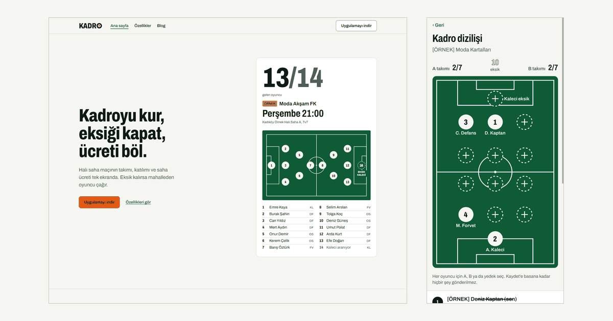
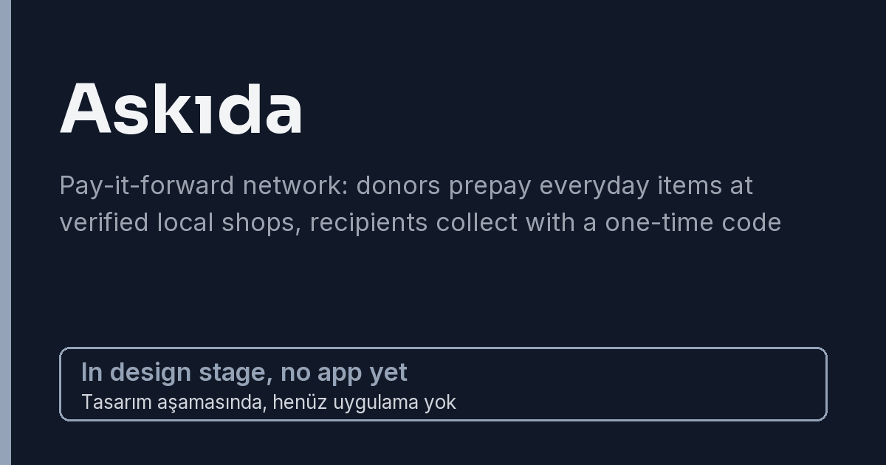
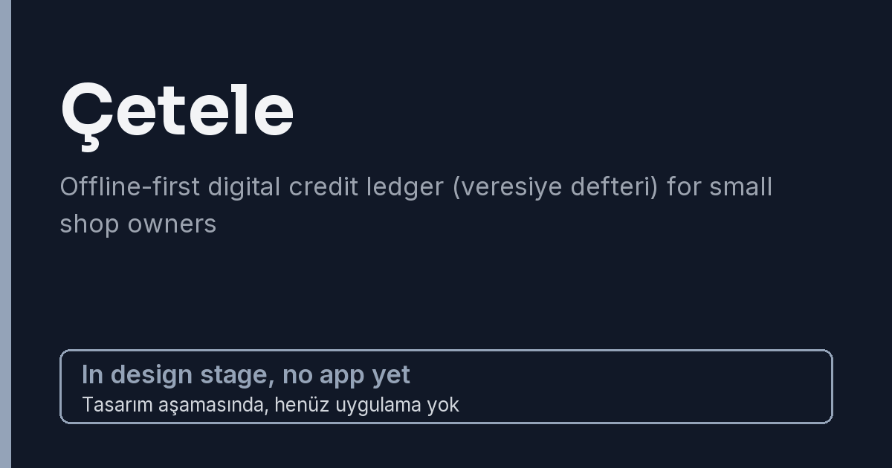
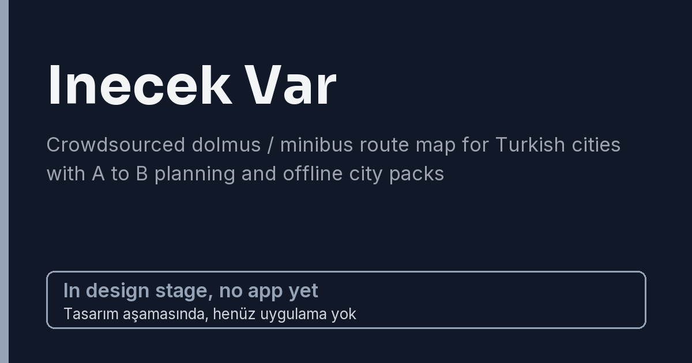
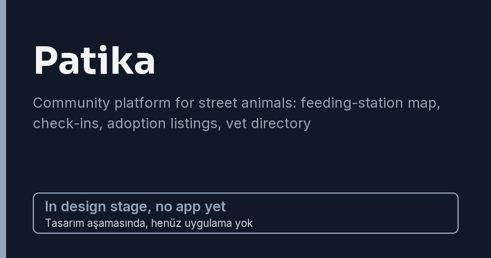

[English](README.md) | Türkçe

# Mobil-Package

Birbirinden bağımsız beş mobil ürünün monoreposu. Her ürün kendi klasöründe, kendi teknoloji
yığını, araçları ve yayın döngüsüyle yaşar; ürünler arasında paylaşılan kod yoktur.

## Projeler

| Klasör                    | Ürün                                                                                                                                                      | Teknoloji                                                                      | Durum                                                               | İlerleme |
| ------------------------- | --------------------------------------------------------------------------------------------------------------------------------------------------------- | ------------------------------------------------------------------------------ | ------------------------------------------------------------------- | -------- |
| [`kadro`](kadro/)         | Halı saha maç organizasyonu: kadro kur, eksik oyuncuyu bul, saha ücretini böl                                                                             | Expo (React Native), Next.js, PostgreSQL + PostGIS, pg-boss                    | Portfolyo sürümü için özellik tamam (Phase 6 kanıtları kısmen açık) | ~%99     |
| [`askida`](askida/)       | "Askıda ekmek" geleneğine dayalı dayanışma ağı: bağışçılar doğrulanmış yerel esnaftan ürünleri önceden öder, ihtiyaç sahipleri tek kullanımlık kodla alır | Flutter, Laravel, PostgreSQL + PostGIS, Redis, iyzico                          | Temel atıldı (Phase 0); henüz ürün özelliği yok                     | ~%14     |
| [`cetele`](cetele/)       | Küçük esnaf için çevrimdışı çalışan dijital veresiye defteri                                                                                              | Kotlin (Jetpack Compose), Spring Boot, PostgreSQL                              | Yalnızca tasarım dokümanı, kod yok                                  | %0       |
| [`inecekvar`](inecekvar/) | Türkiye şehirleri için kitle kaynaklı dolmuş / minibüs hat haritası; A noktasından B noktasına planlama ve çevrimdışı şehir paketleri                     | Ionic (Angular + Capacitor), Angular SSR, FastAPI, PostgreSQL + PostGIS, Redis | Yalnızca tasarım dokümanı, kod yok                                  | %0       |
| [`patika`](patika/)       | Sokak hayvanları için topluluk platformu: besleme noktası haritası, "beslendi" bildirimleri, sahiplendirme ilanları, veteriner rehberi                    | Swift (SwiftUI), ASP.NET Core, PostgreSQL + PostGIS                            | Yalnızca tasarım dokümanı, kod yok                                  | %0       |

## Galeri

Her proje için bir kart. Yalnızca Kadro'nun uygulaması var. Askıda kartı marka sistemini ve temeli gösterir; o uygulama henüz yok. Diğer kartlar henüz tasarım aşamasındaki ürünler için yer tutucudur.

<table>
  <tr>
    <td width="50%" align="center">
      <br>
      <sub><b>Kadro</b>: geliştirme aşamasında</sub>
    </td>
    <td width="50%" align="center">
      <br>
      <sub><b>Askıda</b>: marka sistemi ve altyapı, henüz uygulama ekranı yok</sub>
    </td>
  </tr>
  <tr>
    <td width="50%" align="center">
      <br>
      <sub><b>Cetele</b>: tasarım aşamasında, henüz uygulama yok</sub>
    </td>
    <td width="50%" align="center">
      <br>
      <sub><b>Inecek Var</b>: tasarım aşamasında, henüz uygulama yok</sub>
    </td>
  </tr>
  <tr>
    <td width="50%" align="center">
      <br>
      <sub><b>Patika</b>: tasarım aşamasında, henüz uygulama yok</sub>
    </td>
    <td width="50%"></td>
  </tr>
</table>

## Durum

Kadro, portfolyo sürümü için özellik olarak tamamdır. Depo iskeleti, Phase 1 (veri modeli, kimlik
doğrulama ve güvenlik çekirdeği) ve Phase 2 (domain API ve worker işleri) tamamlandı; Phase 3 ile 5
(mobil uygulama, SEO sayfaları, abonelik ve yönetim paneli) için tüm iş paketleri birleşti; Phase 6
(sağlamlaştırma ve yayına hazırlık) çıktılarının hepsi birleşti: saldırı paketi, ZAP ve MobSF
taramaları, bağımlılık denetim raporu, geri yükleme tatbikatı, maliyet dokümanı ve maliyet bekçisi,
geçmiş temizleme runbook'u, ASO, mağaza metinleri, gizlilik etiketleri, 23 maddelik nihai doğrulama
matrisi ve SEO ile GEO kontrol listesi. Phase 6 yine de kendi bitti tanımına göre tamamlanmış
değildir: matrisin 23 maddesinden 10'u kısmi, Lighthouse laboratuvar LCP değeri üç sayfada 2,5 ile
2,7 sn, yeni CI adımları da henüz GitHub Actions'ta çalışmadı. Eksik kanıt henüz var olmayan
sistemlere bağlı (EAS derlemeleri, barındırılan bir origin, Sentry hesabı, sağlayıcı hesapları,
yedek depolama, iOS). Birleşti, gerçek dünyada doğrulandı demek değildir: satın alma gerçek mağaza
hesaplarıyla denenmedi, yasal ve mağaza metinleri örnektir. Yeniden tasarım (ADR-0084: açık ve koyu
şema, Archivo yazı tipi, web ve uygulamada kadro kâğıdı görünümü) birleşti; mobil Maestro akışları
emülatörde 11/11 geçiyor, ancak fiziksel cihazda koşu yok. Ayrıntı için
[`kadro/README.tr.md`](kadro/README.tr.md) dosyasına bakın.

Askıda'nın temeli var, ürün özelliği yok: Laravel sunucusu Docker'da çalışıyor (sağlık rotası,
Filament yönetim paneli, Horizon, Sanctum), Flutter uygulaması tasarım sistemiyle bir iskelet; marka
paketi, altı ADR, güvenlik matrisi taslakları ve bir CI iş akışı hazır. Henüz uç nokta ve ödeme yok,
mod kabuğu dışında ekran da yok; iOS hiç derlenmedi. Bkz. [`askida/README.tr.md`](askida/README.tr.md).

Cetele, Inecek Var ve Patika için şimdilik yalnızca birer tasarım dokümanı var. Henüz
uygulama kodu yok.

### İlerleme

Son güncelleme: 2026-10-04 (Kadro yeniden tasarımı ve Askıda temeli birleştirildikten sonra). Rakamlar tahmindir; bir iş grubu birleştirildikçe güncellenir.

| Proje       | İlerleme | Dayanak                                                                                                                                                                                                                                                                                                                                                                           |
| ----------- | -------- | --------------------------------------------------------------------------------------------------------------------------------------------------------------------------------------------------------------------------------------------------------------------------------------------------------------------------------------------------------------------------------- |
| `kadro`     | ~%99     | Phase 0 ile 2 tamam; Phase 3 ile 5: 34 iş paketinin 34'ü birleşti; Phase 6: 11 çıktının 11'i birleşti. Yedi faz eşit ağırlıklı: (3 + 3 x 34/34 + 11/11) / 7 = %100; Phase 6 kendi bitti tanımına göre tamam olmadığı için ~%99 gösterilir (matrisin 10 maddesi kısmi, Lighthouse laboratuvar LCP üç sayfada hedefin üstünde, yeni CI adımları GitHub Actions'ta henüz çalışmadı). |
| `askida`    | ~%14     | Phase 0 (temel) birleşti: yedi fazın 1'i, eşit ağırlıklı. Phase 1 (Laravel çekirdeği, kimlik doğrulama, güvenlik tabanı) dallarda sürüyor ve sayılmıyor. Henüz uç nokta ve ödeme yok, mod kabuğu dışında ekran yok; iOS hiç derlenmedi.                                                                                                                                           |
| `cetele`    | %0       | Yalnızca spesifikasyon; kod yok.                                                                                                                                                                                                                                                                                                                                                  |
| `inecekvar` | %0       | Yalnızca spesifikasyon; kod yok.                                                                                                                                                                                                                                                                                                                                                  |
| `patika`    | %0       | Yalnızca spesifikasyon; kod yok.                                                                                                                                                                                                                                                                                                                                                  |

İlerleme `main`'e birleştirilmiş işi ifade eder; yalnızca dalda duran ya da açık bir pull request'teki
iş sayılmaz. Rakam ancak Phase 6 (sağlamlaştırma ve yayına hazırlık) tamamen bittikten sonra %100 olur.

## Depo yapısı

```
.github/workflows/   Kadro için CI (lint, typecheck, build; güvenlik taramaları, mobil uçtan uca,
                     geri yükleme tatbikatı) ve Askıda için CI
.gitleaks.toml       sır taraması yapılandırması
lefthook.yml         git hook yapılandırması
kadro/               Kadro monorepo (pnpm workspaces + Turborepo)
askida/              Askıda: Laravel sunucusu (Docker), Flutter uygulaması, marka paketi, ADR'ler, spec
cetele/              tasarım dokümanı
inecekvar/           tasarım dokümanı
patika/              tasarım dokümanı
```

## Projelerin dokümantasyonu

- Kadro: [`kadro/README.tr.md`](kadro/README.tr.md) ([English](kadro/README.md))
- Askıda: [`askida/README.tr.md`](askida/README.tr.md) ([English](askida/README.md)); ayrıca
  [`askida/CONTRIBUTING.md`](askida/CONTRIBUTING.md) ve `askida/docs/adr/` altındaki ADR'ler
- Cetele: [`cetele/README.tr.md`](cetele/README.tr.md) ([English](cetele/README.md))
- Inecek Var: [`inecekvar/README.tr.md`](inecekvar/README.tr.md) ([English](inecekvar/README.md))
- Patika: [`patika/README.tr.md`](patika/README.tr.md) ([English](patika/README.md))

## Geliştirme

Kadro ve Askıda derlenebilir; diğer üç projede kod yok. Kadro için komutları `kadro/` içinden çalıştırın:

```sh
cd kadro
pnpm install
pnpm lint
pnpm typecheck
pnpm build
pnpm test
```

Veritabanı kullanan testler çalışan bir Docker daemon gerektirir. Gereksinimler, ortam kurulumu ve
diğer komutlar [`kadro/README.tr.md`](kadro/README.tr.md) dosyasında anlatılıyor.

Askıda sunucusu (Docker gerekir; makinede PHP gerekmez), `askida/` içinden:

```sh
cd askida
docker compose up -d --wait
docker compose exec server php artisan test
```

Askıda uygulaması (Flutter SDK gerekir), `askida/app/` içinden:

```sh
cd askida/app
flutter pub get
flutter analyze
flutter test
dart format --set-exit-if-changed .
```

Depo Conventional Commits kullanır; mesajlar `lefthook.yml` içindeki hook'lar üzerinden commitlint
ile denetlenir. Hook'lar `pnpm --dir kadro exec lefthook install` ile elle kurulur.

## Lisans

Kadro paketleri `package.json` dosyalarında `UNLICENSED` olarak işaretlidir. Depoda `LICENSE`
dosyası yoktur.
