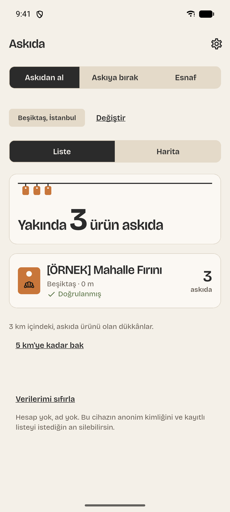
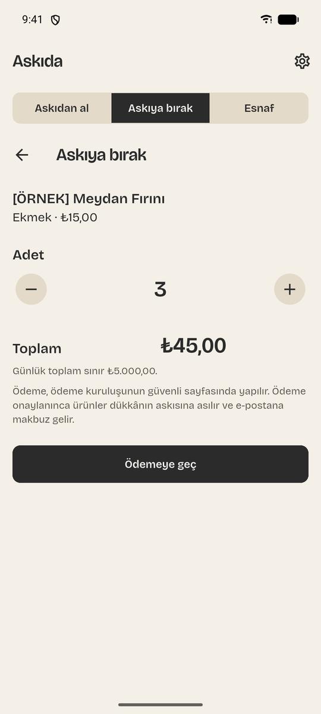
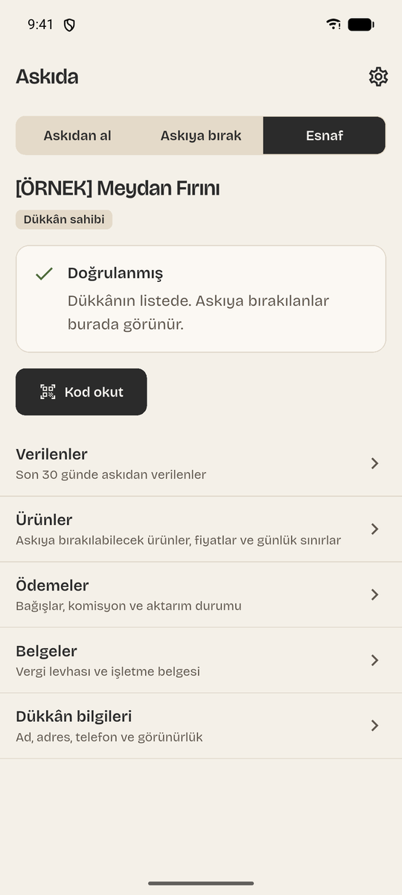

[English](README.md) | Türkçe

# Mobil-Package

Birbirinden bağımsız beş mobil ürünün monoreposu. Her ürün kendi klasöründe, kendi teknoloji
yığını, araçları ve yayın döngüsüyle yaşar; ürünler arasında paylaşılan kod yoktur.

## Projeler

| Klasör                    | Ürün                                                                                                                                                      | Teknoloji                                                                      | Durum                                                              | İlerleme |
| ------------------------- | --------------------------------------------------------------------------------------------------------------------------------------------------------- | ------------------------------------------------------------------------------ | ------------------------------------------------------------------ | -------- |
| [`kadro`](kadro/)         | Halı saha maç organizasyonu: kadro kur, eksik oyuncuyu bul, saha ücretini böl                                                                             | Expo (React Native), Next.js, PostgreSQL + PostGIS, pg-boss                    | Planlanan tüm fazlar birleşti (gerçek dünya kanıtları kısmen açık) | %100     |
| [`askida`](askida/)       | "Askıda ekmek" geleneğine dayalı dayanışma ağı: bağışçılar doğrulanmış yerel esnaftan ürünleri önceden öder, ihtiyaç sahipleri tek kullanımlık kodla alır | Flutter, Laravel, PostgreSQL + PostGIS, Redis, iyzico                          | Planlanan tüm fazlar birleşti (gerçek dünya kanıtları kısmen açık) | %100     |
| [`cetele`](cetele/)       | Küçük esnaf için çevrimdışı çalışan dijital veresiye defteri                                                                                              | Kotlin (Jetpack Compose), Spring Boot, PostgreSQL                              | Yalnızca tasarım dokümanı, kod yok                                 | %0       |
| [`inecekvar`](inecekvar/) | Türkiye şehirleri için kitle kaynaklı dolmuş / minibüs hat haritası; A noktasından B noktasına planlama ve çevrimdışı şehir paketleri                     | Ionic (Angular + Capacitor), Angular SSR, FastAPI, PostgreSQL + PostGIS, Redis | Yalnızca tasarım dokümanı, kod yok                                 | %0       |
| [`patika`](patika/)       | Sokak hayvanları için topluluk platformu: besleme noktası haritası, "beslendi" bildirimleri, sahiplendirme ilanları, veteriner rehberi                    | Swift (SwiftUI), ASP.NET Core, PostgreSQL + PostGIS                            | Yalnızca tasarım dokümanı, kod yok                                 | %0       |

## Galeri

Her proje için bir kart. Kadro'nun ve Askıda'nın uygulaması var. Askıda kartı marka sistemini ve üç uygulama ekranını gösterir (Android emülatörü, örnek veri); tamamı [`askida/README.tr.md`](askida/README.tr.md#ekran-görüntüleri) dosyasında. Diğer kartlar henüz tasarım aşamasındaki ürünler için yer tutucudur.

<table>
  <tr>
    <td width="50%" align="center">
      <br>
      <sub><b>Kadro</b>: geliştirme aşamasında</sub>
    </td>
    <td width="50%" align="center">
      <br>
      
      
      <br>
      <sub><b>Askıda</b>: marka sistemi ve Android uygulama ekranları (örnek veri)</sub>
    </td>
  </tr>
  <tr>
    <td width="50%" align="center">
      <br>
      <sub><b>Cetele</b>: tasarım aşamasında, henüz uygulama yok</sub>
    </td>
    <td width="50%" align="center">
      <br>
      <sub><b>Inecek Var</b>: tasarım aşamasında, henüz uygulama yok</sub>
    </td>
  </tr>
  <tr>
    <td width="50%" align="center">
      <br>
      <sub><b>Patika</b>: tasarım aşamasında, henüz uygulama yok</sub>
    </td>
    <td width="50%"></td>
  </tr>
</table>

## Durum

Kadro'nun planlanan fazlarının hepsi birleşti. Depo iskeleti, Phase 1 (veri modeli, kimlik
doğrulama ve güvenlik çekirdeği) ve Phase 2 (domain API ve worker işleri) tamamlandı; Phase 3 ile 5
(mobil uygulama, SEO sayfaları, abonelik ve yönetim paneli) için tüm iş paketleri birleşti; Phase 6
(sağlamlaştırma ve yayına hazırlık) çıktılarının hepsi birleşti: saldırı paketi, ZAP ve MobSF
taramaları, bağımlılık denetim raporu, geri yükleme tatbikatı, maliyet dokümanı ve maliyet bekçisi,
geçmiş temizleme runbook'u, ASO, mağaza metinleri, gizlilik etiketleri, 23 maddelik nihai doğrulama
matrisi ve SEO ile GEO kontrol listesi. Açık kanıtlar açık olarak kayıtlıdır:
matrisin 23 maddesinden 10'u kısmi, Lighthouse laboratuvar LCP değeri üç sayfada 2,5 ile
2,7 sn, yeni CI adımları da henüz GitHub Actions'ta çalışmadı. Eksik kanıt henüz var olmayan
sistemlere bağlı (EAS derlemeleri, barındırılan bir origin, Sentry hesabı, sağlayıcı hesapları,
yedek depolama, iOS). Birleşti, gerçek dünyada doğrulandı demek değildir: satın alma gerçek mağaza
hesaplarıyla denenmedi, yasal ve mağaza metinleri örnektir. Yeniden tasarım (ADR-0084: açık ve koyu
şema, Archivo yazı tipi, web ve uygulamada kadro kâğıdı görünümü) birleşti; mobil Maestro akışları
emülatörde 11/11 geçiyor, ancak fiziksel cihazda koşu yok. Ayrıntı için
[`kadro/README.tr.md`](kadro/README.tr.md) dosyasına bakın.

Askıda'nın planlanan yedi fazının tamamı hazır: Docker'da çalışan Laravel sunucusu (kimlik
doğrulama, dükkânlar ve katalog, askı, iyzico ödeme akışıyla bağışlar, webhook'lar, esnaf
ödemeleri, Filament yönetim paneli, OpenAPI sözleşmesi), bağışçı, esnaf ve anonim alıcılar için
Flutter uygulaması, SEO ve GEO ile herkese açık web ve sertleştirme fazı (saldırı test takımı,
kalıcı XSS taraması, ZAP ve MobSF taramaları, bağımlılık denetimleri, geri yükleme tatbikatlı
şifreli yedekler, gönderim bütçesi, yayın ve mağaza dokümanları). Son güvenlik doğrulama
matrisinde 23 maddenin 14'ü tamam, 9'u kısmi; kısmi olanlar burada bulunmayan sistemlere (ödeme
sağlayıcı hesabı, mağaza hesapları, alan adı ve sunucu, hata izleme, üretim yedek kovası, macOS)
bağlı ya da ancak push'tan sonra çalışır. Gerçek ödeme ve cihaz doğrulaması denenmedi, iOS hiç
derlenmedi. Bkz. [`askida/README.tr.md`](askida/README.tr.md) ve
[`askida/docs/security/verification-matrix.md`](askida/docs/security/verification-matrix.md).

Cetele, Inecek Var ve Patika için şimdilik yalnızca birer tasarım dokümanı var. Henüz
uygulama kodu yok.

### İlerleme

Son güncelleme: 2026-10-05 (Askıda Phase 4-6 birleştirmesi için yazıldı). Rakamlar tahmindir; bir iş grubu birleştirildikçe güncellenir.

| Proje       | İlerleme | Dayanak                                                                                                                                                                                                                                                                                                                                                                                                                                                                                                                                                                                                                 |
| ----------- | -------- | ----------------------------------------------------------------------------------------------------------------------------------------------------------------------------------------------------------------------------------------------------------------------------------------------------------------------------------------------------------------------------------------------------------------------------------------------------------------------------------------------------------------------------------------------------------------------------------------------------------------------- |
| `kadro`     | %100     | Phase 0 ile 2 tamam; Phase 3 ile 5: 34 iş paketinin 34'ü birleşti; Phase 6: 11 çıktının 11'i birleşti. Yedi faz eşit ağırlıklı: (3 + 3 x 34/34 + 11/11) / 7 = %100. Phase 6 portfolyo kapsamında tamamdır (11 çıktının 11'i birleşti); henüz var olmayan sistemlere bağlı kanıtlar kısmi olarak kayıtlı kalır (23 güvenlik maddesinin 10'u, barındırılan origin, EAS derlemeleri, sağlayıcı hesapları, iOS). Yani %100, planlanan işin birleştiği anlamına gelir; her kontrolün üretimde kanıtlandığı anlamına gelmez.                                                                                                  |
| `askida`    | %100     | Phase 0-6 birleşti: yedi fazın 7'si, eşit ağırlıklı (temel; veri katmanı, kimlik doğrulama ve güvenlik tabanı; dükkânlar, hesaplar ve askı; ödeme akışı, webhook'lar, esnaf ödemeleri ve yönetim paneli; Flutter uygulaması; herkese açık web, SEO ve GEO; sertleştirme ve yayına hazırlık): 7/7 = %100. %100 planlanan işin birleştiği anlamına gelir, her kontrolün üretimde kanıtlandığı anlamına gelmez: 23 güvenlik maddesinin 9'u kısmi kalır ([doğrulama matrisi](askida/docs/security/verification-matrix.md)); gerçek ödeme, gerçek cihaz doğrulaması, mağaza hesapları, barındırılan origin ve iOS denenmedi. |
| `cetele`    | %0       | Yalnızca spesifikasyon; kod yok.                                                                                                                                                                                                                                                                                                                                                                                                                                                                                                                                                                                        |
| `inecekvar` | %0       | Yalnızca spesifikasyon; kod yok.                                                                                                                                                                                                                                                                                                                                                                                                                                                                                                                                                                                        |
| `patika`    | %0       | Yalnızca spesifikasyon; kod yok.                                                                                                                                                                                                                                                                                                                                                                                                                                                                                                                                                                                        |

İlerleme `main`'e birleştirilmiş işi ifade eder; yalnızca dalda duran ya da açık bir pull request'teki
iş sayılmaz. %100, tüm fazların birleştiği anlamına gelir; gerçek dünya doğrulaması ayrıca izlenir.

## Depo yapısı

```
.github/workflows/   Kadro için CI (lint, typecheck, build; güvenlik taramaları, mobil uçtan uca,
                     geri yükleme tatbikatı) ve Askıda için CI
.gitleaks.toml       sır taraması yapılandırması
lefthook.yml         git hook yapılandırması
kadro/               Kadro monorepo (pnpm workspaces + Turborepo)
askida/              Askıda: Laravel sunucusu (Docker), Flutter uygulaması, marka paketi, ADR'ler, spec
cetele/              tasarım dokümanı
inecekvar/           tasarım dokümanı
patika/              tasarım dokümanı
```

## Projelerin dokümantasyonu

- Kadro: [`kadro/README.tr.md`](kadro/README.tr.md) ([English](kadro/README.md))
- Askıda: [`askida/README.tr.md`](askida/README.tr.md) ([English](askida/README.md)); ayrıca
  [`askida/CONTRIBUTING.md`](askida/CONTRIBUTING.md) ve `askida/docs/adr/` altındaki ADR'ler
- Cetele: [`cetele/README.tr.md`](cetele/README.tr.md) ([English](cetele/README.md))
- Inecek Var: [`inecekvar/README.tr.md`](inecekvar/README.tr.md) ([English](inecekvar/README.md))
- Patika: [`patika/README.tr.md`](patika/README.tr.md) ([English](patika/README.md))

## Geliştirme

Kadro ve Askıda derlenebilir; diğer üç projede kod yok. Kadro için komutları `kadro/` içinden çalıştırın:

```sh
cd kadro
pnpm install
pnpm lint
pnpm typecheck
pnpm build
pnpm test
```

Veritabanı kullanan testler çalışan bir Docker daemon gerektirir. Gereksinimler, ortam kurulumu ve
diğer komutlar [`kadro/README.tr.md`](kadro/README.tr.md) dosyasında anlatılıyor.

Askıda sunucusu (Docker gerekir; makinede PHP gerekmez), `askida/` içinden:

```sh
cd askida
docker compose up -d --wait
docker compose exec server php artisan test
```

Askıda uygulaması (Flutter SDK gerekir), `askida/app/` içinden:

```sh
cd askida/app
flutter pub get
flutter analyze
flutter test
dart format --set-exit-if-changed .
```

Depo Conventional Commits kullanır; mesajlar `lefthook.yml` içindeki hook'lar üzerinden commitlint
ile denetlenir. Hook'lar `pnpm --dir kadro exec lefthook install` ile elle kurulur.

## Lisans

Kadro paketleri `package.json` dosyalarında `UNLICENSED` olarak işaretlidir. Depoda `LICENSE`
dosyası yoktur.
