English | [Türkçe](README.tr.md)

# Askıda

Tagline (tr): "İyilik askıda kalmasın."

## Product summary

Askıda is a pay-it-forward network built on the Turkish "askıda ekmek" (bread on the hook) tradition. Donors prepay everyday items such as bread, soup, meals or stationery at verified local shops. Recipients collect them anonymously with a one-time code, without creating an account. One mobile app serves three modes: donor, merchant (esnaf) and recipient. The tone is warm, dignified and plain, never pitying.

## MVP features

- Donor and merchant sign-up with email and password, Sign in with Apple and Google, password reset.
- Merchant onboarding: shop details, map pin, verification documents, state `Pending → Verified | Rejected`; only verified shops are visible.
- Merchant catalog: items with category, price and a daily redeem cap.
- Donor flow: browse shops by distance, choose item and quantity, pay through a card checkout, receive a receipt and see donation history, with per-transaction and per-day caps.
- Recipient flow: no account, anonymous device identity, nearby shops with available items, one-time 8-character code (text and QR) valid for 10 minutes, daily fairness caps.
- Redemption: the merchant scans the QR or types the code; the server validates it; the donor receives an anonymous "Askın alındı" push.
- Payout ledger: donations, redeemed counts, settlement status and transparent platform commission.
- Impact: public district-level counters and an in-app donor impact card.
- Push notifications for merchants ("Yeni askı") and donors ("Askın alındı").
- In-app and web account deletion; an anonymous "reset my data" option for recipients.
- Website: marketing and how-it-works pages, verified-shop directory, impact page, guides, legal pages and an admin panel.

## Out of scope

- Cash donations to individuals
- Recipient accounts or profiles
- Chat
- Ratings of recipients
- Pharmacy or medical items
- Multi-currency
- Delivery
- Ads
- Corporate donor invoicing portal (planned for v2)

## Technology stack

| Layer              | Technology                                                                                                             |
| ------------------ | ---------------------------------------------------------------------------------------------------------------------- |
| Mobile app         | Flutter 3.47.6 and Dart 3.13.5 (iOS and Android), Riverpod 3.4.3, go_router 18.0.2; drift is planned for a later phase |
| Backend API        | Laravel 13.34.0 on PHP 8.3.35 (Docker only), Sanctum 4.3.3                                                             |
| Admin panel        | Filament 3.3.55                                                                                                        |
| Database           | PostgreSQL 16.9 with PostGIS 3.5.2                                                                                     |
| Queues and cache   | Redis 7.4.11, Horizon 5.50.0                                                                                           |
| Object storage     | S3-compatible (Cloudflare R2)                                                                                          |
| Payments           | iyzico marketplace payments (Checkout Form and sub-merchants)                                                          |
| Web                | Laravel Blade, server-side rendered                                                                                    |
| Device attestation | Play Integrity (Android) and DeviceCheck (iOS) via platform channels                                                   |

## Architecture

A monorepo with two main roots: `app/` for the Flutter client and `server/` for the Laravel backend, plus `brand/` and `docs/`. The Flutter app is a single codebase with donor, merchant and recipient modes. The backend exposes a versioned JSON API under `/api/v1`, serves the Blade website and hosts the Filament admin. Money is stored as integer minor units (kuruş) in TRY; the platform never holds funds, since payments flow from the donor through the payment provider to the merchant. Recipient anonymity is a core invariant: no accounts, no recipient identity shown to donors or merchants, and no precise recipient location stored.

## Screenshots

Captured on the Android emulator (`Pixel_8`) against the local stack; iOS is not built or
captured. Every shop, person and amount on screen is sample data labelled `[ÖRNEK]`, and the
payment ran on the local fake checkout page. Turkish is the default language; one screen shows
English. The merchant payouts screen is not captured because it shows an error on this build.
Captions, capture details and the capture command are in
[`docs/release/screenshots/README.md`](docs/release/screenshots/README.md).

### Recipient (Askıdan al)

| Onboarding | Nearby list | Map | Shop | Code and QR | Settings |
| --- | --- | --- | --- | --- | --- |
| 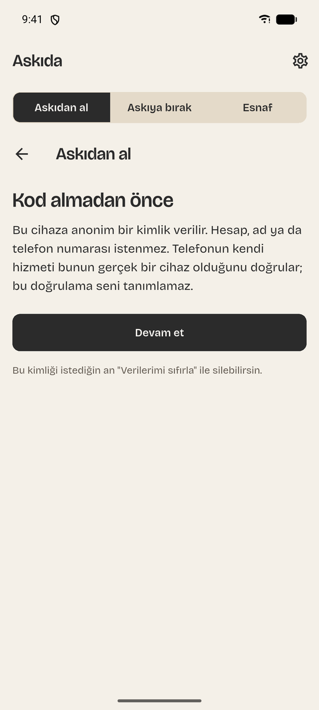 |  | 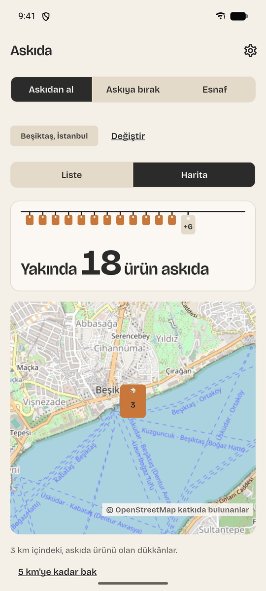 | 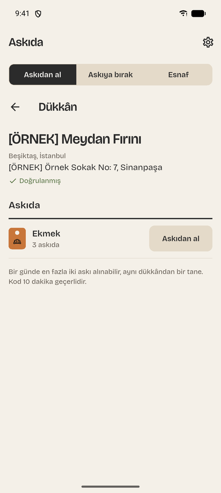 | 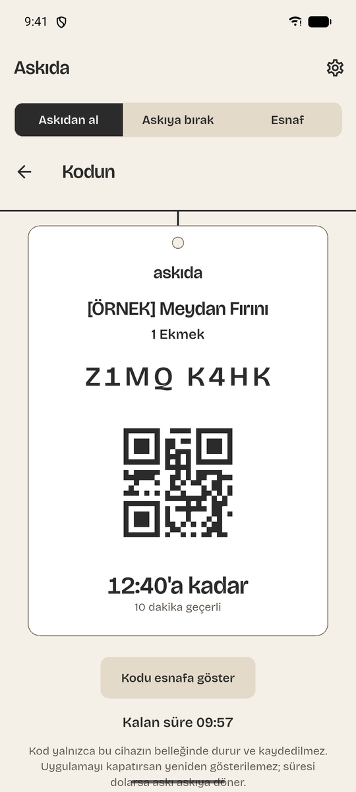 | 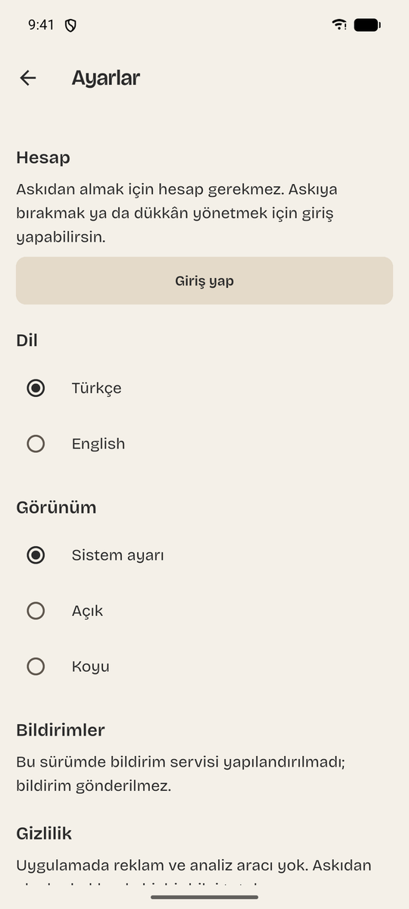 |

### Donor (Askıya bırak)

| Discover | Shop | Donate | Receipt | History | Impact |
| --- | --- | --- | --- | --- | --- |
|  | 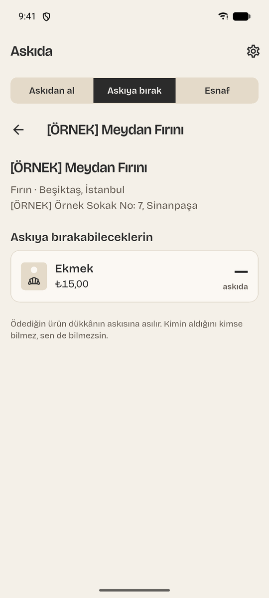 |  | 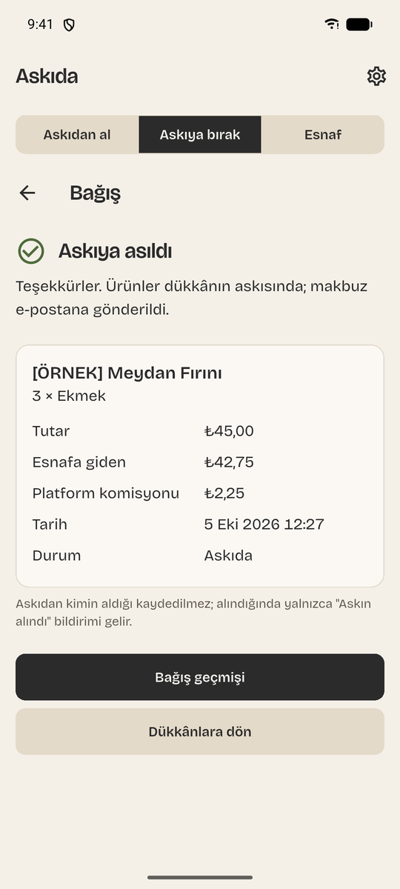 | 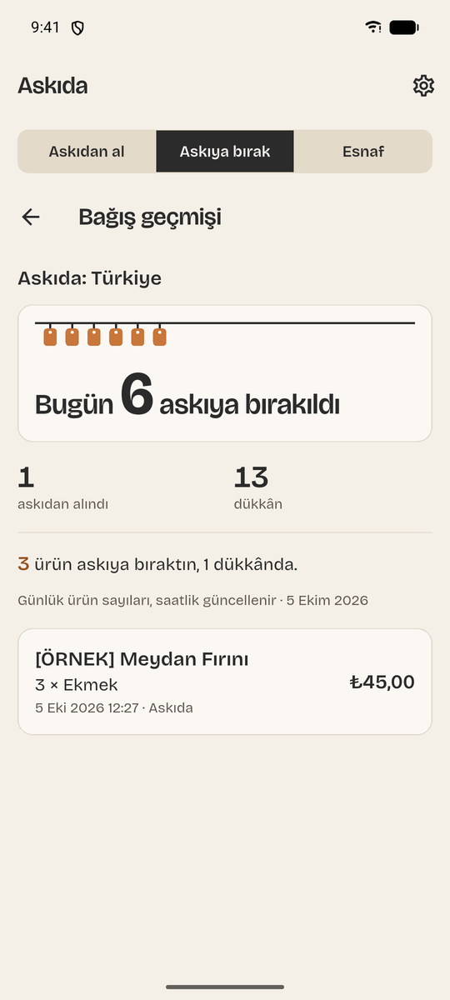 | 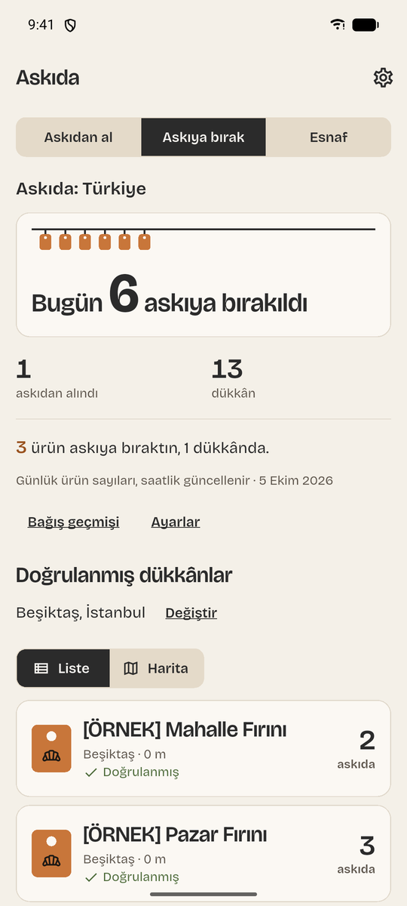 |

### Merchant (Esnaf)

| Shop onboarding | Catalog | Home | Redeem by code | Redeemed | Redemptions |
| --- | --- | --- | --- | --- | --- |
| 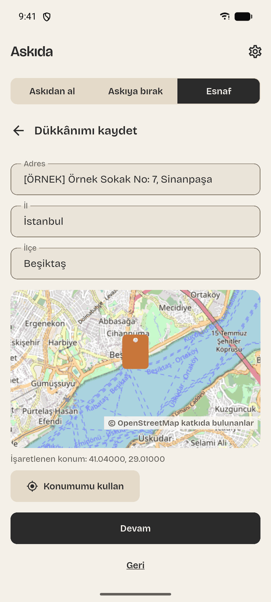 |  |  | 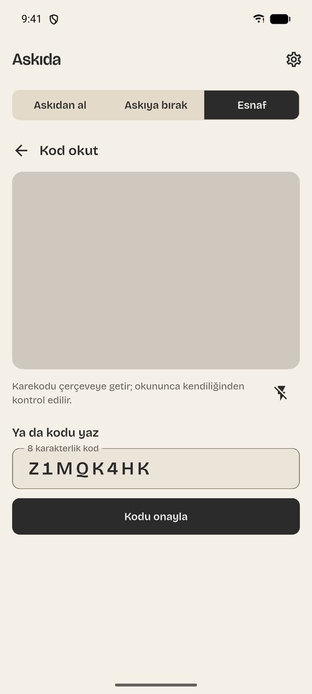 | 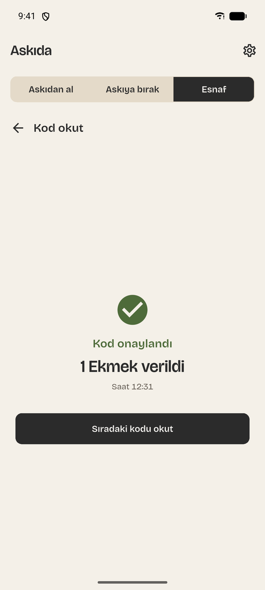 | 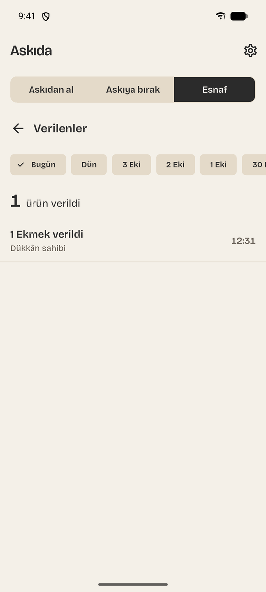 |

### Account, dark scheme and English

| Settings | Delete account | Dark: home | Dark: redemptions | English |
| --- | --- | --- | --- | --- |
| 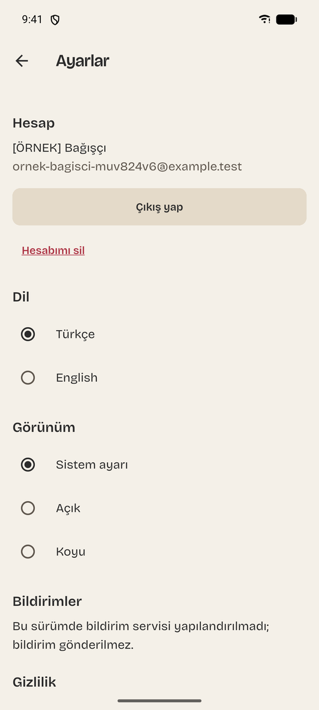 | 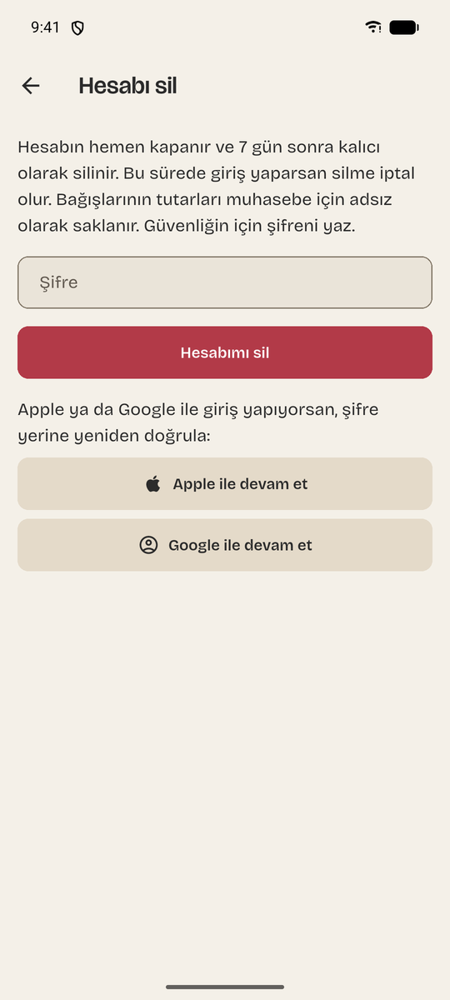 | 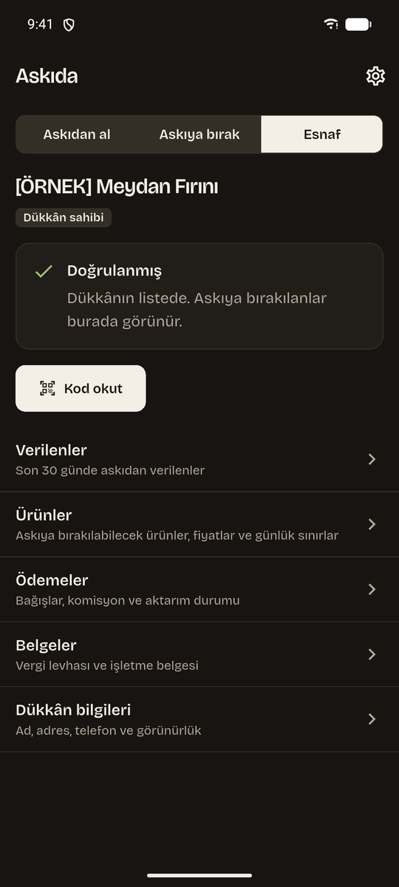 | 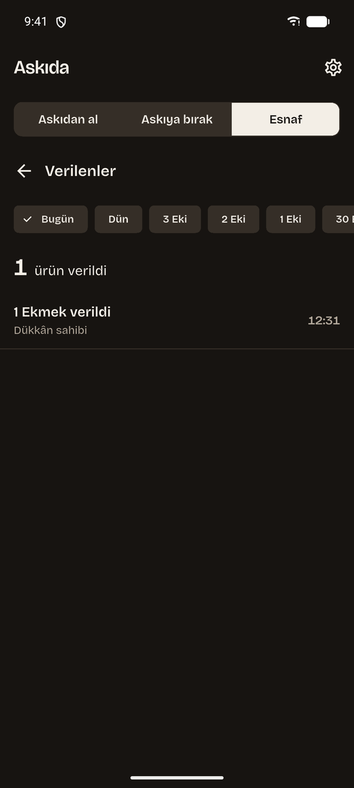 | 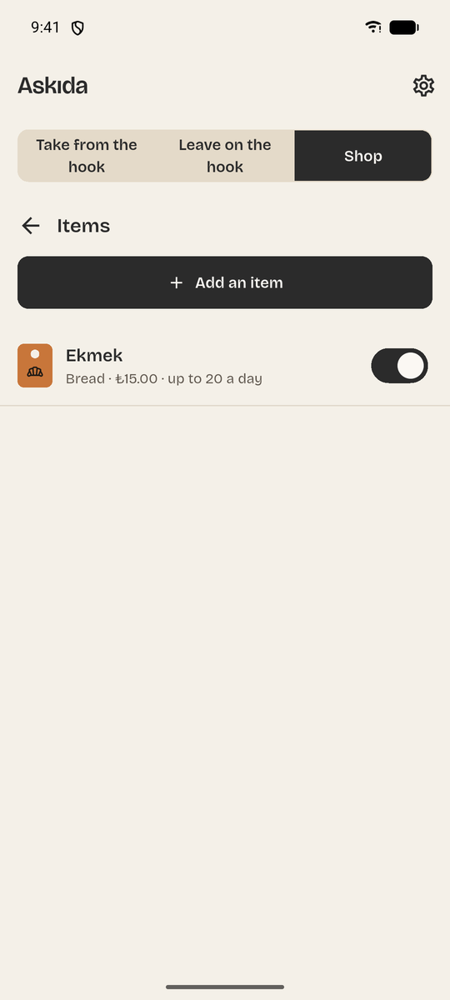 |

## Status

Phase 0 (foundation) is merged: the Laravel server runs in Docker (health route, Filament admin
panel, Horizon, Sanctum), the Flutter app is a skeleton with a design system, and the brand package,
ADR-0001 to ADR-0006, security matrix drafts and a CI workflow are in place. There are no API
endpoints, no payments and no screens beyond a mode shell yet. The iOS project is not built
(it needs macOS). Resolved versions are recorded in
[`docs/adr/0001-stack-and-versions.md`](docs/adr/0001-stack-and-versions.md).

## Getting started

The product and technical specification lives in this folder as `04-askida-flutter.md`. Contributor
rules and all commands are in [`CONTRIBUTING.md`](CONTRIBUTING.md).

Server (needs Docker; PHP runs only inside the containers), from this folder:

```sh
docker compose up -d --wait
docker compose exec server php artisan test
```

App (needs the Flutter SDK), from `app/`:

```sh
flutter pub get
flutter analyze
flutter test
dart format --set-exit-if-changed .
```
