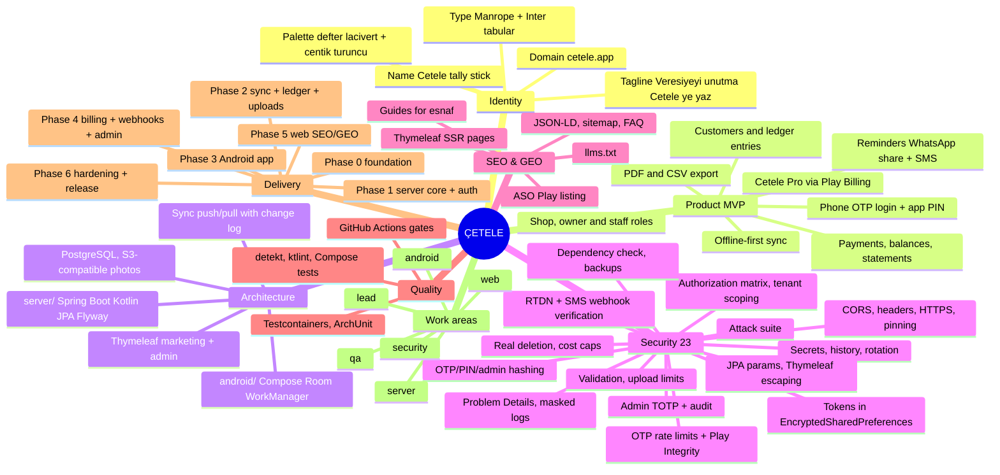

# ÇETELE — Product Specification
**Stack:** Kotlin (Android, Jetpack Compose) · Spring Boot 3 (Kotlin) · PostgreSQL · S3-compatible storage
**Product:** Offline-first digital "veresiye defteri" (credit ledger) for small shop owners — customers, debts, payments, reminders, multi-device sync.
**Owner:** Ayberk (`ayberkaarda/cetele`) · **Specification version:** 1.0 · **Language rule:** code, identifiers, commits, docs = English; all user-facing product copy = Turkish (tr-TR primary, en secondary).

---

## 0. Operating Contract (read before any action)

1. **Phase-gated delivery.** Work strictly in the phases of §10. At the end of every phase: **STOP and REPORT** using §11, then wait for Ayberk's explicit `devam`. Never start the next phase on your own.
2. **No silent scope expansion.** Anything not in §3 (MVP) is out of scope; propose it in the report instead of building it.
3. **No git operations without explicit approval.** Do not run `git add/commit/push/rebase/filter-repo/tag`. Propose Conventional Commit messages in each report (`feat(android): ...`, `feat(server): ...`, `chore(ci): ...`).
4. **No placeholders.** No `TODO`, `FIXME`, `lorem`, `YOUR_KEY_HERE`, stubbed functions, or fake "real" business data. `.env.example` / `application-example.yml` may contain documented dummy values; code may not.
5. **Work areas have exclusive owners** (§9). Cross-boundary needs go through `docs/handoffs/`.
6. **Money is integer minor units (kuruş) in `Long`/`BIGINT`, currency fixed to `TRY`.** Never `Double`/`Float` for amounts. Ledger entries are immutable; corrections are reversing entries.
7. **Decide, then record.** Engineering decisions inside scope are made by you and logged in `docs/adr/`. Ask Ayberk only when scope, cost, or legal exposure changes.
8. **Versions.** Latest stable at scaffold time (Kotlin, AGP, Compose BOM, Spring Boot, Gradle), pinned via version catalog (`gradle/libs.versions.toml`) and Spring BOM; resolved versions recorded in `docs/adr/0001-stack-and-versions.md`.

---

## 1. Mind Map



Every top-level branch is a section below.

---

## 2. Corporate Identity (decided — do not re-brainstorm)

| Element | Decision |
|---|---|
| Name | **Çetele** — the traditional tally stick esnaf used to record debts by notches |
| Tagline (tr) | **Veresiyeyi unutma, Çetele'ye yaz.** |
| Positioning | Bakkal, manav, kasap, berber, kahvehane ve küçük esnaf için çalışan, internet olmadan da yazan dijital veresiye defteri. |
| Audience | Small shop owners and their staff; mid/low-end Android devices; intermittent connectivity |
| Legal name | Çetele Yazılım |
| Domain | `cetele.app` (HSTS-preloaded TLD) |
| Application id | `app.cetele.android` |
| Play title | **Çetele: Veresiye Defteri** |
| Palette | Defter Lacivert `#1E2A5A` (primary) · Çentik Turuncu `#E8712B` (accent/CTA) · Kâğıt `#FAF7F0` (surface) · Mürekkep `#1A1A1A` (text) · Ödendi Yeşili `#2E8B57` (payment) · Borç Kırmızısı `#C0392B` (debt) · Kurşun `#6B7280` (muted) |
| Typography | Display: **Manrope** (700) · Body: **Inter** (400/500/600) with `tnum` for amounts; bundled in `res/font/`. Minimum body size 16 sp; large-touch targets ≥ 48 dp. |
| Logo concept | Four vertical tally strokes with the fifth diagonal stroke drawn as the cedilla of a large `Ç`. Icon: strokes in Kâğıt on Defter Lacivert. Deliver SVG + adaptive icon layers in `brand/`. |
| Tone of voice | Respectful "siz", plain Turkish, no fintech jargon: "Borç yaz", "Tahsilat al", "Hesap dökümü gönder". |
| Design tokens | `brand/tokens.json` → Compose `Theme.kt` (Material 3 color scheme, typography, shapes) and Thymeleaf CSS variables. |

---

## 3. Product Scope (MVP) and Non-Goals

### Personas
- **Sahip (owner):** registers the shop, full control, exports, manages staff, Pro subscription.
- **Çalışan (staff):** records debts/payments and views balances; cannot delete customers, export everything, or manage members.
- **Müşteri (customer):** not a user; receives statements/reminders via SMS or WhatsApp; may open a signed statement link in a browser.

### MVP user stories
1. Login by phone number + 6-digit SMS OTP (Turkish numbers, E.164). App PIN (6 digits) or biometric lock on every cold start after 2 minutes in background.
2. Create shop (name, type, il/ilçe); invite staff by phone number (invitation code, 24 h validity); roles `OWNER|STAFF`.
3. Customers: name, phone, note, tag; search; balance shown live; per-customer statement.
4. Ledger entries: `DEBT` or `PAYMENT`, amount (kuruş), occurred date, note, optional photo (handwritten note/receipt). Entries are immutable; "düzelt" creates a reversing entry linked by `reversed_by`.
5. Dashboard: today's debts/payments, total receivable, top 10 debtors, "bugün vadesi gelen" list (due dates on debts optional).
6. Reminders: (a) WhatsApp share intent with a templated Turkish message and a signed statement link; (b) SMS via provider (Netgsm or İleti Merkezi — pick in ADR-0003) only for customers with recorded consent (`sms_consent = true`, date and source stored); monthly SMS quota Free 30 / Pro 500.
7. Export: PDF statement per customer (`android.graphics.pdf.PdfDocument`), CSV of all entries; share sheet.
8. Offline-first: everything works without network; outbox syncs when online; multi-device (owner + staff) consistency; conflict handling per §4.
9. **Çetele Pro** (Google Play Billing subscription, monthly/yearly): unlimited customers (Free: 100), SMS quota, 2 000 photos/month, priority sync. Entitlement enforced server-side via RTDN + Play Developer API.
10. Account & shop deletion in-app and on web (`/hesap-silme`).
11. Web: marketing site, guides, legal pages, admin console (platform admins only).

### Non-goals
- Payment processing, POS integration, e-Fatura/GİB, inventory, iOS app (KMP is a v2 candidate), accountant portal, multi-currency, advertising.

---

## 4. Architecture

### Repository layout (single repo, two roots)
```
cetele/
  android/            Gradle project (Kotlin DSL, version catalog, modules below)
    app/              Compose UI, navigation, DI wiring
    core/domain/      entities, use cases (pure Kotlin, no Android deps)
    core/data/        Room, DataStore, sync engine, repositories
    core/network/     Ktor client, DTOs, auth interceptor
    core/designsystem/ theme from brand tokens, components
    feature/{auth,shop,customers,ledger,reminders,export,settings,billing}/
  server/             Spring Boot 3 (Kotlin), Gradle
    src/main/kotlin/app/cetele/server/{config,security,auth,tenancy,ledger,sync,reminders,billing,media,web,admin}
    src/main/resources/{db/migration (Flyway), templates (Thymeleaf), static}
  brand/              tokens.json, logo SVGs, adaptive icon sources
  docs/adr docs/security docs/ops docs/handoffs docs/seo docs/api
  .github/workflows
```

### Android
- Kotlin 2.x, Jetpack Compose + Material 3, single-activity, Hilt, Navigation Compose (type-safe routes), Room (with **SQLCipher** — key generated once, wrapped by Android Keystore AES-GCM, stored in EncryptedSharedPreferences), Proto DataStore (settings), WorkManager (sync, reminder scheduling, photo upload), Ktor client (OkHttp engine) + Kotlinx Serialization, Coil (photos), CameraX not required — `ActivityResultContracts.TakePicture` + on-device compression, Biometric (`androidx.biometric`), Play Billing Library 7+, Play Integrity API, `minSdk 26`, `targetSdk` latest, R8 full mode with mapping upload, `android:allowBackup="false"` + `dataExtractionRules` excluding DB/tokens, Baseline Profiles.
- Sync engine: local outbox of operations (`UUIDv7` ids, Lamport-style `client_seq`); ledger entries append-only → no conflicts; customer profile fields use last-writer-wins by server `updated_at`; deletions are tombstones. Pull uses a server change log cursor (`BIGINT`, monotonic per shop).

### Server
- Spring Boot 3 (Kotlin), Spring Web MVC, Spring Security (resource server with our own ES256 JWT + refresh tokens), Spring Data JPA (Hibernate, Kotlin JPA plugin), Flyway, PostgreSQL 16, Bean Validation, Bucket4j (rate limiting, Caffeine backend), springdoc-openapi (spec exported to `docs/api/openapi.json`), Thymeleaf (marketing + admin), AWS SDK v2 (S3-compatible: Cloudflare R2 or MinIO in dev; presigned URLs), Apache Tika (upload magic-byte checks), Thumbnailator (re-encode), Netgsm/İleti Merkezi client (`WebClient`), Micrometer + Prometheus, Logback JSON with masking, Testcontainers.
- Google Play: purchases verified with Play Developer API (`purchases.subscriptionsv2.get`); RTDN via Pub/Sub push subscription to `POST /v1/webhooks/play-rtdn`.
- Admin console: `/admin/**` Thymeleaf pages, form login for platform admins (email + Argon2id password + TOTP), audit log.
- Deployment: Docker image (Jib), reverse proxy with automatic TLS (Caddy) or Cloudflare; `docker-compose.yml` for local (Postgres 16, MinIO, server). Decide hosting in ADR-0002.

---

## 5. Data Model and API Surface

### Tables (Flyway V1__init.sql onward; ids UUIDv7; all tenant tables carry `shop_id`)
`users` (phone_e164 unique, display_name, created_at, deactivated_at) · `shops` (name, type, il, ilce, plan `FREE|PRO`, created_by, deleted_at) · `memberships` (shop_id, user_id, role `OWNER|STAFF`, unique) · `invitations` (shop_id, phone_e164, code_hash, expires_at, accepted_at) · `customers` (shop_id, name, phone_e164 nullable, note, tag, sms_consent boolean, sms_consent_at, sms_consent_source, deleted_at) · `ledger_entries` (shop_id, customer_id, client_id UUID unique, type `DEBT|PAYMENT`, amount_minor BIGINT CHECK > 0, currency CHAR(3) DEFAULT 'TRY', occurred_on DATE, due_on DATE nullable, note, photo_key nullable, reversed_by nullable, created_by, created_at) · `change_log` (shop_id, seq BIGSERIAL per shop via sequence table, entity, entity_id, op, payload jsonb, at) · `sync_outbox_receipts` (shop_id, device_id, client_seq, applied_at) · `otp_codes` (phone_e164, code_hmac, expires_at, attempts, consumed_at) · `refresh_tokens` (token_hash, user_id, device_id, expires_at, rotated_from, revoked_at) · `devices` (user_id, device_id, model, app_version, last_seen_at, integrity_verified_at) · `reminders` (shop_id, customer_id, channel `SMS|WHATSAPP`, template, status, provider_msg_id, sent_at, delivered_at) · `sms_quota` (shop_id, month, used) · `statement_links` (shop_id, customer_id, token_hash, expires_at, opened_at) · `subscriptions` (shop_id, purchase_token_hash, product_id, state, expires_at, linked_at) · `webhook_events` (provider, event_id unique, received_at, processed_at) · `admin_users` (email, password_hash, totp_secret_enc, role `ADMIN|SUPPORT`) · `audit_logs` (actor_type, actor_id, action, target, ip_hash, metadata) · `deletion_requests` (user_id, shop_id, requested_at, grace_until, completed_at).

### API (`/v1`, JSON, RFC 9457 Problem Details)
`POST auth/otp/request · POST auth/otp/verify · POST auth/refresh · POST auth/logout · GET me · PATCH me · DELETE me`
`POST shops · GET shops/{id} · PATCH shops/{id} · POST shops/{id}/invitations · POST invitations/{code}/accept · GET shops/{id}/members · DELETE shops/{id}/members/{userId}`
`POST shops/{id}/sync/push · GET shops/{id}/sync/pull?since={seq}&limit=500` (batch, idempotent by `client_id`)
`GET shops/{id}/customers/{customerId}/statement.pdf` (server-rendered fallback) · `POST shops/{id}/statement-links`
`POST shops/{id}/reminders (channel=SMS)` · `POST shops/{id}/media/presign`
`POST shops/{id}/billing/link (purchaseToken)` · `POST webhooks/play-rtdn` · `POST webhooks/sms-dlr`
`GET s/{token}` (public signed statement page, `noindex`)
`/admin/**` (Thymeleaf, platform admins)

---

## 6. Security — the 23-item checklist, mapped to this stack

1. **Anahtarları çıkar.** Impl: Android has no secrets (API base URL via `buildConfigField` from `local.properties`/CI env; Play Integrity needs no client secret; SQLCipher key generated on device); server reads secrets only from environment (`application.yml` uses `${ENV_VAR}` placeholders; no `application-prod.yml` in repo); `local.properties`, `keystore.properties`, `*.jks`, `.env*` gitignored; `gitleaks` pre-commit + CI. Verify: `gitleaks detect` clean; grep for `BEGIN PRIVATE KEY|AKIA|secretKey=` empty.
2. **.env'i geçmişten sil.** Impl: `docs/security/history-purge-runbook.md` with `git filter-repo` commands for `.env`, `local.properties`, `keystore.properties`, `*.jks`, `service-account*.json`, plus rotation list (DB password, JWT key pair, S3 keys, SMS API key, Play service account key). **Do not execute** (git operation → Ayberk). Verify: runbook present; CI history scan configured.
3. **İzin kurallarını yaz.** Impl: `server/.../security/Permissions.kt` (sealed class) + `docs/security/authorization-matrix.md`: `OWNER` (all shop actions), `STAFF` (customer read/create/update, entry create, reminder send, no delete-customer, no export-all, no members, no billing), platform `ADMIN` (support views, no ledger writes), `SUPPORT` (read-only). `PermissionEvaluator` bean used via `@PreAuthorize("@perm.can(#shopId, 'LEDGER_WRITE')")`. Verify: table-driven tests over every matrix cell.
4. **Yetkiyi sunucuda tut.** Impl: `shop_id` always derived from the caller's membership, never from the body; every repository query includes `shop_id`; ArchUnit rule: every `@Repository` method touching tenant entities must accept `shopId`. Android gates UI by role but the server is authoritative. Verify: tenant-isolation tests (shop A token cannot read/write shop B data → 404).
5. **Girişe sınır koy.** Impl: Bucket4j: `otp/request` 3 per 10 min per phone and 10 per 10 min per IP; `otp/verify` 5 attempts per code then code invalidated; `refresh` 30/min per device; `otp/request` additionally requires a valid Play Integrity token (blocks SMS pumping from scripts); IP from trusted proxy header only. Verify: 4th OTP request → 429 with `Retry-After`; missing integrity token → 403.
6. **Girdiyi doğrula.** Impl: Bean Validation on all DTOs (`@Pattern` E.164, `@Min(1) @Max(100_000_000_00)` amounts, name 1..80, note ≤ 500, batch size ≤ 500 ops), Jackson `FAIL_ON_UNKNOWN_PROPERTIES=true`, `spring.servlet.multipart.max-file-size=0` (no multipart; uploads go to storage directly), request body limit 1 MB (`server.tomcat.max-swallow-size`, filter). Android: validators in ViewModels + Room `CHECK` constraints. Verify: negative tests per constraint.
7. **Yüklemeyi sınırla.** Impl: photos only; client compresses to ≤ 1600 px JPEG ≤ 1 MB, strips EXIF; server presign requires `Content-Length ≤ 1_200_000` and `Content-Type image/jpeg|image/webp`; post-upload job verifies magic bytes (Tika), re-encodes (Thumbnailator) and deletes the original; quota Free 200 / Pro 2 000 photos per month. Verify: renamed PDF rejected; oversize rejected at presign.
8. **CORS'u kilitle.** Impl: API has no browser clients → CORS disabled (no `Access-Control-Allow-Origin` ever); marketing/admin are same-origin; public statement page `GET s/{token}` is plain HTML. Verify: preflight from any origin gets no CORS headers.
9. **Güvenlik başlıkları.** Impl: Spring Security headers: HSTS (`max-age=63072000; includeSubDomains; preload`), CSP with per-request nonce (`CspNonceFilter` + `th:attr="nonce=${cspNonce}"`), `frame-ancestors 'none'`, `X-Content-Type-Options: nosniff`, `Referrer-Policy: strict-origin-when-cross-origin`, `Permissions-Policy: camera=(), geolocation=(), microphone=()`; API responses `Cache-Control: no-store`. Verify: header assertion test in `WebTestClient`.
10. **HTTPS zorunlu.** Impl: TLS at Caddy/Cloudflare; `server.forward-headers-strategy=native`; `requiresChannel().anyRequest().requiresSecure()` in prod profile; Android `network_security_config.xml` (`cleartextTrafficPermitted="false"`), `usesCleartextTraffic="false"`, OkHttp `CertificatePinner` with primary + backup SPKI pins and a documented rotation date (toggle in `BuildConfig`, on in release). Verify: `http://` API call fails on device; pinning test with wrong pin fails.
11. **Şifreleri hash'le.** Impl: OTP stored as `HMAC-SHA256(pepper, phone || code)` with 5-min TTL, single use; app PIN hashed on device with Argon2id (Bouncy Castle `Argon2BytesGenerator`, m=32 MiB, t=3, salt in Keystore-encrypted prefs) — never sent to server; admin passwords `Argon2PasswordEncoder(16, 32, 1, 65536, 3)`; refresh tokens and statement-link tokens stored as SHA-256. Verify: DB contains only hashes; PIN never appears in network logs.
12. **Çerezi güvenli yap.** Impl: admin console cookie `__Host-CETELE_ADMIN` (HttpOnly, Secure, SameSite=Strict, Path=/) + Spring CSRF; sessions 30 min idle; Android tokens in `EncryptedSharedPreferences` (Keystore-backed), access JWT 15 min in memory, refresh 60 days rotated with reuse detection; tokens wiped on logout/deletion; `allowBackup=false`. Verify: cookie attributes asserted; refresh reuse revokes the token family (test).
13. **Hata mesajını kıs.** Impl: `@RestControllerAdvice` → RFC 9457 `ProblemDetail` with generic `title`, machine `code`, `traceId`; `server.error.include-stacktrace=never`, `include-message=never`, `include-binding-errors=never` (field errors returned as codes only); Android maps `code` → Turkish strings. Verify: forced exception returns generic body only.
14. **Logları temizle.** Impl: Logback JSON encoder + masking converter (phone → `+90*******12`, names/notes never logged, amounts not logged at INFO, OTP never logged, `Authorization`/cookies dropped); MDC `traceId`; retention 30 days documented; Android release build strips `Log.*` via R8 rules and Timber has a release tree that logs only anonymized codes; Sentry `beforeSend` scrub on both. Verify: log sample of OTP + sync flow contains no phone/code/token.
15. **Sorguyu parametrele.** Impl: Spring Data JPA derived queries and JPQL with named params; native queries only via `@Query(nativeQuery = true)` with `:params`; no `EntityManager.createNativeQuery(String)` concatenation (ArchUnit rule forbids `createNativeQuery` outside an allowlisted class); Room `@Query` bind params only. Verify: ArchUnit test green; grep for `"SELECT ... " +` empty.
16. **XSS'e karşı kaçır.** Impl: Thymeleaf `th:text` everywhere (`th:utext` forbidden by a unit test scanning templates); CSP nonce; statement page renders customer/shop names escaped; PDF export escapes text; Android uses no WebView. Verify: stored `<script>` in customer name renders as text on the statement page.
17. **Webhook imzası.** Impl: (a) `POST /v1/webhooks/play-rtdn`: verify Google-signed OIDC JWT in `Authorization: Bearer` (issuer `https://accounts.google.com`, audience = configured endpoint URL, `email` = configured Pub/Sub service account, signature via Google JWKS), then re-verify the purchase through Play Developer API — never trust the notification body alone; idempotency by `messageId`; (b) `POST /v1/webhooks/sms-dlr`: HMAC-SHA256 over the raw body with a per-provider secret in header `X-Cetele-Signature`, timestamp header within ±5 min, replay cache on `provider_msg_id`, source IP allowlist as defence in depth; both return 200 fast and process asynchronously. Verify: tests for missing/invalid JWT, wrong audience, replayed message, bad HMAC, stale timestamp.
18. **Admin'e rol koy.** Impl: `admin_users` separate from `users`; `/admin/**` requires `ADMIN|SUPPORT` + TOTP (`dev.samstevens.totp`) at login; `SUPPORT` read-only; every admin action → `audit_logs`; no admin ability to read ledger notes/photos (support sees counts and metadata only). Verify: role tests; audit row assertions.
19. **Paketleri denetle.** Impl: Gradle `org.owasp.dependencycheck` (fail on CVSS ≥ 7) for both roots, `com.github.ben-manes.versions` report, Renovate (`gradle`, `github-actions`), version catalog with pinned versions, CycloneDX SBOM task; Spring Boot BOM managed. Verify: CI workflow + report artifact.
20. **Otomatik yedek.** Impl: `docs/ops/backup-restore.md`; `ops/backup/backup.sh` (`pg_dump -Fc` daily + WAL archiving with `pgBackRest` when self-hosted, or managed PITR — ADR-0002), encrypted with `age`, uploaded to a separate write-only bucket with 30-day retention; storage bucket versioning for photos; monthly restore drill; CI `restore-drill.yml` restores the latest dump into Testcontainers and asserts row counts + a ledger balance checksum. Android: optional encrypted local export (`.cetele` file, AES-256-GCM with user passphrase via Argon2id). Verify: drill output; export/import round-trip test.
21. **Hesabı gerçekten sil.** Impl: `Ayarlar → Hesabı ve dükkânı sil` (Play account-deletion policy) and `cetele.app/hesap-silme`: OTP re-verify → 14-day grace (esnaf accidental deletes) → hard delete: customers, ledger entries, reminders, statement links, photos in storage, device rows; SMS logs anonymized; subscription: cannot be cancelled server-side → show Play instructions and mark `subscriptions.state = ORPHANED`; `deletion_requests.completed_at`; audit row without PII; local SQLCipher DB wiped and key destroyed. Owner deletion with other members: transfer ownership prompt or delete shop entirely (owner choice). Verify: e2e test asserts zero rows reference the shop after completion.
22. **Harcama uyarısı kur.** Impl: `docs/ops/cost-alerts.md` (hosting budget, DB size, storage size/egress, SMS provider balance, Play Integrity quota); server job `SmsBalanceMonitor` (daily) alerts by email when provider credit < threshold or < 20 %; hard caps: per-shop monthly SMS quota, global daily SMS cap (config), presign quota; alerts via Resend email + log. Verify: monitor tests with mocked provider balance.
23. **Saldırgan gibi dene.** Impl: `docs/security/threat-model.md` (tenant isolation, OTP brute force, SMS pumping/toll fraud, IDOR, sync replay/tampering, rooted-device data theft, re-signed APK abuse, statement-link enumeration, webhook forgery); `server/src/test/kotlin/.../security/AttackSuiteTest.kt` (RestAssured): IDOR matrix, OTP brute force, integrity-token bypass, spoofed `X-Forwarded-For`, JWT alg/kid tampering, refresh reuse, oversize batches, MIME spoof, webhook forgery/replay, statement-token guessing; OWASP ZAP API scan with `docs/api/openapi.json`; MobSF scan of release AAB/APK (exported components, backup flags, cleartext, pinning); documented in `docs/security/pentest-report.md` with fixes and retest. Verify: report present; all findings closed or accepted with reason.

---

## 7. SEO and GEO (web = Thymeleaf pages on the server)

### Information architecture
`/` · `/ozellikler` · `/fiyatlandirma` · `/esnaf-icin` (per-trade landing: bakkal, manav, kasap, berber — 4 pages) · `/rehber/[slug]` (guides: "Veresiye defteri nasıl tutulur", "Alacak takibi için 7 kural", "Müşteriye borç hatırlatma mesajı örnekleri", "KVKK: müşteri telefonunu saklamak", "Bakkal için dijital defter") · `/sss` · `/hakkinda` · `/gizlilik` · `/kvkk-aydinlatma` · `/hesap-silme` · `/iletisim` · `/s/{token}` (statement, `noindex, nofollow`) · `/admin/**` (`noindex`, robots disallow).

### Technical SEO
- Server-side rendered Thymeleaf with semantic HTML; per-page `<title>` ≤ 60, description ≤ 155 (Turkish); canonical; `hreflang` `tr-TR` + `x-default`; `sitemap.xml` generated by a controller from a route registry; `robots.txt` disallowing `/admin`, `/s/`; OG/Twitter meta with static brand image; JSON-LD `Organization`, `MobileApplication` (Android, `applicationCategory: BusinessApplication`, `offers` Free/Pro), `FAQPage` on `/sss`, `Article` on guides, `BreadcrumbList`; Core Web Vitals: critical CSS inlined, fonts self-hosted `font-display: swap`, WebP images with dimensions, resource chain with content hashes, gzip/brotli at proxy; Lighthouse CI budgets (performance/SEO/accessibility ≥ 90).
- App linking: `/.well-known/assetlinks.json` for `app.cetele.android` (paths `/s/*`, `/invite/*`); Android `intent-filter` with `autoVerify`.

### GEO
- `/llms.txt` and `/llms-full.txt` (definition, audience, features, pricing, links); each page opens with a 40–60 word definitional paragraph ("Çetele, küçük esnafın veresiye…"); `/sss` with 15 Turkish Q&A pairs mirrored in JSON-LD; consistent facts across `/hakkinda`, `llms.txt`, JSON-LD; honest `dateModified`; guides written as answer-first, quotable sections.

### ASO (`docs/seo/aso.md`)
Play title "Çetele: Veresiye Defteri"; short description "Esnafın dijital veresiye defteri. İnternetsiz çalışır."; keywords: veresiye defteri, alacak takibi, esnaf, bakkal, tahsilat, borç defteri, müşteri borcu; feature graphic concept; 6 screenshots with Turkish captions; Data Safety form must match implementation (phone numbers of customers = user-provided data, encrypted in transit and at rest, deletable).

---

## 8. Quality, Testing, CI, Observability

- Android: detekt + ktlint + Compose lint; unit tests (JUnit 5, MockK, Turbine, kotlinx-coroutines-test) for use cases, sync engine (conflict/tombstone/idempotency scenarios), money formatting; Room tests (Robolectric, SQLCipher); Compose UI tests for auth, ledger entry, statement; Paparazzi screenshot tests for key screens; Baseline Profile generation.
- Server: JUnit 5 + Testcontainers (PostgreSQL) + `WebTestClient`; ArchUnit (tenant scoping, no native query concatenation, layering); contract test that the running app's OpenAPI matches `docs/api/openapi.json`; Flyway migration test from V1 to head.
- CI (`.github/workflows/ci.yml`): Android (lint, unit, assembleRelease unsigned) and server (test, dependency-check, jib build) jobs; `gitleaks`; ZAP API scan on a compose-up stack; MobSF steps documented for manual/optional run.
- Observability: Sentry (Android + server) scrubbed; Micrometer → Prometheus; JSON logs with `traceId`; `/actuator/health` public (no details), other actuator endpoints internal only.
- Accessibility: TalkBack labels, min 48 dp targets, 16 sp text, contrast ≥ 4.5:1; Turkish first, English secondary via `strings.xml` (`values`, `values-en`).

---

## 9. Work Ownership and Repository Conventions

| Owner | Owns (exclusive write) | Reads |
|---|---|---|
| `lead` | `docs/adr/**`, `docs/handoffs/**`, `docs/api/**`, `brand/**`, `CONTRIBUTING.md`, root configs, `docker-compose.yml` | everything |
| `server` | `server/**` except web paths | ADRs, brand |
| `android` | `android/**` | `docs/api/openapi.json`, brand |
| `web` | `server/src/main/resources/templates/**`, `server/src/main/resources/static/**`, `server/src/main/kotlin/app/cetele/server/web/**`, `docs/seo/**` | brand, ADRs |
| `security` | `docs/security/**`, `server/src/test/kotlin/app/cetele/server/security/**`, `.github/workflows/security.yml`, `ops/backup/**` | everything (read-only elsewhere) |
| `qa` | `android/app/src/androidTest/**`, `server/src/test/kotlin/app/cetele/server/contract/**`, `.github/workflows/ci.yml` | everything |

Rules: cross-boundary needs → `docs/handoffs/<from>-to-<to>-<NNN>.md`; API contract changes → `server` updates `docs/api/openapi.json` via `lead`; git operations follow the approval rule in §0.

---

## 10. Delivery Phases and Gates

Each phase ends with **STOP → REPORT (§11) → wait for `devam`**.

**Phase 0 — Foundation.** Repo layout, Gradle projects for `android/` and `server/`, version catalog, `CONTRIBUTING.md` (§13), ADR-0001 (stack/versions), ADR-0002 (hosting), ADR-0003 (SMS provider), `brand/` tokens + logo + adaptive icon, `docker-compose.yml`, CI skeleton, authorization matrix draft, threat-model outline. Gate: both projects build.

**Phase 1 — Server core + auth + security baseline (items 1, 3–6, 8–15).** Flyway schema, tenancy, OTP auth with Play Integrity, JWT/refresh rotation, rate limits, validation, headers, CSP, Problem Details, masked logging, permissions module + matrix tests, tenant-isolation tests. Gate: tests green; verification notes.

**Phase 2 — Sync, ledger, reminders, media (items 7, 21 partial).** Sync push/pull with change log, ledger + customers + reversing entries, statement links + statement page + server PDF fallback, reminders (SMS provider client, consent checks, quota), presign + post-processing, deletion request flow. Gate: sync scenario tests (offline edits from two devices converge); OpenAPI exported.

**Phase 3 — Android app.** Compose design system, auth + PIN/biometric lock, shop/members, customers, ledger, dashboard, reminders (WhatsApp share, SMS request), PDF/CSV export, offline-first sync engine with WorkManager, settings + deletion, SQLCipher, pinning. Gate: UI tests + sync unit tests green; release build assembles; MobSF baseline notes.

**Phase 4 — Billing, webhooks, admin (items 17, 18).** Play Billing integration, purchase linking, RTDN endpoint + Play Developer API verification, SMS DLR webhook, entitlement enforcement, admin console with TOTP and audit. Gate: webhook and entitlement tests green.

**Phase 5 — Web SEO/GEO (§7).** Marketing pages, 4 trade landings, 5 Turkish guides (≥ 600 words each), legal pages, sitemap/robots/JSON-LD/hreflang, `llms.txt`, assetlinks, Lighthouse CI. Gate: Lighthouse ≥ 90 on 5 pages; JSON-LD validates.

**Phase 6 — Hardening and release readiness (items 2, 19, 20, 22, 23 + matrix).** Attack suite, ZAP, MobSF report, dependency-check, backups + restore drill, cost alerts + SMS balance monitor, history-purge runbook, ASO doc, Play listing copy (tr/en), Data Safety mapping, final **23-item verification matrix**. Gate: FINAL REPORT.

---

## 11. Report Template (use verbatim at every gate)

```
# Çetele — Phase <N> Report
## Summary (5 lines max)
## Files created / modified (grouped by owner, full paths)
## Decisions & ADRs added
## Security checklist status
| # | Item | Status (done / partial / not-started) | Evidence (test name, doc path) |
## SEO/GEO status (Phase 5+)
## Tests executed (command + result counts)
## Known gaps / risks
## Open questions / proposals (scope, cost, legal)
## Proposed Conventional Commits (not executed)
## Next phase preview (3 lines)
STOPPED — waiting for "devam".
```

---

## 12. Definition of Done (final)

- 23/23 items **done** with evidence; SEO/GEO checklist complete; every MVP story demonstrable (UI tests + server tests).
- No placeholders (CI grep gate `TODO|FIXME|lorem|YOUR_`); no `Double` amounts (detekt custom rule).
- `./gradlew check` green in both roots; dependency-check no CVSS ≥ 7; `gitleaks` clean.
- Docs: ADRs, authorization matrix, threat model, pentest report, backup/restore runbook, cost alerts, ASO, Play listing, KVKK texts (aydınlatma metni includes the shop-as-data-controller explanation and SMS consent wording).
- Release: signed AAB config (Play App Signing), internal testing track notes, server Docker image, Caddy config.

---

## 13. `CONTRIBUTING.md` to create in Phase 0 (fill completely)

```
# Çetele — Contributor Rules
- Language: code/docs/commits English; product copy Turkish (tr-TR), English secondary.
- Phase discipline per the product spec (§10); stop and report at gates; wait for "devam".
- Never run git commands. Propose Conventional Commits in reports.
- Money = Long minor units (kuruş), TRY only; ledger entries immutable (reversals).
- No placeholders; sample data only when clearly labeled [ÖRNEK].
- Ownership table (copy of spec §9); handoffs via docs/handoffs/.
- Security: 23-item checklist is a hard requirement; docs/security/verification-matrix.md maintained.
- Commands: android: ./gradlew :app:assembleDebug | :app:testDebugUnitTest | :app:connectedDebugAndroidTest | detekt ; server: ./gradlew test | bootRun | dependencyCheckAnalyze | jibDockerBuild ; docker compose up
- Env: server secrets via environment only; android via local.properties (gitignored) — documented keys in docs/ops/env.md.
- Parallel work only on disjoint ownership sets (§9).
```
