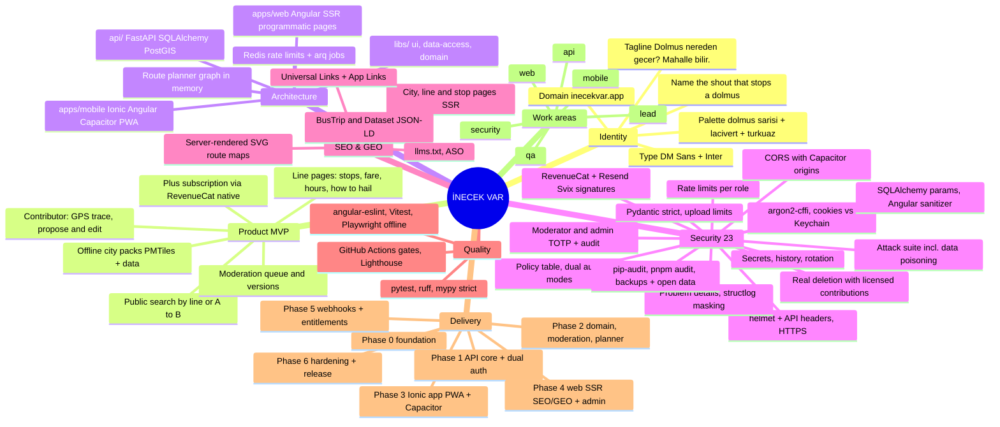

# İNECEK VAR — Product Specification
**Stack:** Ionic (Angular + Capacitor, PWA-first) · Angular SSR web · FastAPI (Python) · PostgreSQL + PostGIS · Redis
**Product:** Crowdsourced dolmuş / minibüs / servis route map for Turkish cities — lines, stops, fares, hours, A→B planning with transfers, offline city packs.
**Owner:** Ayberk (`ayberkaarda/inecekvar`) · **Specification version:** 1.0 · **Language rule:** code, identifiers, commits, docs = English; all user-facing product copy = Turkish (tr-TR primary, en secondary).

---

## 0. Operating Contract (read before any action)

1. **Phase-gated delivery.** Work strictly in the phases of §10; at the end of every phase **STOP and REPORT** (§11) and wait for Ayberk's explicit `devam`.
2. **No silent scope expansion.** Anything not in §3 is out of scope; propose it in the report.
3. **No git operations without explicit approval.** Never run `git add/commit/push/rebase/filter-repo/tag`; propose Conventional Commit messages (`feat(mobile): ...`, `feat(web): ...`, `feat(api): ...`, `chore(ci): ...`).
4. **No placeholders.** No `TODO`, `FIXME`, `lorem`, `YOUR_KEY_HERE`, stubs, or fabricated real routes. **Never invent real-world line data.** Development seeds are a small, clearly labeled sample set (`is_sample = true`, city `[ÖRNEK] Test Şehri`); production data comes from contributors and moderators.
5. **Work areas have exclusive owners** (§9); cross-boundary needs go through `docs/handoffs/`.
6. **Contributor privacy.** Raw GPS traces are private to their owner and moderators, deleted 30 days after the derived line version is published, and never exposed through public endpoints; logs round coordinates to 3 decimals.
7. **Decide, then record.** In-scope engineering choices are yours; log them in `docs/adr/`. Ask Ayberk only for scope, cost, or legal changes (data licence, city coverage).
8. **Versions.** Latest stable Angular, Ionic, Capacitor, Nx, Python 3.12+, FastAPI at scaffold time; pin (`pnpm-lock.yaml`, `uv.lock`); record resolved versions in `docs/adr/0001-stack-and-versions.md`.

---

## 1. Mind Map



Every top-level branch is a section below.

---

## 2. Corporate Identity (decided — do not re-brainstorm)

| Element | Decision |
|---|---|
| Name | **İnecek Var** (the phrase passengers shout to stop a dolmuş); wordmark `İNECEK VAR`, short form `İnecekVar` |
| Tagline (tr) | **Dolmuş nereden geçer? Mahalle bilir.** |
| Positioning | Resmî verisi olmayan dolmuş, minibüs ve servis hatlarını mahallelinin birlikte haritaladığı, çevrimdışı da çalışan hat rehberi. |
| Audience | Commuters and students in İstanbul, İzmir, Ankara, Bursa, Antalya; newcomers; low-end Android users (PWA-first) and iPhone users |
| Legal name | İnecek Var Teknoloji |
| Domain | `inecekvar.app` (web) · `app.inecekvar.app` (PWA) · `api.inecekvar.app` |
| Application id / bundle id | `app.inecekvar.mobile` |
| Store title | **İnecek Var: Dolmuş & Minibüs Hatları** |
| Palette | Dolmuş Sarısı `#F2B705` (primary) · Lacivert `#14213D` (dark surface/text) · Krem `#FFF8E7` (surface) · Turkuaz `#2AB7CA` (secondary, İstanbul minibüs stripe) · Yol Grisi `#6C757D` (muted) · Fren Kırmızısı `#D7263D` (danger) · Onay Yeşili `#2E8B57` (published) |
| Typography | Display: **DM Sans** (700) · Body/UI: **Inter** (400/500/600) with `tabular-nums` for fares; self-hosted in both apps |
| Logo concept | A rounded yellow bus-sign badge with the wordmark; the dot of `İ` is a bus-stop circle with a lacivert ring. Icon: badge on Lacivert. Deliver SVG + icon sets in `brand/`. |
| Tone of voice | Street-smart, playful, clear: "Hat nereden geçer?", "İnecek var!", "Bu hat değişti mi? Söyle." Light İstanbul argosu allowed ("ustam" only in playful microcopy). |
| Design tokens | `brand/tokens.json` → `libs/ui` (Ionic CSS variables + Tailwind for web) |

---

## 3. Product Scope (MVP) and Non-Goals

### Personas
- **Yolcu:** searches lines or A→B; no account; installs PWA or native app; downloads a city pack.
- **Katkıcı (contributor):** account; records a ride as a GPS trace; proposes lines, stops, fares, hours; edits; earns reputation.
- **Moderatör:** reviews proposals, publishes versions, rolls back vandalism, verifies fare updates.

### MVP user stories
1. Public search: by line code/name or free text; A→B by typing places or tapping the map (geocoding via a keyless local index of stops + neighbourhoods; no external geocoder in MVP); nearby lines using device location (when-in-use).
2. Line page: polyline on the map, ordered stops, fare (TRY, with "son güncelleme" date), hours text, payment methods (`nakit|kart|İstanbulkart`), how-to-hail notes, last verified date, contributor count; report button ("Bu hat değişti").
3. A→B planner: up to 3 itineraries, max 2 transfers (walking edges ≤ 300 m between stops), estimated fare; server-side graph; results cached 10 min per city/origin/destination cell.
4. Offline city packs: line/stop dataset JSON per city + PMTiles basemap for the city bbox; installed via Capacitor Filesystem (native) or Cache Storage (PWA); free tier: 1 city; Plus: unlimited.
5. Contributor: email + password (argon2id) or magic link; record trace (foreground geolocation while riding, points simplified on device with Douglas–Peucker, ≤ 5 000 points), mark stops while riding, submit proposal with fare/hours/notes and optional photo of the fare table or stop sign; edit existing lines (diff-based proposals).
6. Moderation: queue with map diff, approve → new `line_version` (immutable), reject with reason, rollback to any version; contributors cannot approve their own proposals; reputation increases per accepted proposal; new accounts limited to 10 proposals/day.
7. Favorites: local for guests, synced for signed-in users.
8. **Plus** (RevenueCat, native only; web stays free): unlimited offline cities, supporter badge; entitlement enforced server-side for pack downloads beyond the first city.
9. Open data: weekly public export per city (GeoJSON, CC BY 4.0 — licence decided in ADR-0003) at `/veri`; contributors accept the licence on first submission.
10. Account deletion in-app and on web (`/hesap-silme`); contributions stay under the licence, anonymized.
11. Web (Angular SSR): city hubs, line/stop programmatic pages with server-rendered SVG maps, guides, legal pages, admin/moderation UI.

### Non-goals
- Real-time vehicle tracking, ticketing, ride-hailing, official-data claims, ads, driver accounts, push notifications (v2), routing across cities.

---

## 4. Architecture

### Repository layout (Nx workspace + separate Python API)
```
inecekvar/
  apps/mobile/     Ionic 8 + Angular (standalone, signals) + Capacitor; PWA at app.inecekvar.app
  apps/web/        Angular SSR (server routes, prerender for line pages) at inecekvar.app; /admin area
  libs/ui/         design tokens, shared components (Angular)
  libs/domain/     TS types generated from api/openapi.json (openapi-typescript)
  libs/data-access/ API client (fetch + signals), auth strategies (cookie vs bearer)
  api/             FastAPI (Python 3.12+, uv), app/{core,auth,security,cities,lines,stops,edits,traces,media,planner,billing,webhooks,admin,export}
  api/alembic/     migrations
  ops/             Caddyfile, backup scripts, PMTiles build scripts (Planetiler/tilemaker recipe)
  brand/  docs/adr docs/security docs/ops docs/handoffs docs/seo docs/api
  .github/workflows  docker-compose.yml
```

### Mobile / PWA (`apps/mobile`)
- Ionic 8 + Angular (standalone components, signals, `@angular/service-worker` with `ngsw-config.json` caching app shell + data packs), Capacitor plugins: `@capacitor/geolocation`, `@capacitor/filesystem`, `@capacitor/preferences` (non-sensitive prefs only), `@capacitor/network`, `@capacitor/share`, `@capacitor/app` (deep links), a Keychain/Keystore-backed secure storage plugin (choose in ADR-0004; `capacitor-secure-storage-plugin` is the default candidate) for the native refresh token, `@revenuecat/purchases-capacitor` (native only), MapLibre GL JS + `pmtiles` protocol (no API keys), Transloco (tr default, en), `capacitor.config.ts` with `server.androidScheme = 'https'`.
- Auth strategy by runtime: **web/PWA** → HttpOnly session cookie (same-site via reverse proxy path `https://app.inecekvar.app/api/*` → API) + CSRF header; **native** → bearer access token in memory + refresh token in secure storage. One `AuthStrategy` interface in `libs/data-access`.

### Web (`apps/web`)
- Angular SSR with server routes: line/stop/city pages `RenderMode.Server` with an in-memory + Redis page cache (10 min) and prerender for guides/static pages; server-rendered SVG polyline maps (no client JS needed for SEO pages; interactive MapLibre map loads only on user action); `helmet` on the Express server; `/admin` lazy module (role-guarded UI; enforcement is in the API).

### API (`api/`)
- FastAPI, Pydantic v2 (`extra='forbid'`), SQLAlchemy 2 async + GeoAlchemy2 + `asyncpg`, Alembic, PostgreSQL 16 + PostGIS, Redis (rate limiting, planner cache, page cache), `arq` workers (planner graph rebuild, exports, deletion, backup verify, webhook processing), `argon2-cffi`, `PyJWT` (ES256), `pyotp`, `structlog`, `httpx` (RevenueCat REST, Resend), object storage via `aioboto3` presigned PUT (Cloudflare R2), `Pillow` (photo re-encode), `shapely` (simplification/validation), `networkx` (planner graph, rebuilt per city on publish and cached in process + serialized to Redis).
- Deployment: Docker (api, worker), Caddy with automatic TLS (`inecekvar.app`, `app.`, `api.`), `docker-compose.yml` for local (Postgres+PostGIS, Redis, MinIO, api, worker, web, mobile dev server). Hosting in ADR-0002.

---

## 5. Data Model and API Surface

### Tables (Alembic; ids UUIDv7; `created_at/updated_at`)
`cities` (name, slug, bbox geometry, centroid, timezone, is_sample, pack_version) · `lines` (city_id, code, name, slug, mode `dolmus|minibus|servis`, status `draft|published|retired`, current_version_id, contributor_count, last_verified_at) · `line_versions` (line_id, version_no, geom LINESTRING, fare_minor, fare_updated_at, hours_text, payment_methods jsonb, hail_notes, stop_ids ordered jsonb, source_edit_id, published_by, published_at) · `stops` (city_id, name, slug, location geography, kind `formal|informal`, status) · `line_stops` (line_version_id, stop_id, seq) · `edits` (kind `new_line|update_line|new_stop|update_stop|fare_update|retire`, city_id, line_id nullable, payload jsonb, diff jsonb, state `pending|approved|rejected`, author_id, reviewer_id, reason, photo_key nullable) · `traces` (author_id, city_id, points jsonb (simplified), started_at, ended_at, linked_edit_id, delete_after) · `photos` (owner_id, key, kind, moderation_state) · `users` (email unique, email_verified_at, password_hash nullable, display_name, role `user|contributor|moderator|admin`, reputation, licence_accepted_at, totp_secret_enc, deactivated_at) · `refresh_tokens` · `magic_links` (token_hash, expires_at, used_at) · `favorites` (user_id, line_id unique) · `subscriptions` (user_id, rc_app_user_id, product_id, status, expires_at) · `pack_downloads` (user_id nullable, anon_hash, city_id, day) · `webhook_events` (provider, event_id unique, received_at, processed_at) · `email_suppressions` (email_hash, reason, at) · `audit_logs` · `deletion_requests` · `exports` (city_id, version, path, published_at).

### API (`/v1`, JSON, RFC 9457)
`POST auth/register · POST auth/login · POST auth/magic-link · POST auth/magic-link/verify · POST auth/refresh · POST auth/logout · POST auth/csrf (web) · GET me · PATCH me · DELETE me · POST me/licence-accept`
`GET cities · GET cities/{slug} · GET cities/{slug}/pack (JSON dataset; entitlement check beyond first city) · GET cities/{slug}/tiles.pmtiles (redirect to CDN)`
`GET lines?city=&q= · GET lines/{slug} · GET lines/{slug}/versions · GET stops/{slug} · GET stops/near?lat=&lng=&radius=`
`POST plan (city, from, to, max_transfers)`
`POST traces · GET traces/{id} (owner|moderator) · DELETE traces/{id}`
`POST edits · GET edits (mine) · GET edits/{id} · POST media/presign (kind=fare_table|stop_sign)`
`GET|PUT|DELETE me/favorites/{lineId}`
`GET moderation/edits?state=pending (moderator) · POST moderation/edits/{id}/approve · POST moderation/edits/{id}/reject · POST moderation/lines/{id}/rollback (version_no)`
`POST webhooks/revenuecat · POST webhooks/resend`
`GET export/{city}/latest.geojson (public)`
`GET|POST admin/** (admin + TOTP step-up)`
OpenAPI generated by FastAPI to `docs/api/openapi.json`; TS types generated into `libs/domain` (CI checks freshness).

---

## 6. Security — the 23-item checklist, mapped to this stack

1. **Anahtarları çıkar.** Impl: Angular `environment.ts` files hold only public values (API base, RevenueCat **public** SDK key, PMTiles CDN URL); `capacitor.config.ts` has no secrets; API reads secrets only through `pydantic-settings` (`Settings` class) from environment; `.env*` gitignored (`.env.example` committed with documented dummies); signing keys/keystores outside the repo; `gitleaks` pre-commit + CI. Verify: `gitleaks detect` clean; grep for `BEGIN PRIVATE KEY|AKIA|sk_` empty.
2. **.env'i geçmişten sil.** Impl: `docs/security/history-purge-runbook.md` (`git filter-repo` for `.env`, `*.keystore`, `*.jks`, `*.p8`, `google-services.json`), rotation list (DB, Redis, JWT key pair, R2, Resend, RevenueCat webhook secret, TOTP encryption key). **Not executed** — Ayberk's approval required. Verify: runbook + CI history scan.
3. **İzin kurallarını yaz.** Impl: `api/app/security/policy.py` — declarative table `PERMISSIONS[role][action]` (actions: `propose_edit`, `edit_own_pending`, `upload_trace`, `view_trace`, `approve_edit`, `reject_edit`, `publish_version`, `rollback`, `retire_line`, `manage_users`, `export_admin`); ownership predicates (trace owner, edit author); documented in `docs/security/authorization-matrix.md`. Verify: table-driven pytest over every cell.
4. **Yetkiyi sunucuda tut.** Impl: FastAPI dependencies `require_role()` + resource checks in services; moderators cannot approve their own edits (checked server-side); Angular guards are UX only. Verify: IDOR suite (`api/tests/security/test_idor.py`): user A cannot read B's traces/edits; contributor cannot approve; self-approval blocked.
5. **Girişe sınır koy.** Impl: Redis sliding window: `auth/login|register|magic-link|refresh` 5/15 min per IP **and** per normalized email; `edits` 10/day for `reputation < 20`, 100/day otherwise; `traces` 20/day; `plan` 30/min per IP; 429 + `Retry-After`; client IP from Caddy's trusted header only. Verify: 6th login → 429; spoofed `X-Forwarded-For` ignored.
6. **Girdiyi doğrula.** Impl: Pydantic models with `extra='forbid'`, bounded types (coordinates within city bbox, fare 0..100_000_00 minor, trace ≤ 5 000 points, polyline length ≤ 150 km, strings bounded, enums), request body limit 1 MB (`traces` endpoint 2 MB) via middleware; geometry validity via `shapely` (`is_valid`, no self-intersection beyond tolerance); Angular reactive-form validators mirror the rules. Verify: negative tests per constraint.
7. **Yüklemeyi sınırla.** Impl: photos only (`image/jpeg|image/webp`, ≤ 4 MB) via presigned R2 PUT with `Content-Length` bound; worker re-encodes with Pillow (WebP, 1600 px, metadata stripped), magic-byte check, quarantine on failure; quota 20/day per user; traces are JSON validated point-by-point (no file uploads). Verify: MIME spoof and oversize rejected; stored objects have no EXIF.
8. **CORS'u kilitle.** Impl: `CORSMiddleware` allowlist exactly `https://inecekvar.app`, `https://app.inecekvar.app`, `capacitor://localhost`, `https://localhost` (Capacitor iOS/Android origins), `http://localhost:4200|8100` in `local` only; `allow_credentials=True` only for the two web origins (cookie mode); explicit methods/headers; no `*`. Verify: request from `https://evil.example` gets no CORS headers; Capacitor origin gets bearer-only access.
9. **Güvenlik başlıkları.** Impl: Angular SSR Express server with `helmet` (HSTS 2 years preload, CSP with per-request nonce via `ngCspNonce`, `frame-ancestors 'none'`, `object-src 'none'`, `img-src 'self' data: https://tiles.inecekvar.app`, `connect-src 'self' https://api.inecekvar.app https://tiles.inecekvar.app`), `Referrer-Policy: strict-origin-when-cross-origin`, `Permissions-Policy: geolocation=(self), camera=(), microphone=()`; API middleware adds `Cache-Control: no-store`, `X-Content-Type-Options: nosniff`, HSTS. Verify: header assertions in Playwright and pytest.
10. **HTTPS zorunlu.** Impl: Caddy automatic TLS + redirect; HSTS preload (`.app`); Capacitor `androidScheme: 'https'`, Android `network_security_config.xml` no cleartext, iOS ATS defaults; PWA served only over HTTPS (service worker requirement); API refuses `http` behind proxy (`proto` check). Verify: `http://` request redirects; ATS/network config tests.
11. **Şifreleri hash'le.** Impl: `argon2-cffi` `PasswordHasher(time_cost=3, memory_cost=65536, parallelism=1)`; `needs_rehash` on login; magic-link and refresh tokens stored as SHA-256; TOTP secrets encrypted with AES-256-GCM (`cryptography`) key from env; password policy ≥ 10 chars + HIBP k-anonymity. Verify: DB dump shows only `$argon2id$` and hashes.
12. **Çerezi güvenli yap.** Impl: web session cookie `__Host-iv_session` (HttpOnly, Secure, SameSite=Lax, Path=/, 7-day rolling) issued by API on the same origin path (`/api/*` proxied by Caddy under `app.inecekvar.app` and `inecekvar.app`), CSRF double-submit header `X-CSRF-Token` required on mutations in cookie mode; native: access JWT 15 min in memory, refresh token 30 days in secure storage, rotation with reuse detection; logout everywhere endpoint. Verify: cookie attributes asserted; CSRF-less mutation → 403; refresh reuse revokes family.
13. **Hata mesajını kıs.** Impl: exception handlers → RFC 9457 `{type,title,status,code,request_id}`; `debug=False`; no tracebacks; SSR error pages generic; Angular `HttpInterceptor` maps `code` → Turkish toasts (Transloco). Verify: forced exception returns generic body only.
14. **Logları temizle.** Impl: `structlog` JSON with processors dropping `authorization`, cookies, CSRF tokens; emails hashed; coordinates rounded to 3 dp; no bodies for `/auth/*`, `/traces`; request id bound to every log line; uvicorn access log through the same processors; retention 30 days documented; Angular: no user data in console in production builds; Sentry `beforeSend` scrub on both. Verify: log sample of login + trace + plan contains no email/token/precise coordinate.
15. **Sorguyu parametrele.** Impl: SQLAlchemy ORM/Core with bound parameters; `text()` only with `:named` params; GeoAlchemy2 functions for spatial predicates; `bandit` + a `semgrep` rule flagging f-strings passed to `text()`/`execute()`. Verify: semgrep and bandit clean.
16. **XSS'e karşı kaçır.** Impl: Angular's default sanitization; `bypassSecurityTrust*` banned by ESLint rule except in one audited `SafeSvgPipe` used only for server-generated SVG maps built from numeric data (no user strings); no `[innerHTML]` with user content; line notes are plain text with line breaks only (no Markdown in MVP); CSP nonce; SVG maps generated server-side escape all text nodes. Verify: stored `<script>` in a line note renders as text on web, PWA, and SSR pages.
17. **Webhook imzası.** Impl: (a) `POST /v1/webhooks/revenuecat`: raw body, `Authorization` header compared with `hmac.compare_digest` against `REVENUECAT_WEBHOOK_SECRET`, unknown `app_user_id` rejected, idempotency by `event.id` (unique in `webhook_events`), 200 within 2 s then `arq` job; nightly reconciliation via RevenueCat REST; (b) `POST /v1/webhooks/resend` (bounces/complaints): verify Svix signature (`svix-id`, `svix-timestamp` ±5 min, `svix-signature` HMAC-SHA256 base64 over `id.timestamp.body`) against `RESEND_WEBHOOK_SECRET`, idempotency by `svix-id`, update `email_suppressions`. Verify: tests for missing/wrong secret, stale timestamp, tampered body, replayed id, unknown user.
18. **Admin'e rol koy.** Impl: roles `user|contributor|moderator|admin`; moderation endpoints require `moderator|admin`; `admin/**` and destructive moderation (`rollback`, `retire_line`) require a TOTP step-up (`pyotp`) valid 15 min; every moderation/admin action → `audit_logs` (actor, action, target, diff hash); moderators cannot manage users; Angular `/admin` UI role-guarded. Verify: role tests; step-up tests; audit assertions; admin e2e.
19. **Paketleri denetle.** Impl: CI `pnpm audit --audit-level=high` (fail), `pip-audit` on `uv.lock` export (fail on High/Critical), `osv-scanner` on all lockfiles, Renovate (npm, pip, GitHub Actions, Gradle, CocoaPods), Capacitor plugin allowlist documented in ADR-0004, CycloneDX SBOM optional. Verify: CI workflow + reports.
20. **Otomatik yedek.** Impl: `ops/backup/backup.sh` (`pg_dump -Fc` daily, `age`-encrypted, to a separate write-only R2 bucket, 30-day lifecycle) + WAL/PITR when self-hosted (`pgBackRest`) or managed PITR (ADR-0002); R2 versioning on photos and exports; worker `backup.verify` alerts on stale backups; weekly public GeoJSON exports double as a community-visible data backup; `docs/ops/backup-restore.md`; CI `restore-drill.yml` weekly restores latest dump into Postgres+PostGIS container and asserts spatial invariants (every published line has a valid geometry and ≥ 2 stops). Verify: drill output.
21. **Hesabı gerçekten sil.** Impl: in-app + web `/hesap-silme`: re-auth → immediate deactivation (tokens revoked, favorites deleted, private traces deleted **now**, pending edits withdrawn) → 7-day grace (login cancels) → worker `deletion.hard_delete`: delete PII rows and user photos; approved contributions remain under the accepted licence with `author_id = NULL` and attribution "silinmiş katkıcı" (licence and this consequence are stated at first contribution and in KVKK text); RevenueCat subscriber deleted via REST; confirmation email; audit row without PII. Verify: e2e proves no residual PII; traces gone immediately.
22. **Harcama uyarısı kur.** Impl: `docs/ops/cost-alerts.md` (hosting budget, DB/Redis size, R2 storage + **egress for PMTiles** with Cloudflare cache rules, Resend volume, RevenueCat tier, Sentry quota); application caps: `plan` rate limit + 3-second timeout + degrade mode (returns "yoğunluk" message and single-transfer results) when CPU alert fires, pack download rate limit per anon hash/day, presign quota; worker `cost.guard` counts daily emails and pack downloads and alerts above thresholds. Verify: doc + guard tests.
23. **Saldırgan gibi dene.** Impl: `docs/security/threat-model.md` (data poisoning/vandalism, private trace exposure, self-approval, IDOR, CSRF in cookie mode, CORS with Capacitor origins, SSR injection, planner DoS with pathological inputs, PMTiles hotlinking, webhook forgery, entitlement bypass for packs, cache poisoning of SSR pages); `api/tests/security/test_attack_suite.py` (IDOR matrix, self-approval, rate-limit bypass via spoofed headers, JWT tampering, refresh reuse, CSRF-less mutation, oversized traces, invalid geometries, MIME spoof, webhook forgery/replay, pack download without entitlement, planner inputs outside bbox); OWASP ZAP baseline (web + PWA) and API scan (`openapi.json`) in CI; MobSF on Capacitor APK/IPA; Lighthouse PWA/security audits; `semgrep` + `bandit`; documented in `docs/security/pentest-report.md` with fixes and retest. Verify: report present; findings closed or accepted with reason.

---

## 7. SEO and GEO (web = `apps/web` Angular SSR) — programmatic pages are the growth engine

### Information architecture
`/` · `/[sehir]` (city hub: line count, popular lines, recently updated) · `/[sehir]/hatlar` · `/[sehir]/hat/[slug]` (server-rendered SVG map, stops, fare with date, hours, payment, how-to-hail, last verified, "Bu hattı düzelt" CTA, deep link) · `/[sehir]/durak/[slug]` (lines passing this stop) · `/[sehir]/rota/[from]-[to]` (canonical A→B pages generated only for the top 200 stop pairs per city by search volume, `noindex` until a city has ≥ 50 published lines) · `/rehber/[slug]` (guides: "İstanbul'da dolmuş nasıl kullanılır", "Minibüs ücretleri nasıl belirlenir", "Dolmuş nerede durur, nasıl durdurulur", "Servis hatları ve öğrenci indirimi", "Katkıcı olmak: bir hattı nasıl haritalarım") · `/veri` (open data, `Dataset` JSON-LD, licence) · `/hakkinda` · `/sss` · `/veri-lisansi` · `/gizlilik` · `/kvkk-aydinlatma` · `/hesap-silme` · `/iletisim` · `/admin/**` (`noindex`, disallowed).

### Technical SEO
- SSR for all public pages with cached responses; prerender for guides/static; per-page title ≤ 60 / description ≤ 155 (Turkish, template: "Kadıköy–Bostancı minibüs hattı: duraklar, ücret, saatler | İnecek Var"); canonical; `hreflang` `tr-TR` + `en` + `x-default`; sitemap index + per-city sitemaps generated by the API export job with honest `lastmod`; `robots.txt`; OG images per line rendered server-side (SVG → PNG via `sharp` in the SSR server) with brand frame; JSON-LD: `Organization`, `WebSite` + `SearchAction`, `MobileApplication` + `WebApplication`, `BusTrip` (with `departureBusStop`/`arrivalBusStop`, `provider` = community note), `BusStop` on stop pages, `Dataset` on `/veri`, `BreadcrumbList`, `FAQPage` on `/sss`, `Article` on guides; Core Web Vitals: no map JS on SSR pages (SVG only), lazy interactive map, self-hosted fonts, `angular.json` budgets, Lighthouse CI ≥ 90 (performance/SEO/accessibility/PWA).
- App linking: `/.well-known/apple-app-site-association` and `/.well-known/assetlinks.json` for `app.inecekvar.mobile` (paths `/[sehir]/hat/*`, `/[sehir]/durak/*`); Smart App Banner meta; PWA manifest (`name`, `short_name`, tr `description`, maskable icons, `shortcuts` for "Yakınımdaki hatlar"); install prompt UX.

### GEO
- `/llms.txt` + `/llms-full.txt` (definition, coverage cities, how data is verified, licence, links); every line page opens with a 40–60 word answer-first summary built from data ("Kadıköy–Bostancı minibüsü Kadıköy Rıhtım'dan kalkar, 24 durakla Bostancı'ya ulaşır; ücret ₺X (güncelleme: tarih)"); `/sss` with 15 Turkish Q&A pairs mirrored in JSON-LD; consistent entity facts across `/hakkinda`, `llms.txt`, JSON-LD; `/veri` gives quotable dataset facts with methodology; honest `dateModified` = version publish date.

### ASO (`docs/seo/aso.md`)
Title "İnecek Var: Dolmuş & Minibüs Hatları"; subtitle "Hat, durak, ücret; çevrimdışı"; keywords (tr): dolmuş, minibüs, hat, durak, toplu taşıma, İstanbul minibüs, İzmir dolmuş, servis hattı, güzergâh; en secondary; 6 screenshots with Turkish captions; Data Safety / App Privacy: location used in-app only, traces are user content deleted after publish.

---

## 8. Quality, Testing, CI, Observability

- Angular/Ionic: `angular-eslint` + security rules (`no-bypass-security`), Prettier; Vitest unit tests (services, auth strategies, offline pack store); Playwright e2e for web (line page SSR content without JS, JSON-LD presence, headers) and PWA (install, offline city pack, search offline, cookie/CSRF flows); Capacitor smoke on emulator/simulator documented; axe accessibility checks in Playwright.
- API: pytest + `httpx.AsyncClient` + Testcontainers (Postgres+PostGIS, Redis); planner tests (transfer limits, walking edges, timeouts); geometry tests; `ruff`, `mypy --strict`, `bandit`, `semgrep`; OpenAPI freshness check.
- CI (`.github/workflows/ci.yml`): `nx affected` lint/test/build; Python lint/type/test; audits; `gitleaks`; ZAP on compose stack; Lighthouse CI; TS type generation freshness. Native builds and store uploads on manual dispatch only.
- Observability: Sentry (Angular + FastAPI) scrubbed; structured logs with request ids; `/v1/health` (no details); Redis/planner metrics logged; uptime checks on web, PWA, API.
- Accessibility: Ionic components with ARIA, contrast (Lacivert text on Krem/Sarı verified), keyboard navigation on web; Turkish first, English secondary via Transloco.

---

## 9. Work Ownership and Repository Conventions

| Owner | Owns (exclusive write) | Reads |
|---|---|---|
| `lead` | `docs/adr/**`, `docs/handoffs/**`, `docs/api/**`, `brand/**`, `libs/domain/**`, `libs/ui/**`, `CONTRIBUTING.md`, root configs, `docker-compose.yml`, `ops/Caddyfile` | everything |
| `api` | `api/**`, `ops/backup/**` | ADRs |
| `mobile` | `apps/mobile/**`, `libs/data-access/**` | `docs/api/openapi.json`, brand, libs |
| `web` | `apps/web/**`, `docs/seo/**` | brand, libs |
| `security` | `docs/security/**`, `api/tests/security/**`, `.github/workflows/security.yml`, `ops/security/**` | everything (read-only elsewhere) |
| `qa` | `apps/web-e2e/**`, `apps/mobile-e2e/**`, `.github/workflows/ci.yml` | everything |

Rules: handoffs via `docs/handoffs/<from>-to-<to>-<NNN>.md`; contract changes flow through `lead` (`docs/api/openapi.json` → `libs/domain`); git operations follow the approval rule in §0.

---

## 10. Delivery Phases and Gates

Each phase ends with **STOP → REPORT (§11) → wait for `devam`**.

**Phase 0 — Foundation.** Nx workspace (mobile, web, libs), `api/` project with `uv`, `CONTRIBUTING.md` (§13), ADR-0001 (stack/versions), ADR-0002 (hosting + Postgres backups), ADR-0003 (open-data licence), ADR-0004 (Capacitor plugin allowlist + secure storage), `brand/` tokens/logo/icons, `docker-compose.yml`, Caddyfile, CI skeleton, authorization matrix draft, threat-model outline, `.env.example`. Gate: all three apps build; ADRs written.

**Phase 1 — API core + dual auth + security baseline (items 1, 3–6, 8–15).** Alembic schema + PostGIS indexes, `[ÖRNEK]` sample city seed, auth (password, magic link, cookie mode + bearer mode, CSRF, refresh rotation), rate limits, validation, headers/CORS, problem details, `structlog` masking, policy table + matrix tests, IDOR harness. Gate: pytest green.

**Phase 2 — Domain, moderation, planner, exports (items 7, 21 partial).** Cities/lines/stops/versions, edits + diff + moderation actions + rollback, traces (simplification validation, retention job), photos presign + post-processing, favorites, planner (graph build, Dijkstra with transfers, cache, timeouts, degrade mode), pack endpoints, weekly GeoJSON export + sitemaps, deletion flow, OpenAPI + TS types. Gate: planner and moderation tests green; export generated for sample city.

**Phase 3 — Ionic app (PWA + Capacitor).** Design system, search + map (MapLibre + PMTiles), line/stop pages, A→B planner UI, offline packs (Cache Storage + Filesystem), contributor tools (trace recorder, stop marking, proposal form, photo upload), auth strategies, favorites sync, settings + deletion, deep links, RevenueCat Plus paywall (native only), Transloco tr/en, service worker config. Gate: Playwright PWA offline scenario green; Capacitor builds for Android and iOS succeed; Lighthouse PWA ≥ 90.

**Phase 4 — Web SSR SEO/GEO + admin (§7, item 18).** City/line/stop/route pages with server-rendered SVG maps, guides (5 Turkish articles ≥ 600 words), open-data page, legal pages, sitemaps/robots/JSON-LD/hreflang/OG rendering, `llms.txt`, AASA/assetlinks, moderation + admin UI with TOTP step-up, Lighthouse CI. Gate: Lighthouse ≥ 90 on 5 pages; JSON-LD validates; moderation e2e.

**Phase 5 — Webhooks + entitlements (item 17).** RevenueCat webhook + reconciliation + pack entitlement gating; Resend webhook + suppression list; nightly jobs. Gate: webhook and entitlement tests green.

**Phase 6 — Hardening and release readiness (items 2, 19, 20, 22, 23 + matrix).** Attack suite, ZAP, MobSF, `semgrep`/`bandit`, dependency audits, backups + restore drill, cost guards and planner degrade mode, history-purge runbook, ASO doc, store copy (tr/en), privacy mapping, final **23-item verification matrix**. Gate: FINAL REPORT.

---

## 11. Report Template (use verbatim at every gate)

```
# İnecek Var — Phase <N> Report
## Summary (5 lines max)
## Files created / modified (grouped by owner, full paths)
## Decisions & ADRs added
## Security checklist status
| # | Item | Status (done / partial / not-started) | Evidence (test name, doc path) |
## SEO/GEO status (Phase 4+)
## Tests executed (command + result counts)
## Known gaps / risks
## Open questions / proposals (scope, cost, legal)
## Proposed Conventional Commits (not executed)
## Next phase preview (3 lines)
STOPPED — waiting for "devam".
```

---

## 12. Definition of Done (final)

- 23/23 items **done** with evidence; SEO/GEO checklist complete; every MVP story demonstrable (Playwright + pytest + documented native smoke).
- No placeholders (CI grep `TODO|FIXME|lorem|YOUR_`); no fabricated real-world line data (only `[ÖRNEK]` sample city); trace privacy invariants tested.
- `nx affected --targets=lint,test,build` green; `ruff`, `mypy --strict`, pytest green; `pnpm audit`, `pip-audit`, `osv-scanner` clean; `gitleaks` clean; Lighthouse budgets met.
- Docs: ADRs (incl. licence), authorization matrix, threat model, pentest report, backup/restore runbook, cost alerts, ASO, store copy, KVKK texts (contribution licence + trace retention stated).
- Release: Capacitor build docs (no keys in repo), PWA deployment, Docker images, Caddyfile, PMTiles build recipe.

---

## 13. `CONTRIBUTING.md` to create in Phase 0 (fill completely)

```
# İnecek Var — Contributor Rules
- Language: code/docs/commits English; product copy Turkish (tr-TR), English secondary.
- Phase discipline per the product spec (§10); stop and report at gates; wait for "devam".
- Never run git commands. Propose Conventional Commits in reports.
- Data rules: never invent real routes; sample city only ([ÖRNEK]); traces private, deleted 30 days after publish.
- Auth: cookie mode for web/PWA, bearer mode for native — one AuthStrategy interface.
- Ownership table (copy of spec §9); handoffs via docs/handoffs/.
- Security: 23-item checklist is a hard requirement; docs/security/verification-matrix.md maintained.
- Commands: pnpm nx serve mobile | pnpm nx serve web | pnpm nx run-many -t lint test build ; api: uv sync | uv run uvicorn app.main:app --reload | uv run pytest | uv run ruff check . | uv run mypy ; docker compose up
- Env: api secrets via environment (pydantic-settings) only; Angular environments hold public values only — keys documented in docs/ops/env.md.
- Parallel work only on disjoint ownership sets (§9).
```
