[English](README.md) | Türkçe

# Kadro

Halı saha maçları için organizasyon uygulaması. Kadronu kur, eksik oyuncuyu bul, saha ücretini böl.
Uygulama içinde para hareketi olmaz; kaptan yalnızca kimin ödediğini takip eder.

## Durum

Portföy projesi, geliştirme aşamasında. Phase 0 ile Phase 5 arası `main`'e birleşti; Phase 6
(sertleştirme ve yayına hazırlık) büyük ölçüde birleşti. Domain API, mobil uygulama, tanıtım ve SEO
sayfaları, Kadro Pro aboneliği ve ekip yönetim paneli kodda ve otomatik testlerle mevcut.

Açık kalanlar çoğunlukla bu deponun sahip olmadığı sistemler gerektiren kanıtlar: mobil Maestro
akışları bir cihazda ya da emülatörde hiç çalıştırılmadı, paywall ve satın alma akışları gerçek App
Store veya Google Play hesaplarına karşı denenmedi, yayında bir origin yok (Caddy kenar
yapılandırması ve `deploy.md` runbook'u yazılmadı), üretim yedekleme yolu, hata izleme ve maliyet
uyarıları tasarlandı ama sağlayıcılarda yapılandırılmadı. Güvenlik doğrulama matrisi 23 maddenin
13'ünü tamam, 10'unu kısmi gösterir; eksik kanıt her satırda yazılıdır. Hukuki sayfalar portföy
projesi için örnek metindir, öyle etiketlenmiştir; hukuki incelemeden geçmiş metin değildir.

`apps/mobile` Expo uygulaması (Türkçe ve İngilizce ekranlar), `apps/worker` pg-boss işlerini
çalıştırır (hatırlatma, push, e-posta, yükleme, saha içe aktarma, hesap silme, faturalama,
`cost.guard`), `apps/web` ise `/api/v1` altında REST API'yi, herkese açık web sayfalarını ve
`/admin` altında ekip panelini sunar.

## Ekran görüntüleri

Ekran görüntüleri `[ÖRNEK]` etiketli örnek veriyi gösterir: web sayfaları yerel bir yığından, mobil ekranlar bir Android emülatöründen alınmıştır. Gerçek cihazlar, gerçek sahalar ve yayında bir site gösterilmez. Tüm setler ve çekim yöntemi [`docs/screenshots/README.md`](docs/screenshots/README.md) (mobil) ve [`docs/screenshots/web-README.md`](docs/screenshots/web-README.md) (web) dosyalarındadır.

### Web (sistemin açık veya koyu ayarını izler)

<table>
  <tr>
    <td align="center">
      <picture>
        <source media="(prefers-color-scheme: dark)" srcset="docs/screenshots/web/web-01-home-dark.png">
        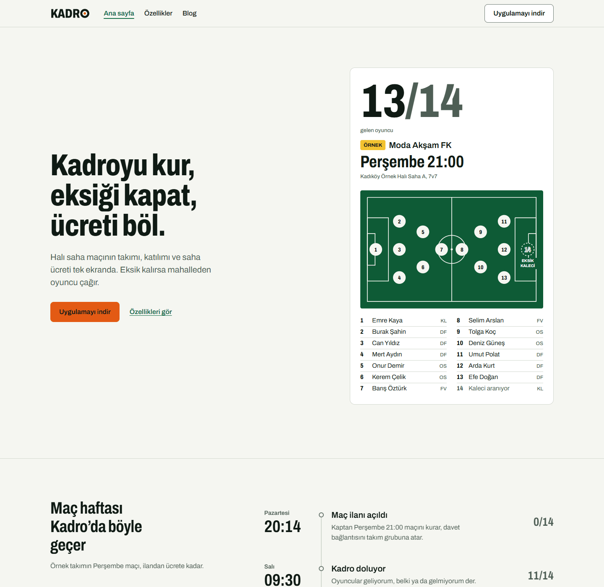
      </picture><br>
      <sub>Ana sayfa</sub>
    </td>
    <td align="center">
      <picture>
        <source media="(prefers-color-scheme: dark)" srcset="docs/screenshots/web/web-02-features-dark.png">
        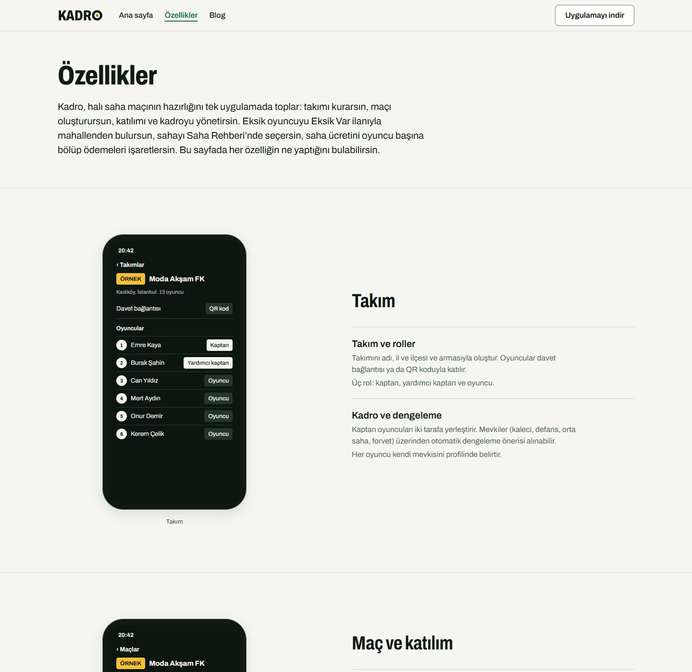
      </picture><br>
      <sub>Özellikler sayfası</sub>
    </td>
  </tr>
  <tr>
    <td align="center">
      <picture>
        <source media="(prefers-color-scheme: dark)" srcset="docs/screenshots/web/web-04-blog-article-dark.png">
        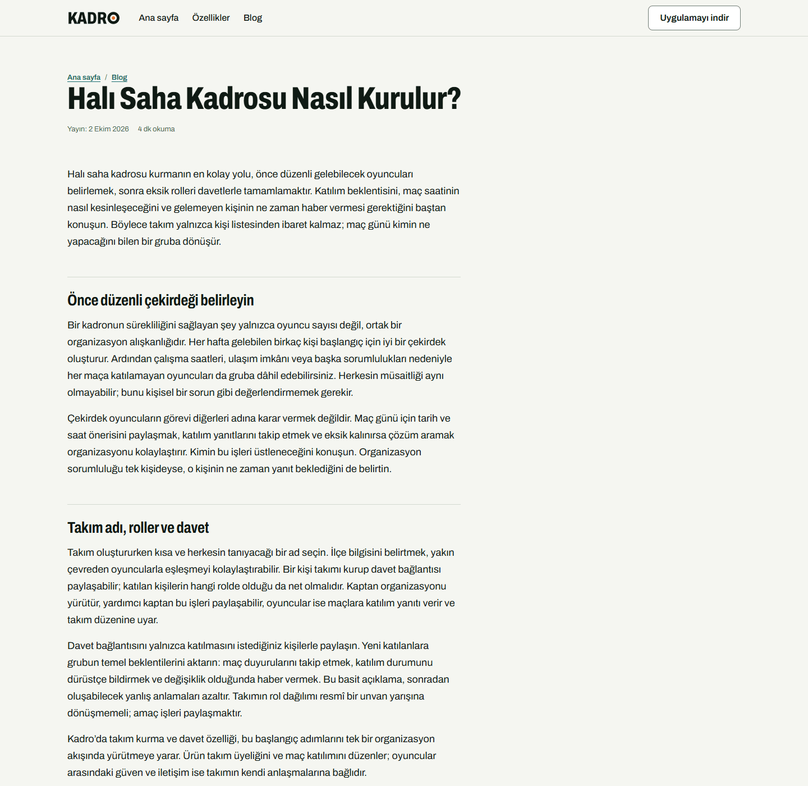
      </picture><br>
      <sub>Blog yazısı</sub>
    </td>
    <td align="center">
      <picture>
        <source media="(prefers-color-scheme: dark)" srcset="docs/screenshots/web/web-05-venue-dark.png">
        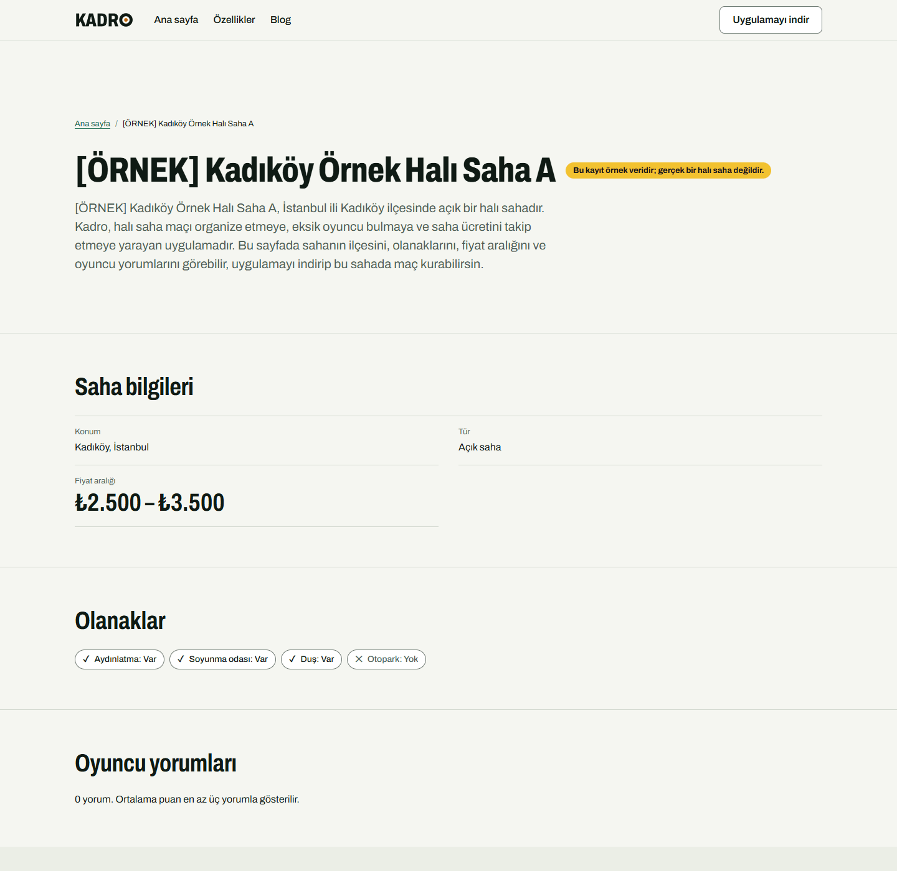
      </picture><br>
      <sub>Saha sayfası</sub>
    </td>
  </tr>
</table>

### Mobil (üst sıra açık, alt sıra koyu)

<table>
  <tr>
    <td align="center">
      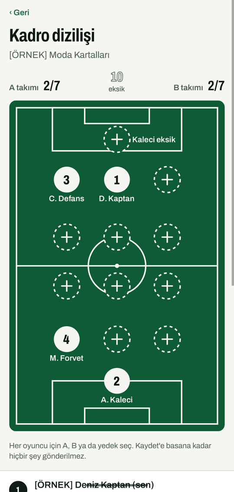<br>
      <sub>Diziliş</sub>
    </td>
    <td align="center">
      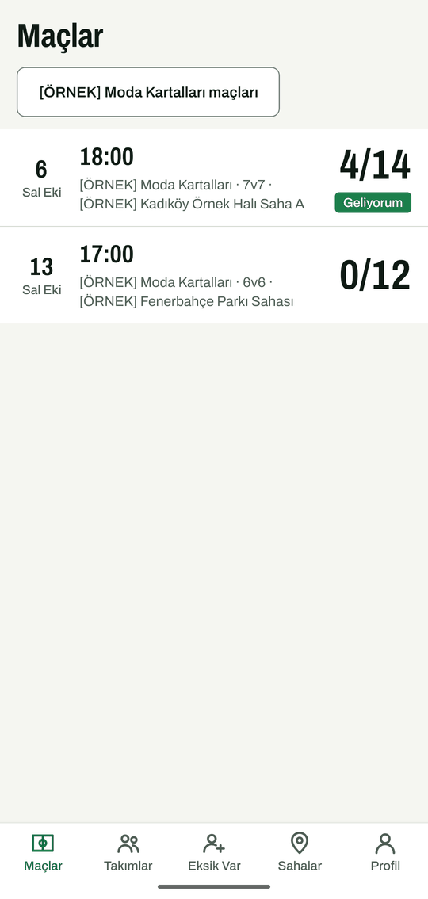<br>
      <sub>Maçlar</sub>
    </td>
    <td align="center">
      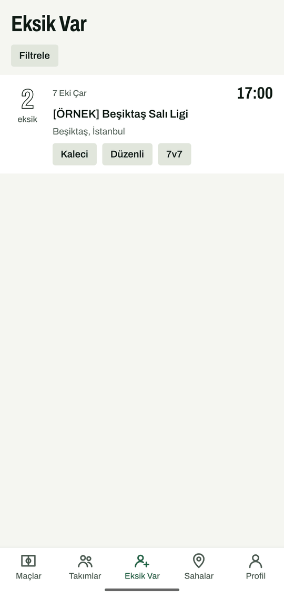<br>
      <sub>Eksik Var ilanları</sub>
    </td>
    <td align="center">
      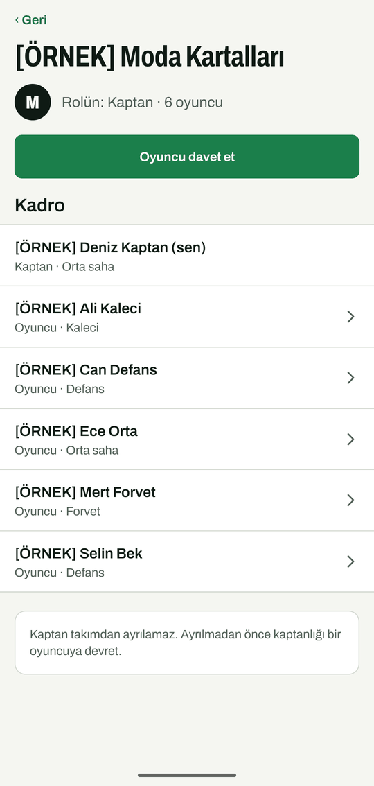<br>
      <sub>Takım</sub>
    </td>
  </tr>
  <tr>
    <td align="center">
      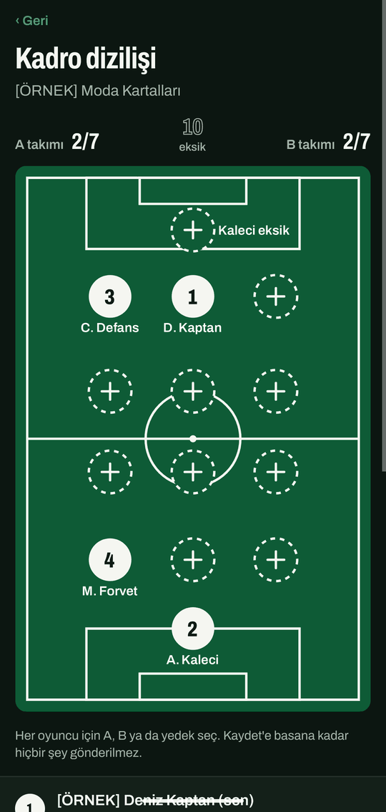<br>
      <sub>Diziliş</sub>
    </td>
    <td align="center">
      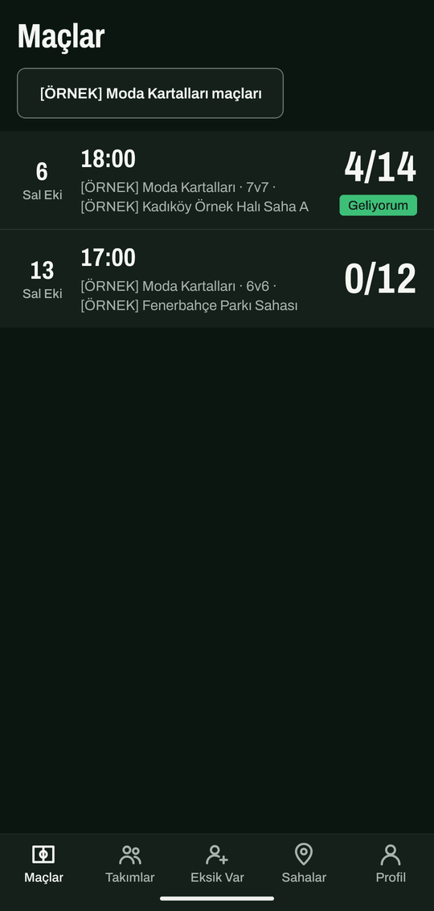<br>
      <sub>Maçlar</sub>
    </td>
    <td align="center">
      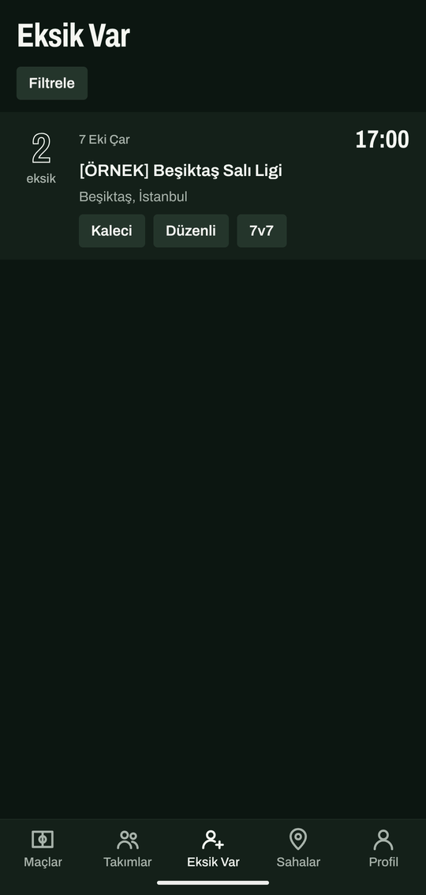<br>
      <sub>Eksik Var ilanları</sub>
    </td>
    <td align="center">
      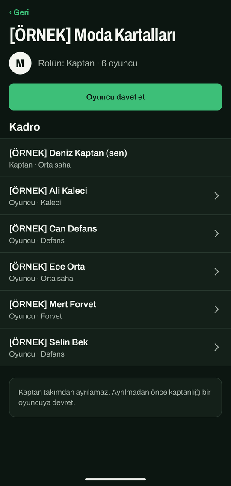<br>
      <sub>Takım</sub>
    </td>
  </tr>
</table>

## MVP özellikleri

"Uygulandı", kodun, API sözleşmesinin ve otomatik testlerin `main` üzerinde bulunduğu anlamına gelir.
Mobil satırlarda "cihaz akışları doğrulanmadı" etiketi vardır: ekranlar birim ve bileşen testleriyle
kapsanır, ancak Maestro akışları (`apps/mobile/.maestro/`) bir cihazda ya da emülatörde
çalıştırılmadı.

| Özellik                                                                                                               | Durum                                                                                                        |
| --------------------------------------------------------------------------------------------------------------------- | ------------------------------------------------------------------------------------------------------------ |
| E-posta + şifre ile kayıt ve giriş, Apple ve Google ile giriş, şifre sıfırlama                                        | Uygulandı (API ve mobil ekranlar; sağlayıcı girişi cihazlarda denenmedi)                                     |
| Veritabanı şeması, migration'lar ve seed verisi (ilçeler, örnek sahalar)                                              | Uygulandı                                                                                                    |
| Takımlar, roller (kaptan, yardımcı kaptan, oyuncu), davet bağlantıları                                                | Uygulandı (API, mobil; cihaz akışları doğrulanmadı)                                                          |
| Maçlar, yedek listeli RSVP, pozisyona göre dengelenen kadro dizilimi                                                  | Uygulandı (API, mobil; cihaz akışları doğrulanmadı)                                                          |
| Ücret bölüşümü ve ödendi/ödenmedi takibi                                                                              | Uygulandı (API, mobil; cihaz akışları doğrulanmadı)                                                          |
| "Eksik Var": eksik oyuncu ilanı yayınlama, göz atma ve başvuru                                                        | Uygulandı (API, mobil, herkese açık web listeleri; cihaz akışları doğrulanmadı)                              |
| Puan ve yorumlu saha rehberi ("Saha Rehberi"), saha önerileri                                                         | Uygulandı (API, mobil; cihaz akışları doğrulanmadı)                                                          |
| Worker üzerinden hatırlatma ve bildirimler (push, e-posta)                                                            | Uygulandı (worker işleri; gerçek push ve e-posta teslimi doğrulanmadı)                                       |
| Maçın oyuncusu (MVP) oylaması ve temel oyuncu istatistikleri                                                          | Uygulandı (API, mobil profil ve maç ekranları)                                                               |
| Kadro Pro aboneliği (RevenueCat), sunucu tarafında doğrulanan yetkiler, uygulama içi paywall                          | Uygulandı, birleşti ama gerçek mağazalara karşı doğrulanmadı (webhook ve yetkiler fixture'larla test edildi) |
| Uygulama içinden ve web üzerinden hesap silme (`/hesap-silme`)                                                        | Uygulandı (7 gün bekleme süresi, mezar taşı geçmişi); e-posta teslimi doğrulanmadı                           |
| Tanıtım sitesi, blog, örnek etiketli hukuki sayfalar (KVKK aydınlatma, gizlilik, iletişim)                            | Uygulandı (hukuki metin örnektir, hukuki tavsiye değildir)                                                   |
| Programatik sayfalar: saha sayfaları ve "Eksik Var" ilçe sayfaları, sitemap, JSON-LD                                  | Uygulandı (Lighthouse CI'da bilgilendirme amaçlı; henüz gerçek alan adı yok)                                 |
| Davet landing sayfası (`/mac/<kod>`) ve uygulama bağlantı dosyaları                                                   | Uygulandı (uygulama bağlantı dosyaları imzalı mağaza derlemeleriyle doğrulanmadı)                            |
| Ekip yönetim paneli (`/admin`): saha doğrulama, saha CSV içe aktarma, roller, yasaklar, denetim günlüğü, TOTP step-up | Uygulandı (yalnızca web, Playwright kapsıyor; yorum ve açık ilan kaldırma için API var, ekran yok)           |
| Her `/api/v1` işleminin OpenAPI 3.1 açıklaması                                                                        | Uygulandı (`docs/api/openapi.json`, uç nokta kayıt defterinden üretilir)                                     |

MVP kapsamı dışında bilinçli olarak bırakılanlar: oyuncular arası uygulama içi ödeme, saha rezervasyon
entegrasyonu, canlı sohbet, video, reklam, lig ve turnuvalar, Türkçe ve İngilizce dışındaki diller.

## Teknoloji yığını

- Mobil: Expo (React Native), Expo Router, TypeScript
- Web ve API: Next.js (App Router), `/api/v1` altında REST
- Veritabanı: PostGIS'li PostgreSQL 16, Drizzle ORM ve SQL migration'ları
- Arka plan işleri: pg-boss (worker uygulaması)
- Doğrulama ve sözleşmeler: zod
- Şifreler: Argon2id; erişim token'ları: ES256 JWT; rotasyonlu refresh token'lar
- Araçlar: pnpm workspaces, Turborepo, Vitest, ESLint, Prettier

Sabitlenmiş sürümler ve gerekçeleri
[`docs/adr/0001-stack-and-versions.md`](docs/adr/0001-stack-and-versions.md) dosyasında.

## Depo yapısı

```
apps/
  mobile/      Expo uygulaması
  web/         Next.js: API (/api/v1), herkese açık sayfalar ve ekip paneli (/admin)
  worker/      pg-boss iş çalıştırıcısı
packages/
  auth/        yetkilendirme politikası, şifre hashleme, token araçları
  brand/       tasarım token'ları, logo SVG'leri, fontlar
  config/      doğrulanmış ortam yapılandırması (process.env'i okuyan tek modül)
  contracts/   zod şemaları ve paylaşılan tipler
  db/          Drizzle şeması, migration'lar, seed verisi
docs/
  adr/         mimari karar kayıtları
  api/         uç nokta kayıt defterinden üretilen OpenAPI dokümanı
  handoffs/    paketler arası devir notları
  legal/       hukuki inceleme kontrol listesi
  mobile/      mobil uygulama dokümanları
  ops/         barındırma, operasyon, runbook'lar
  release/     mağaza metinleri, yedek tatbikatı, maliyet uyarıları
  security/    yetkilendirme matrisi, tehdit modeli, doğrulama matrisi
  seo/         SEO ve GEO kontrol listesi
  web/         web uygulaması dokümanları, yönetim paneli dahil
```

## Gereksinimler

- Node.js: [`.nvmrc`](.nvmrc) dosyasındaki sürüm (`engines` alanı en az 22.12.0 ister)
- pnpm: [`package.json`](package.json) içindeki `packageManager` alanında sabitlenen sürüm
- Docker: yerel veritabanı ve veritabanı kullanan testler için

## Kurulum ve çalıştırma

Tüm komutlar bu dizinden (`kadro/`) çalıştırılır.

```sh
pnpm install
cp .env.example .env
pnpm --silent --filter @kadro/config secrets:generate
```

`secrets:generate` imzalama anahtarlarını, CSRF sırrını ve hash sırrını yazdırır; bunları `.env`
içindeki boş anahtarların üzerine yapıştırın. Bu değerler boşken web uygulaması başlamaz.

```sh
pnpm db:up                           # Docker'da PostgreSQL + PostGIS
pnpm build                           # workspace paketleri önce derlenmeli
pnpm --filter @kadro/db db:migrate   # migration'ları uygula
pnpm --filter @kadro/db db:seed      # ilçeler ve [ÖRNEK] sahalar
pnpm dev                             # http://localhost:3000 üzerinde web ve worker
```

Diğer komutlar:

| Komut                                         | Amaç                                                 |
| --------------------------------------------- | ---------------------------------------------------- |
| `pnpm worker:dev`                             | yalnızca worker                                      |
| `pnpm mobile:start`                           | Expo geliştirme sunucusunu başlatır                  |
| `pnpm lint` / `pnpm typecheck` / `pnpm build` | tüm paketlerde lint, tip kontrolü ve derleme         |
| `pnpm test`                                   | tüm testleri çalıştırır                              |
| `pnpm format` / `pnpm format:check`           | Prettier biçimini yazar veya denetler                |
| `docker compose up --build`                   | tüm yığın konteynerlerde (web + worker + veritabanı) |

## Ortam değişkenleri

[`.env.example`](.env.example) tüm değişkenleri açıklamalarıyla listeler. İmzalama anahtarları,
CSRF sırrı ve hash sırrı dışındaki değerler yerel geliştirme için örnek değerlerdir; bu üçü bilerek
boş bırakılmıştır ve her makinede `pnpm --silent --filter @kadro/config secrets:generate` ile
üretilir. Preview ve production değerleri barındırma sağlayıcısının sır deposunda tutulur, depoya
asla girmez. Zorunlu bir değişken eksik veya geçersizse uygulamalar açılışta hata verip durur.

## Testler

`pnpm test` her paketin Vitest testlerini çalıştırır. Veritabanı testleri (`@kadro/db`) ve web API
testleri (`@kadro/web`) geçici bir PostGIS konteyneri başlatır; bu yüzden çalışan bir Docker daemon
gerekir. Docker yoksa testler açık bir hata mesajıyla başarısız olur.

## Güvenlik yaklaşımı

Yetkilendirme belgelenmiş bir matristen yola çıkılarak sunucu tarafında uygulanır; sırlar asla
commit'lenmez; refresh token'lar, davet kodları ve e-posta token'ları yalnızca hash olarak saklanır;
kimlik doğrulama uç noktalarında rate limit vardır; yanıtlar katı header'lar ve yüzey bazlı CSP
taşır. CI, tüm geçmişi sır için tarar ve bağımlılıkları denetler. Ayrıntılar:

- [`docs/security/authorization-matrix.md`](docs/security/authorization-matrix.md)
- [`docs/security/threat-model.md`](docs/security/threat-model.md)
- [`docs/security/verification-matrix.md`](docs/security/verification-matrix.md)
- [`docs/security/history-purge-runbook.md`](docs/security/history-purge-runbook.md)
- [`docs/adr/`](docs/adr/) (güvenlikle ilgili kararlar: ADR 0011, 0014, 0015, 0019, 0021 gibi)

## Dokümantasyon

- [`docs/adr/README.md`](docs/adr/README.md): mimari karar kayıtlarının dizini
- [`docs/security/`](docs/security/): güvenlik dokümanları
- [`docs/ops/README.md`](docs/ops/README.md): barındırma ve operasyon
- [`docs/ops/admin-recovery.md`](docs/ops/admin-recovery.md): ekip hesabı kilitlenmesi ve TOTP kaybı runbook'u (İngilizce)
- [`docs/api/README.md`](docs/api/README.md): API kuralları ve uç nokta kayıt defterinden üretilen OpenAPI dokümanı
- [`docs/web/admin-panel.md`](docs/web/admin-panel.md): ekip yönetim paneli
- [`docs/mobile/`](docs/mobile/): mobil mimari, ekranlar, faturalama, derin bağlantılar
- [`docs/release/`](docs/release/): mağaza metinleri, yedek tatbikatı, maliyet uyarıları
- [`docs/seo/`](docs/seo/): SEO ve GEO kontrol listesi
- [`docs/handoffs/`](docs/handoffs/): paketler arası devir notları

## Yol haritası

- Phase 0, iskelet: tamam
- Phase 1, veri, kimlik doğrulama ve güvenlik çekirdeği: tamam
- Phase 2, domain API ve worker işleri (takımlar, maçlar, açık ilanlar, sahalar, yüklemeler,
  hatırlatmalar): tamam, birleşti
- Phase 3, mobil uygulama: tamam, birleşti (cihaz akışları doğrulanmadı)
- Phase 4, web SEO sayfaları, tanıtım sitesi ve herkese açık listeler: tamam, birleşti
- Phase 5, Kadro Pro aboneliği, webhook ve yönetim paneli: tamam, birleşti (mağaza satın alımları
  gerçek mağazalara karşı doğrulanmadı)
- Phase 6, sertleştirme ve yayına hazırlık: büyük ölçüde birleşti (güvenlik doğrulama matrisi,
  tehdit modeli, saldırı raporu, SEO ve GEO kontrol listesi, cost guard, mağaza metni taslakları).
  Açık: cihazda Maestro çalıştırması, mağaza ve RevenueCat doğrulaması, EAS derlemeleri ve imzalı
  güncelleme kanalı, Caddy kenarı ve `deploy.md` ile yayında bir origin, üretim yedekleri, hata
  izleme, sağlayıcı tarafında maliyet uyarıları, MobSF ve ZAP API sonuçları, gerçek alan adında
  sitemap gönderimi ve depo genelinde yer tutucu grep kapısı.

## Lisans

Paketler `package.json` dosyalarında `UNLICENSED` olarak işaretlidir; depoda `LICENSE` dosyası
yoktur.
