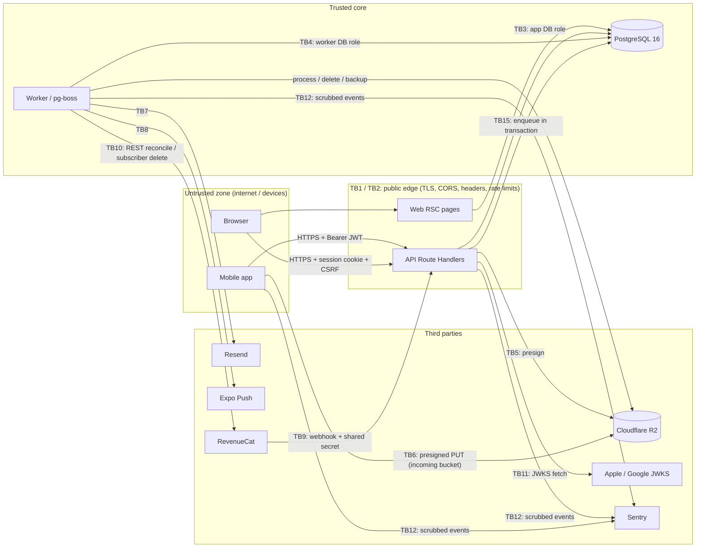

# Kadro — Threat Model

|                     |                                                                                                                                                                                                                                                                                                                                                                                                                                                                                                                                |
| ------------------- | ------------------------------------------------------------------------------------------------------------------------------------------------------------------------------------------------------------------------------------------------------------------------------------------------------------------------------------------------------------------------------------------------------------------------------------------------------------------------------------------------------------------------------ |
| Status              | **Phase 6 update of the Phase 2 design baseline.** Sections carry a "Completed in Phase N" marker. The "Verify" column names the test or artefact that proves the control; where a row names a test file, the file exists on `main` (suites: `apps/web/tests/**`, `apps/worker/test/**`, `packages/*/src/*.test.ts`; adversarial suites: `apps/web/tests/attack/**`, see `attack-report.md`). Rows whose Verify cell is only prose have no named test yet. Consolidated evidence per checklist item: `verification-matrix.md`. |
| Method              | STRIDE per trust boundary and per feature; each threat mapped to a control and to the 23-item checklist (product spec §6).                                                                                                                                                                                                                                                                                                                                                                                                     |
| Decisions           | `docs/adr/0003` … `docs/adr/0044` (authorization, domain-integrity, worker, upload, notification and deletion decisions) and `docs/adr/0063` … `docs/adr/0068`, `0075` … `0080` (billing, admin, mobile and web surfaces) referenced by threat rows below                                                                                                                                                                                                                                                                      |
| Companion documents | `docs/security/authorization-matrix.md` (who may do what), `docs/security/attack-report.md` (Phase 6 attack suite and ZAP baseline), `docs/security/verification-matrix.md`, `docs/security/history-purge-runbook.md`, `docs/release/history-purge-runbook.md`, `docs/release/backup-restore-drill.md`, `docs/release/cost-alerts.md`                                                                                                                                                                                          |
| Review cadence      | Updated at every phase gate; any new endpoint, queue, or third-party integration requires a row here before it ships.                                                                                                                                                                                                                                                                                                                                                                                                          |

---

## 1. System overview

> Completed in Phase 2. Component list as decided in ADR-0028..0032; queues of later phases are marked.

| Component                         | Runtime                   | Holds / touches                                                                                                                                                                                                                                                                                                                                                                                                                                                                                 |
| --------------------------------- | ------------------------- | ----------------------------------------------------------------------------------------------------------------------------------------------------------------------------------------------------------------------------------------------------------------------------------------------------------------------------------------------------------------------------------------------------------------------------------------------------------------------------------------------- |
| Mobile app (`apps/mobile`)        | Expo, iOS + Android       | Access JWT + refresh token in `expo-secure-store`; RevenueCat public SDK key; `EXPO_PUBLIC_API_URL`; location (foreground, Eksik Var)                                                                                                                                                                                                                                                                                                                                                           |
| Web (`apps/web`, marketing + SEO) | Next.js RSC               | Public content, `__Host-kadro_session` + CSRF cookie for logged-in web flows (deletion page, invite landing)                                                                                                                                                                                                                                                                                                                                                                                    |
| API (`apps/web/app/api/v1/**`)    | Next.js Route Handlers    | All business logic, authorization, JWT signing key, TOTP encryption key, R2 credentials, Resend key, RevenueCat webhook secret + REST key                                                                                                                                                                                                                                                                                                                                                       |
| Worker (`apps/worker`)            | Node, pg-boss             | Queues `email.send`, `push.send`, `push.receipts`, `match.reminder`, `upload.process`, `account.hard_delete`, `opencall.expire`, `maintenance.sweep`, `venue.import` (ADR-0028); Phase 5: `webhook.revenuecat.process`, `subscription.reconcile`; `cost.guard` (ADR-0081, implemented); `backup.verify` (ADR-0082, implemented: weekly artifact check only, no decrypt or restore). Credentials: DB (worker role), R2 (worker key), Resend, Expo access token; RevenueCat REST key from Phase 5 |
| PostgreSQL 16                     | Managed or VPS (ADR-0002) | All persistent data, job queue, rate-limit buckets, audit logs                                                                                                                                                                                                                                                                                                                                                                                                                                  |
| Cloudflare R2                     | Object storage            | `kadro-uploads-incoming` (private quarantine, 1-day lifecycle), `kadro-media` (processed WebP avatars and badges, public read through the media domain, no listing) (ADR-0030); `kadro-backups` (encrypted dumps, 30-day lifecycle, Phase 6)                                                                                                                                                                                                                                                    |
| Resend                            | Email SaaS                | Recipient email, verification / reset / deletion emails; called by the worker only (ADR-0029)                                                                                                                                                                                                                                                                                                                                                                                                   |
| Expo Push                         | Push relay to APNs / FCM  | Expo push tokens, notification text                                                                                                                                                                                                                                                                                                                                                                                                                                                             |
| RevenueCat                        | Subscription SaaS         | `app_user_id`, purchase state; sends webhooks                                                                                                                                                                                                                                                                                                                                                                                                                                                   |
| Apple / Google identity           | OIDC                      | Identity tokens verified against JWKS                                                                                                                                                                                                                                                                                                                                                                                                                                                           |
| Sentry                            | Error tracking            | Planned: scrubbed errors from web, worker, mobile (not integrated yet)                                                                                                                                                                                                                                                                                                                                                                                                                          |
| CI (GitHub Actions) + hosting     | Build / deploy            | Deploy credentials, preview environments                                                                                                                                                                                                                                                                                                                                                                                                                                                        |

### 1.1 Data flow diagram

---

## 2. Assets

> Completed in Phase 1 (classification finalised with schema). Draft classification below.

| ID    | Asset                                                                                                                                                                                                           | Location                                                         | C / I / A priority | Why it matters                                                          |
| ----- | --------------------------------------------------------------------------------------------------------------------------------------------------------------------------------------------------------------- | ---------------------------------------------------------------- | ------------------ | ----------------------------------------------------------------------- |
| AS-01 | Password hashes, provider subs                                                                                                                                                                                  | `users`                                                          | C, I               | Credential compromise, account takeover                                 |
| AS-02 | Refresh tokens, sessions, email tokens                                                                                                                                                                          | `refresh_tokens`, `email_tokens`, device secure store, cookies   | C, I               | Session hijack; stored as SHA-256 hashes server-side                    |
| AS-03 | Signing and encryption secrets (JWT ES256 private key, TOTP AES-256-GCM key, R2 keys, Resend key, RevenueCat webhook secret + REST key, DB password, `age` backup key, `CSRF_SECRET`, `HASH_SECRET` (ADR-0023)) | env / hosting secret store / EAS Secrets                         | C                  | Full platform compromise if leaked; rotation list in §6 item 2          |
| AS-04 | Personal data (email, display name, avatar, position, level, district, IP hash)                                                                                                                                 | `users`, R2, logs                                                | C (KVKK)           | Regulatory exposure, user harm                                          |
| AS-05 | Location signals (district, open-call geo, venue points, device location)                                                                                                                                       | `districts`, `open_calls`, client                                | C                  | Users' habitual whereabouts and match times reveal when homes are empty |
| AS-06 | Team, match, RSVP, lineup and payment status                                                                                                                                                                    | domain tables                                                    | I, C               | Integrity of who plays and who paid; social disputes                    |
| AS-07 | Push tokens                                                                                                                                                                                                     | `push_tokens`                                                    | C, I               | Spam / phishing notifications to users                                  |
| AS-08 | Subscription entitlement                                                                                                                                                                                        | `subscriptions`                                                  | I                  | Revenue loss through forged entitlement                                 |
| AS-09 | Staff powers (role, TOTP secret, step-up state)                                                                                                                                                                 | `users`, step-up records                                         | I                  | Moderation abuse, privilege escalation                                  |
| AS-10 | Audit trail                                                                                                                                                                                                     | `audit_logs`                                                     | I                  | Accountability; must be append-only                                     |
| AS-11 | Venue directory and reviews                                                                                                                                                                                     | `venues`, `venue_reviews`                                        | I                  | SEO spam, defamation, fake ratings                                      |
| AS-12 | Backups                                                                                                                                                                                                         | R2 `kadro-backups`                                               | C, A               | Full data copy; encrypted with `age`                                    |
| AS-13 | Availability and spend budget                                                                                                                                                                                   | hosting, Postgres, R2 egress, Resend, Expo Push, RevenueCat tier | A                  | Denial of wallet; cost kill-switches in §6 item 22                      |
| AS-14 | Mobile update channel                                                                                                                                                                                           | `expo-updates` signed bundles                                    | I                  | A malicious OTA update equals full client compromise                    |

---

## 3. Adversaries

| ID   | Adversary                                     | Capability                                                          | Primary goals                                                                                 |
| ---- | --------------------------------------------- | ------------------------------------------------------------------- | --------------------------------------------------------------------------------------------- |
| AD-1 | Anonymous internet attacker                   | Scripts against public endpoints, header spoofing, credential lists | Account takeover, enumeration, scraping, DoS                                                  |
| AD-2 | Authenticated malicious user                  | Valid account, can create teams, call every API directly            | IDOR across teams, mass assignment, spam open calls / reviews / venues, push spam             |
| AD-3 | Malicious team insider (player or co-captain) | Legitimate membership                                               | Escalate to captain, remove captain, falsify payments, tamper lineup, harvest teammates' data |
| AD-4 | Compromised or rogue moderator                | Staff role, maybe stolen password                                   | Abuse moderation, escalate to admin, read PII                                                 |
| AD-5 | Third-party compromise / spoofing             | Forged webhook, poisoned dependency, compromised SaaS               | Forge entitlements, inject code via supply chain, read outbound data                          |
| AD-6 | Device thief / shared device                  | Physical access to unlocked or lost phone                           | Use stored session, read cached data                                                          |
| AD-7 | Insider with infrastructure access            | DB / hosting console                                                | Bulk data read, log scraping, backup exfiltration                                             |

---

## 4. Trust boundaries

> Completed in Phase 2 for TB1–TB8, TB11, TB12, TB15 (controls as decided in ADR-0028..0032); in Phase 5 for TB9–TB10.

| ID   | Boundary                     | Crosses                      | Authentication                                            | Key controls                                                                                                                                                                                                                                                                                                                                | §6 items            |
| ---- | ---------------------------- | ---------------------------- | --------------------------------------------------------- | ------------------------------------------------------------------------------------------------------------------------------------------------------------------------------------------------------------------------------------------------------------------------------------------------------------------------------------------- | ------------------- |
| TB1  | Mobile → API                 | JSON over HTTPS              | Bearer ES256 JWT (15 min), opaque refresh (30 d, rotated) | TLS only (Android cleartext disabled, ATS), zod `.strict()`, rate limits, policy check, problem responses, `no-store`                                                                                                                                                                                                                       | 4, 5, 6, 10, 12, 13 |
| TB2  | Browser → Web / API          | HTML, JSON                   | `__Host-kadro_session` + CSRF double-submit               | CORS allow-list, CSP nonce, HSTS preload, SameSite=Lax, sanitised markdown                                                                                                                                                                                                                                                                  | 8, 9, 10, 12, 16    |
| TB3  | API → PostgreSQL             | SQL                          | DB role `kadro_app` (password in env), TLS to managed DB  | Parameterised Drizzle queries, least-privilege grants (no DDL at runtime, no UPDATE/DELETE on `audit_logs`)                                                                                                                                                                                                                                 | 1, 15               |
| TB4  | Worker → PostgreSQL          | SQL, pg-boss                 | DB role `kadro_worker` (owns `pgboss`)                    | Same as TB3; payloads validated by contracts schemas, ids only; idempotent handlers with `job_receipts` and state re-checks; dead-letter queues (ADR-0028)                                                                                                                                                                                  | 15, 21              |
| TB5  | API → R2 (presign)           | Signed URL issuance          | Web R2 key: `PutObject` on the incoming bucket only       | Server-chosen key from the upload id, declared length 1..2 MB and type allow-list checked, `content-length` and `content-type` signed, 300 s TTL, group U 10 / 24 h (ADR-0030)                                                                                                                                                              | 7, 22               |
| TB6  | Mobile → R2 (direct PUT)     | Image bytes                  | Presigned URL (300 s)                                     | R2 rejects any body whose length or type differs from the signature; bytes stay in the private incoming bucket until the worker checks magic bytes, re-encodes with `sharp` and publishes a new WebP (ADR-0030)                                                                                                                             | 7                   |
| TB7  | Worker → Resend              | Email content                | Resend API key (worker only)                              | Templates only, user strings escaped, tokens issued by the worker and never stored in job rows, links only to `WEB_ORIGIN` with token in the fragment (ADR-0029)                                                                                                                                                                            | 11, 14, 22          |
| TB8  | Worker → Expo Push           | Notification payloads        | Expo access token (enhanced push security)                | Fixed templates without personal data, ids only in `data`, receipts checked, invalid tokens pruned, 5 000 sends / h cap (ADR-0031)                                                                                                                                                                                                          | 14, 22              |
| TB9  | RevenueCat → API webhook     | Subscription events          | Shared secret in `Authorization`                          | Constant-time compare of the `Authorization` header (HMAC digests, `crypto.timingSafeEqual`) before the body is read, strict envelope with the 1 MiB limit, `event.id` unique, always 200 `accepted` / `duplicate` / `ignored` (an unknown user is `ignored`, not rejected), asynchronous processing; no secret configured → 503 (ADR-0063) | 17                  |
| TB10 | Worker → RevenueCat REST     | Reconcile, subscriber delete | Secret REST key                                           | Nightly reconciliation (03:17 UTC, `subscription.reconcile`) corrects webhook drift through read-only REST calls; subscriber deletion on account removal is implemented in the hard-delete job (ADR-0082) and proven against a fake server only (RR-13)                                                                                     | 17, 21              |
| TB11 | API → Apple / Google         | JWKS fetch                   | TLS                                                       | Pinned issuers / audiences, nonce binding (Apple), JWKS cache with refresh on unknown `kid`                                                                                                                                                                                                                                                 | 11, 12              |
| TB12 | All → Sentry                 | Error events                 | DSN                                                       | Planned: `beforeSend` scrubbing identical to the pino redact list (no Sentry integration in the code yet)                                                                                                                                                                                                                                   | 14                  |
| TB13 | CI / hosting / EAS           | Source, secrets, builds      | GitHub, hosting and EAS accounts with 2FA                 | gitleaks, `pnpm audit`, Renovate, signed `expo-updates`, secrets only in platform stores                                                                                                                                                                                                                                                    | 1, 2, 19, 23        |
| TB14 | Backups → R2 `kadro-backups` | Encrypted dumps              | Separate R2 key, write-only from backup job (proposed)    | `age` encryption before upload, 30-day lifecycle, weekly restore drill                                                                                                                                                                                                                                                                      | 20                  |
| TB15 | Web → job queue              | Job rows in `pgboss`         | DB role `kadro_app` (insert jobs only)                    | Enqueued in the domain transaction; payload schema shared with the worker; producers bounded by API rate limits (ADR-0028)                                                                                                                                                                                                                  | 6, 22               |

---

## 5. Threats by feature (STRIDE)

Column legend: **S** spoofing, **T** tampering, **R** repudiation, **I** information disclosure, **D** denial of service, **E** elevation of privilege. "Items" are §6 checklist numbers. "Verify" names the test or artefact that proves the control.

### 5.1 Authentication and sessions — Completed in Phase 1

| ID        | STRIDE | Threat                                                                                                                                     | Control                                                                                                                                                                                                                                                               | Items  | Verify                                                                                                                                                                                                                             |
| --------- | ------ | ------------------------------------------------------------------------------------------------------------------------------------------ | --------------------------------------------------------------------------------------------------------------------------------------------------------------------------------------------------------------------------------------------------------------------- | ------ | ---------------------------------------------------------------------------------------------------------------------------------------------------------------------------------------------------------------------------------- |
| T-AUTH-01 | S      | Credential stuffing / brute force on `auth/login`                                                                                          | 5 / 15 min per IP **and** per email, progressive delay after 3 failures, HIBP check at register                                                                                                                                                                       | 5, 11  | `apps/web/tests/ratelimit.test.ts` (6th request → 429), `apps/web/tests/attack/credential-bruteforce.test.ts`                                                                                                                      |
| T-AUTH-02 | S      | Rate-limit bypass by spoofing `X-Forwarded-For`                                                                                            | IP read only from configured trusted proxy header                                                                                                                                                                                                                     | 5      | `apps/web/tests/ratelimit.test.ts` and `apps/web/tests/attack/credential-bruteforce.test.ts` (spoofed forwarding headers)                                                                                                          |
| T-AUTH-17 | D      | Client-IP header missing (proxy misconfiguration) collapses all such clients into one rate-limit bucket                                    | Shared `unknown` bucket per group (fails strict, never open); email- and user-keyed limits unaffected; `client_ip_missing` metric with alert on any non-zero count in production / preview (ADR-0022)                                                                 | 5      | unit test: missing header → `unknown`; alert rule in cost/ops docs                                                                                                                                                                 |
| T-AUTH-18 | D      | Verification or reset email lost (provider failure, process stop) in the Phase 1 best-effort path                                          | `after()` send with `email_delivery_failed` metric; user re-requests via forgot-password; durable `email.send` job with worker-issued tokens and retries before production (ADR-0026, ADR-0029)                                                                       | 14     | failure-path test logs metric without PII                                                                                                                                                                                          |
| T-AUTH-03 | I      | Account enumeration via register / login / forgot responses or timing                                                                      | Identical responses, dummy Argon2id verify for unknown emails, `register` and `forgot` always 202 (ADR-0015)                                                                                                                                                          | 11, 13 | `apps/web/tests/attack/credential-bruteforce.test.ts` (identical answers for known and unknown addresses), `apps/web/tests/auth/login-races.test.ts` (dummy hash)                                                                  |
| T-AUTH-04 | S      | Forged JWT (`alg: none`, HS256 with public key, wrong key, expired)                                                                        | Verify with fixed `alg: ES256`, `typ: at+jwt`, `kid` = RFC 7638 thumbprint of the configured public key, `aud = kadro-api`, `iss`, `exp`/`iat` with 5 s clock tolerance                                                                                               | 12, 23 | `packages/auth/src/jwt.test.ts` (`alg: none`, HS256 signed with the public key, ES384, expired)                                                                                                                                    |
| T-AUTH-05 | S      | Stolen refresh token replayed                                                                                                              | Rotation on every use, no grace window: a revoked or concurrently used token revokes the family; hashed at rest, device label; clients refresh single-flight (ADR-0019); access tokens of a revoked family fail on the next request (ADR-0025)                        | 12     | `apps/web/tests/attack/session-replay.test.ts` (rotated-token replay burns the family), `apps/web/tests/auth/refresh.test.ts`                                                                                                      |
| T-AUTH-06 | S      | Apple / Google token from another app or replayed                                                                                          | `aud` = our client ids, `iss` pinned, Apple nonce bound to request, Google nonce matched when present and nonce-bound tokens refused without one, `exp` enforced; JWKS cached 1 h, refetched on unknown `kid` at most once per 30 s, unreachable keys → 503           | 11     | provider token tests with wrong `aud` / nonce                                                                                                                                                                                      |
| T-AUTH-07 | E      | Social login silently linking to an existing password account (pre-account takeover)                                                       | Link only if both sides have verified email (matrix footnote 3)                                                                                                                                                                                                       | 3, 11  | link-conflict test                                                                                                                                                                                                                 |
| T-AUTH-08 | S      | Password reset / verify token guessed or reused                                                                                            | 256-bit tokens, SHA-256 at rest, single-use, expiry 24 h (verify) / 1 h (reset), all sessions revoked after reset; tokens travel in the URL fragment of email links so they never reach access logs or `Referer`, and the landing page strips the fragment (ADR-0027) | 11, 12 | reuse test                                                                                                                                                                                                                         |
| T-AUTH-09 | T      | CSRF on cookie-authenticated web mutations                                                                                                 | SameSite=Lax + double-submit CSRF token on every non-GET; token HMAC-signed with `CSRF_SECRET` and bound to the session family id                                                                                                                                     | 12     | `apps/web/tests/attack/edge-csrf.test.ts` (missing, empty, mismatched and cross-session tokens → 403 `csrf_failed`), `packages/auth/src/csrf.test.ts`                                                                              |
| T-AUTH-10 | I      | Tokens in logs / Sentry / AsyncStorage                                                                                                     | pino redact list, Sentry `beforeSend`, `expo-secure-store` only                                                                                                                                                                                                       | 12, 14 | log sample from login flow                                                                                                                                                                                                         |
| T-AUTH-11 | I      | Password hashes leak via DB dump                                                                                                           | Argon2id (64 MiB, t=3, p=1); backups encrypted                                                                                                                                                                                                                        | 11, 20 | DB dump shows only `$argon2id$`                                                                                                                                                                                                    |
| T-AUTH-12 | D      | Argon2id cost used to exhaust CPU                                                                                                          | Auth rate limits applied **before** hashing; body limit 1 MB; password max length 128                                                                                                                                                                                 | 5, 6   | load test note                                                                                                                                                                                                                     |
| T-AUTH-13 | E      | Deactivated user or demoted staff keeps acting with an unexpired access JWT (15 min)                                                       | User row (`role`, `deactivated_at`, `email_verified_at`) and active session family (`sid`) loaded per request; JWT carries no role claim; deactivation, logout and reset revoke the family (ADR-0012, ADR-0025)                                                       | 3, 12  | `apps/web/tests/attack/session-replay.test.ts` (access token dead after logout and after reset), `apps/web/tests/session-revocation.test.ts`, `apps/web/tests/attack/edge-admin-escalation.test.ts` (demoted or deactivated admin) |
| T-AUTH-14 | I      | Browser page obtains JS-readable tokens by declaring itself a mobile client, or a credential is replayed over the other client's transport | `x-kadro-client` selects the transport; `mobile` with `Origin` → 400; bearer accepted only for `mobile`, cookie only for `web`; web sessions share the `refresh_tokens` revocation path (ADR-0014)                                                                    | 8, 12  | `mobile` + `Origin` → 400; cookie on `mobile` request → 401                                                                                                                                                                        |
| T-AUTH-15 | E      | Breach check unavailable lets a breached password be set                                                                                   | Fail open by decision: password accepted with `breachCheck: unavailable` logged and alerted; length rule, Argon2id and group A rate limits stay in force (ADR-0018)                                                                                                   | 5, 11  | breach-check stub tests (`network`, `timeout`, `http_status`, `malformed`); counters `password_breach_check`, `password_breach_check_unavailable`                                                                                  |
| T-AUTH-16 | D      | Legitimate concurrent refresh on one device revokes the family (self-inflicted logout)                                                     | Single-flight refresh required on mobile and web (Web Locks across tabs) (ADR-0019)                                                                                                                                                                                   | 12     | mobile concurrent-401 test asserts one refresh call                                                                                                                                                                                |

### 5.2 Teams, invites, membership — Completed in Phase 2

| ID        | STRIDE | Threat                                                                              | Control                                                                                                                                          | Items  | Verify                                                                                                     |
| --------- | ------ | ----------------------------------------------------------------------------------- | ------------------------------------------------------------------------------------------------------------------------------------------------ | ------ | ---------------------------------------------------------------------------------------------------------- |
| T-TEAM-01 | E      | Cross-team IDOR (team B captain edits team A)                                       | Scoped membership joins, 404 for non-members                                                                                                     | 3, 4   | `apps/web/tests/security/idor.test.ts`, `apps/web/tests/attack/tenant-bola.test.ts`                        |
| T-TEAM-02 | E      | Co-captain promotes self to captain or removes captain                              | Only captain changes roles; transfer is atomic, updates `owner_id`, one-captain partial unique index; co-captain removes players only (ADR-0008) | 3      | matrix rows `member.*`                                                                                     |
| T-TEAM-03 | T      | Mass assignment of `owner_id`, `slug`, `is_pro_locked` via `PATCH teams/:id`        | `.strict()` schema, server-only fields                                                                                                           | 6      | `apps/web/tests/attack/tenant-mass-assignment.test.ts` (extra field on write routes → 400, rows unchanged) |
| T-TEAM-04 | S      | Invite code guessing / probing to join private teams                                | 128-bit codes (ADR-0011), uniform 404 on accept and preview, rate limit I (20 / h), expiry and max uses                                          | 5      | attack-suite enumeration case                                                                              |
| T-TEAM-05 | T      | Race on `uses < max_uses` lets more people join                                     | Atomic conditional increment                                                                                                                     | 6      | concurrency integration test                                                                               |
| T-TEAM-06 | I      | Invite landing page leaks roster or captain identity                                | Landing shows team name, badge, district only; `noindex`                                                                                         | 3      | web e2e snapshot                                                                                           |
| T-TEAM-07 | D      | Free tier limit bypass by creating teams in parallel                                | Owned-team count checked in the same transaction with row lock on the user                                                                       | 3      | concurrency test (Phase 5 with entitlements)                                                               |
| T-TEAM-08 | I      | Removed member keeps reading or attending the team's upcoming matches               | Removal deletes RSVPs on `draft`/`open`/`locked` matches; only `played` rows kept, granting guest projection of those matches only (ADR-0005)    | 3, 4   | `exPlyA` IDOR rows                                                                                         |
| T-TEAM-09 | S      | Invite codes read from a DB dump, backup or request log                             | Only `code_hash` stored; code returned once; invite path segment masked in logs and Sentry (ADR-0011)                                            | 11, 14 | DB inspection + log sample from accept flow                                                                |
| T-TEAM-10 | E      | Leaked invite link (posted in a public group) lets strangers join for up to 14 days | Staff revoke (`DELETE teams/:id/invites/:inviteId`), at most 10 live invites per team, max uses, captain notified on every join (ADR-0034)       | 3      | revoked code → 404 on preview and accept; 11th invite → 409 `invite_limit`                                 |

### 5.3 Matches, RSVP, lineup, payments, MVP — Completed in Phase 2

| ID         | STRIDE | Threat                                                                                              | Control                                                                                                                     | Items | Verify                                                 |
| ---------- | ------ | --------------------------------------------------------------------------------------------------- | --------------------------------------------------------------------------------------------------------------------------- | ----- | ------------------------------------------------------ |
| T-MATCH-01 | T      | Player RSVPs on behalf of another player (body `userId`)                                            | `user_id` from session only                                                                                                 | 3, 4  | IDOR test                                              |
| T-MATCH-02 | T      | Player or co-captain marks own share as paid                                                        | `payment.mark` staff only; self-marking only for the captain (ADR-0006)                                                     | 3     | matrix rows `payment.mark`                             |
| T-MATCH-03 | R      | Staff deny having marked or cleared a payment, dispute between players                              | Mandatory `audit_logs` row for every `payment.mark` in the same transaction; audit failure rolls back the update (ADR-0006) | 3     | audit row test                                         |
| T-MATCH-04 | T      | Fee, slot or format changes after lock (directly, or by reopening then editing) to shift money owed | Frozen once `locked_at` is set on first lock, independent of later status (ADR-0004)                                        | 6     | reopen-then-edit → 409 `match_terms_frozen`            |
| T-MATCH-05 | T      | MVP vote stuffing (multiple votes, self-vote, non-participant vote, after window)                   | Unique voter, `votee ≠ voter`, both `in`, window check server-side                                                          | 3, 6  | vote tests                                             |
| T-MATCH-06 | I      | Guest player (from open call) reads team roster, other matches, payment flags                       | Guest projection only                                                                                                       | 3, 4  | guest IDOR rows                                        |
| T-MATCH-07 | I      | Match times + venue reveal when users are away from home                                            | Public surfaces show district and time only, never member names                                                             | 3     | open-call projection test                              |
| T-MATCH-08 | D      | Waitlist promotion race creates over-booking                                                        | Promotion in a transaction with `SELECT … FOR UPDATE` on the match                                                          | 6     | concurrency test                                       |
| T-MATCH-09 | T      | Stored XSS in match notes / venue text                                                              | React escaping, `rehype-sanitize`, mobile text-only                                                                         | 16    | payload renders as text                                |
| T-MATCH-10 | T      | Lineup body places non-confirmed users, duplicates or overfills a side                              | Only RSVP `in` players, each once, each side ≤ `ceil(slots / 2)`, whole-lineup replace under match lock (ADR-0035)          | 6     | 409 `lineup_invalid_player` / `lineup_side_full` tests |
| T-MATCH-11 | T      | Waitlist queue jumping (re-RSVP, concurrent RSVPs) or guest bumped by waitlist                      | Server-only `waitlisted_at`, oldest-first promotion under match lock, guests never waitlisted (ADR-0035)                    | 6     | concurrent RSVP test; promotion order test             |

### 5.4 Open calls (Eksik Var) and applications — Completed in Phase 2

| ID      | STRIDE | Threat                                                                                                    | Control                                                                                                                                                                                                                | Items  | Verify                                                                               |
| ------- | ------ | --------------------------------------------------------------------------------------------------------- | ---------------------------------------------------------------------------------------------------------------------------------------------------------------------------------------------------------------------- | ------ | ------------------------------------------------------------------------------------ |
| T-OC-01 | E      | Accepting / rejecting applications of another team's call (nested id mismatch)                            | Single scoped join `app → call → match → team_members(staff)`                                                                                                                                                          | 4      | nested-id IDOR test                                                                  |
| T-OC-02 | D      | Spam open calls triggering push fan-out (cost + harassment)                                               | No broadcast push for new calls in the MVP (ADR-0031); notifications only to the call's staff and applicants, coalesced; hourly push cap; `cost.guard` (Phase 6)                                                       | 22     | notification recipient test; `push_capped` test                                      |
| T-OC-03 | D      | Application flooding a captain                                                                            | Unique `(open_call_id, user_id)` constraint, no re-apply after withdraw / reject (ADR-0010), rate limit O                                                                                                              | 5      | duplicate → 409, rate-limit test                                                     |
| T-OC-04 | I      | Public listing scraped to profile users' routines                                                         | Public projection excludes user identities; ISR cache limits origin load                                                                                                                                               | 3      | projection test                                                                      |
| T-OC-05 | T      | Accept beyond capacity                                                                                    | Atomic slot check, 409 `match_full`                                                                                                                                                                                    | 6      | concurrency test                                                                     |
| T-OC-06 | I      | Applicant message used for harassment / phishing links                                                    | 280-char limit, text-only rendering, moderator removal                                                                                                                                                                 | 16, 18 | rendering test                                                                       |
| T-OC-07 | T      | Accepting an application on an expired / closed call adds a player to a cancelled, played or past match   | Acceptance requires call `open` and unexpired, match `open` and in the future, under row locks (ADR-0003)                                                                                                              | 3, 6   | one integration test per 409 code                                                    |
| T-OC-08 | D      | Open-call spam floods the public listing and SEO pages (fake matches, repeated publishing)                | Staff of a team only, one `open` call per match, match must be `open` and in the future, `expires_at ≤ starts_at`, rate limit C 10 / day per user, no broadcast push (ADR-0031, ADR-0037), moderator removal (Phase 5) | 5, 22  | 11th publish in a day → 429; second open call for a match → 409 `open_call_exists`   |
| T-OC-09 | R      | Applicants of an expired call never learn the outcome; stale `open` status misleads                       | Hourly `opencall.expire` sets `expired`, rejects pending applications, notifies applicants; decisions still re-check `expires_at` (ADR-0037)                                                                           | 3      | expiry job test: status, applications, one push per applicant                        |
| T-OC-10 | I      | Application list leaks applicants (identity, message) to team players, other users or other teams         | Staff of the call's team see all rows, the applicant only their own, everyone else 404; scope applied in the query before reading rows (ADR-0041)                                                                      | 3, 4   | `application.list` IDOR rows (`plyA`, `gstM1`, `capB` → 404; applicant sees one row) |
| T-OC-11 | I      | Application list exposes personal data beyond what a decision needs (email, district, other applications) | Items carry the public user card only; strict response schema; message rendered as text                                                                                                                                | 3, 14  | response schema test; no email in any item                                           |

### 5.5 Venues and reviews — Completed in Phase 2 (moderation in Phase 5)

| ID       | STRIDE | Threat                                                                    | Control                                                                                                                                                                           | Items    | Verify                                                 |
| -------- | ------ | ------------------------------------------------------------------------- | --------------------------------------------------------------------------------------------------------------------------------------------------------------------------------- | -------- | ------------------------------------------------------ |
| T-VEN-01 | T      | Fake or SEO-spam venues                                                   | Created unverified, hidden from public / sitemap until moderator verifies, rate limit V                                                                                           | 3, 18    | visibility test                                        |
| T-VEN-02 | T      | Rating manipulation (multiple reviews)                                    | Unique `(venue_id, user_id)`, verified email, played-at-venue eligibility (ADR-0038), rate limit W; `aggregateRating` only with ≥ 3 real reviews                                  | 3, 6     | duplicate review → 409                                 |
| T-VEN-03 | T      | Stored XSS in reviews                                                     | `rehype-sanitize` strict schema, `react/no-danger` error                                                                                                                          | 16       | XSS payload test                                       |
| T-VEN-04 | E      | User sets `verified` / `is_sample` via body                               | `.strict()` schema, server-only fields                                                                                                                                            | 6        | `apps/web/tests/attack/tenant-mass-assignment.test.ts` |
| T-VEN-05 | I      | Defamatory or personal data in reviews                                    | Moderator removal with audit; reporting flow listed as open question                                                                                                              | 18       | admin e2e                                              |
| T-VEN-06 | T      | Malicious CSV in `venue.import` (formula injection, oversize)             | Admin-only, size cap, zod row validation, values stored as text, never re-exported unescaped                                                                                      | 6, 18    | import tests                                           |
| T-VEN-07 | T      | Review spam or targeted defamation by users who never played at the venue | Review only after RSVP `in` on a `played` match at this venue (403 `review_not_eligible`), one per user and venue, rate limit W, author self-delete, moderator removal (ADR-0038) | 3, 5, 18 | eligibility test; duplicate → 409                      |
| T-VEN-08 | I      | Unverified venue exposes a private person's phone or address              | Phone and address of an unverified venue shown only to its creator; excluded from directory, sitemap and open-call projection (ADR-0038)                                          | 3        | projection tests for participant vs creator            |

### 5.6 Uploads — Completed in Phase 2 (ADR-0030)

| ID       | STRIDE | Threat                                                                                                 | Control                                                                                                                                                                                                                    | Items | Verify                                                                               |
| -------- | ------ | ------------------------------------------------------------------------------------------------------ | -------------------------------------------------------------------------------------------------------------------------------------------------------------------------------------------------------------------------- | ----- | ------------------------------------------------------------------------------------ |
| T-UPL-01 | T      | MIME spoofing: executable, HTML or polyglot uploaded with an image type or extension                   | Declared type allow-list at presign; worker checks magic bytes against the declared type (`not_an_image`, `type_mismatch`); only a fresh `sharp` WebP is published; original bytes never leave the private incoming bucket | 7     | renamed `.exe` and HTML-in-PNG polyglot → `rejected`, nothing in the media bucket    |
| T-UPL-02 | D      | Oversized or unlimited uploads (storage and egress cost)                                               | Declared length 1..2 MB at presign (3 MB → 400); `content-length` signed so R2 refuses any other size; worker `HEAD` re-check; group U 10 / 24 h per user; incoming lifecycle 1 day                                        | 7, 22 | 3 MB declared → 400; 1 MB declared, 3 MB sent → 403 from storage; 11th presign → 429 |
| T-UPL-03 | E      | Overwriting another user's avatar or another team's badge                                              | Keys derived from the upload id server-side; client never submits a key; avatar and badge fields written only by the worker (ADR-0030)                                                                                     | 4, 7  | IDOR presign / complete tests; storage-key field in any body → 400                   |
| T-UPL-04 | I      | EXIF GPS or device metadata leaks home location                                                        | `sharp` re-encode writes no metadata; orientation applied first                                                                                                                                                            | 7     | metadata test on the published WebP                                                  |
| T-UPL-05 | I      | Bucket listing, public write or public access to unprocessed bytes                                     | Incoming bucket private with no public domain; media bucket public read only, no listing; web key write-only on incoming                                                                                                   | 7     | bucket policy check (Phase 6)                                                        |
| T-UPL-06 | D      | Decompression bomb or pixel flood (tiny file, huge dimensions) exhausts worker memory and CPU          | `limitInputPixels` 25 MP, first frame only, `failOn: 'error'`, one libvips thread per job, 20 s timeout, `upload.process` concurrency 2                                                                                    | 7     | 20 000 × 20 000 PNG of 1 MB → `too_many_pixels`, worker stays healthy                |
| T-UPL-07 | D      | Presign abuse: URLs requested in bulk, never completed, or used to host arbitrary content              | Quota counted at presign; 300 s URL TTL; incoming bucket not publicly readable, so an uploaded object cannot be served; uncompleted uploads expired by the sweep and the lifecycle rule                                    | 7, 22 | uploaded object not reachable through the media domain; sweep test                   |
| T-UPL-08 | E      | Badge applied after the uploader lost staff rights (demoted or removed between presign and processing) | Worker re-checks the uploader's role and the team before applying; otherwise `rejected` / `not_allowed` (ADR-0030)                                                                                                         | 3, 7  | demote-then-process test                                                             |
| T-UPL-09 | T      | Browser renders a published object as HTML or script                                                   | Published objects are always WebP with `Content-Type: image/webp` and `nosniff`; keys end in `.webp`                                                                                                                       | 7, 9  | response header test on the media domain                                             |

### 5.7 Push and email — Completed in Phase 2 (ADR-0029, ADR-0031)

| ID       | STRIDE | Threat                                                                        | Control                                                                                                                                         | Items  | Verify                                                                     |
| -------- | ------ | ----------------------------------------------------------------------------- | ----------------------------------------------------------------------------------------------------------------------------------------------- | ------ | -------------------------------------------------------------------------- |
| T-NOT-01 | S      | Registering someone else's Expo token to receive their notifications          | Token re-bound to the latest authenticated registrant; old binding deleted; tokens never returned by the API                                    | 3      | push-token test                                                            |
| T-NOT-02 | I      | Personal data in notification payloads visible on lock screens                | Fixed templates with team name, date and counts only; never other people's names, emails, phones or messages; `data` holds ids only (ADR-0031)  | 14     | payload snapshot per notification type                                     |
| T-NOT-03 | D      | Push or email storms (bug or abuse) drain budget or get the sender blocked    | Global 5 000 pushes / h cap with drop and alert; per-user jobs; idempotent handlers; `cost.guard` daily caps in Phase 6                         | 22     | cap test (`push_capped`)                                                   |
| T-NOT-04 | S      | Phishing via email templates with user-controlled content                     | Templates render user strings escaped; links only to `WEB_ORIGIN`                                                                               | 16     | template test                                                              |
| T-NOT-05 | I      | Email tokens stored in job rows, pg-boss archives or backups                  | Payload carries ids only; the worker issues the token at send time and stores only its hash (ADR-0029)                                          | 11, 14 | payload schema test; job table scan after register / forgot shows no token |
| T-NOT-06 | D      | Push harassment: a user toggles RSVPs or applications to spam a captain       | `rsvp.changed` and `application.received` coalesced to one per match or call and recipient per 10 min; producers bounded by rate limits O and G | 5, 22  | 20 RSVP toggles in 1 min → at most 1 notification per recipient            |
| T-NOT-07 | I      | Notification sent to a user who lost access (removed member, cancelled match) | Recipients and content resolved at send time from current data; stale notifications dropped                                                     | 3      | removed-member reminder test                                               |

### 5.8 Subscriptions and RevenueCat webhook — Completed in Phase 5

| ID       | STRIDE | Threat                                                   | Control                                                                                                                                                                                                                                                            | Items | Verify                                                                                                                                                                         |
| -------- | ------ | -------------------------------------------------------- | ------------------------------------------------------------------------------------------------------------------------------------------------------------------------------------------------------------------------------------------------------------------ | ----- | ------------------------------------------------------------------------------------------------------------------------------------------------------------------------------ |
| T-SUB-01 | S      | Forged webhook grants Pro                                | Header compared in constant time (HMAC-SHA-256 digests under a random per-call key, `crypto.timingSafeEqual`); missing / wrong → 401; no secret configured → 503                                                                                                   | 17    | `apps/web/tests/billing/webhook.test.ts` (401 without or with a wrong header and nothing stored; 503 without a secret), `apps/web/tests/attack/webhook-forgery.test.ts`        |
| T-SUB-02 | T      | Replay of an old event to restore lapsed Pro             | `webhook_events.event_id` unique (replay → 200 `duplicate`, nothing enqueued); the job ignores an event older than the last one applied to the same subscription (ADR-0063)                                                                                        | 17    | `apps/web/tests/billing/webhook.test.ts` (replayed and concurrent deliveries), `apps/worker/test/billing.test.ts` (out-of-order deliveries), `packages/db/test/phase5.test.ts` |
| T-SUB-03 | E      | Client claims entitlement from the device SDK            | Server reads only `subscriptions`; nightly REST reconciliation                                                                                                                                                                                                     | 17    | `apps/web/tests/authorize.test.ts` ("Pro entitlement of the actor"), `apps/web/tests/domain/relations.test.ts`, `apps/web/tests/auth/stats.test.ts`                            |
| T-SUB-04 | D      | Slow processing causes RevenueCat retries and duplicates | One transaction stores the event and enqueues `webhook.revenuecat.process`, 200 is returned without any provider call on the request path; idempotent handler                                                                                                      | 17    | `apps/web/tests/billing/webhook.test.ts` ("stores nothing when the processing job cannot be enqueued"); no wall-clock timing test                                              |
| T-SUB-05 | T      | Sandbox events affect production entitlement             | Accepted by decision (ADR-0065 decision 1): rows of both environments count, because App Review purchases on production builds arrive as sandbox events; the environment is stored per row (one row per product and environment); revisit if sandbox abuse appears | 17    | `packages/db/test/phase5.test.ts` (one row per product and environment)                                                                                                        |
| T-SUB-06 | E      | `app_user_id` of another user                            | Unknown, anonymous and tombstone ids are stored as `ignored` and never applied (200, so RevenueCat does not retry); `app_user_id` equals our user id set at SDK login, never a client-chosen alias                                                                 | 17    | `apps/web/tests/billing/webhook.test.ts` ("stores but does not apply deliveries it cannot attribute or does not handle", "treats a deleted account as unknown")                |

### 5.9 Admin and moderation — Completed in Phase 5

| ID       | STRIDE | Threat                                                                                                          | Control                                                                                                                                                                                                         | Items | Verify                                                                                                                                                                                                                                           |
| -------- | ------ | --------------------------------------------------------------------------------------------------------------- | --------------------------------------------------------------------------------------------------------------------------------------------------------------------------------------------------------------- | ----- | ------------------------------------------------------------------------------------------------------------------------------------------------------------------------------------------------------------------------------------------------ |
| T-ADM-01 | E      | Player reaches admin routes                                                                                     | Role check → 403                                                                                                                                                                                                | 18    | `apps/web/tests/admin/moderation.test.ts` (player → 403 with a forged window), `apps/web/tests/attack/edge-admin-escalation.test.ts`, `apps/web/tests/e2e/admin.spec.ts` (player gets no panel and no admin API)                                 |
| T-ADM-02 | S      | Stolen staff password used for admin actions                                                                    | TOTP step-up (15 min, bound to the session or refresh family), a fresh code per role change or deactivation, one 5-attempt budget per account, no step reuse (ADR-0066)                                         | 18    | `apps/web/tests/admin/step-up.test.ts`, `apps/web/tests/attack/edge-totp.test.ts` (replay across endpoints, parallel replay, shared attempt budget), `apps/web/tests/admin/moderation.test.ts` (staff without a window → 401 `step_up_required`) |
| T-ADM-03 | E      | Moderator escalates to admin                                                                                    | Role management is admin-only (403 for a moderator even with a window); own role or ban change → 403; last admin protected (409 `last_admin`); window and role are re-read on every request                     | 18    | `apps/web/tests/attack/edge-admin-escalation.test.ts` (moderator on admin-only routes, demoted or deactivated admin with an open window), `apps/web/tests/admin/moderation.test.ts`                                                              |
| T-ADM-04 | R      | Staff deny moderation actions                                                                                   | Append-only `audit_logs` (no UPDATE/DELETE grant), `ip_hash`, request id                                                                                                                                        | 18    | `apps/web/tests/admin/moderation.test.ts` (one audit row per mutation, no `ip_hash` in the audit list); table grants `INSERT, SELECT` only: `packages/db/test/phase2.test.ts`                                                                    |
| T-ADM-05 | I      | TOTP secrets readable from DB dump                                                                              | AES-256-GCM with env key, unique nonce per secret                                                                                                                                                               | 18    | `apps/web/tests/admin/totp.test.ts` ("secret encryption at rest")                                                                                                                                                                                |
| T-ADM-06 | I      | Admin lists expose full emails                                                                                  | Masked emails in admin projections                                                                                                                                                                              | 14    | `apps/web/tests/admin/moderation.test.ts` ("lists accounts with a masked email and never a tombstone")                                                                                                                                           |
| T-ADM-07 | T      | CSRF against admin web panel                                                                                    | Same CSRF control as T-AUTH-09 plus step-up; `frame-ancestors 'none'` against clickjacking; the `/admin/**` surface is `noindex`, `no-store` and `Referrer-Policy: no-referrer` (ADR-0068)                      | 9, 12 | `apps/web/tests/attack/edge-csrf.test.ts` (the shared cookie control), `apps/web/tests/security-headers.test.ts` (admin surface headers)                                                                                                         |
| T-ADM-08 | D      | Platform left without an admin (concurrent demotions, self-deletion) or first admin created through an API path | Last-admin check under row locks taken in id order → 409 `last_admin`; two admins acting on each other serialize (second gets 403); first admin only via operator DB script with audit row (ADR-0009, ADR-0067) | 18    | `apps/web/tests/attack/edge-admin-escalation.test.ts` (two admins deactivating each other, three-admin demotion ring), `apps/web/tests/admin/moderation.test.ts`                                                                                 |
| T-ADM-09 | E      | Staff use regular API endpoints to override team policies without TOTP or audit                                 | No staff branch outside `/admin/**` (ADR-0007)                                                                                                                                                                  | 3, 18 | `packages/auth/src/policies.test.ts` ("staff get no override on the regular API (ADR-0007)"), `apps/web/tests/security/idor.test.ts`                                                                                                             |

### 5.10 Account deletion — Completed in Phase 2 (flow, ADR-0032), Phase 6 (end-to-end proof)

| ID       | STRIDE | Threat                                                                                                                       | Control                                                                                                                                                                                                                                                                        | Items      | Verify                                                                          |
| -------- | ------ | ---------------------------------------------------------------------------------------------------------------------------- | ------------------------------------------------------------------------------------------------------------------------------------------------------------------------------------------------------------------------------------------------------------------------------ | ---------- | ------------------------------------------------------------------------------- |
| T-DEL-01 | S      | Attacker with a stolen session deletes the account                                                                           | Re-auth required (password or fresh provider token), staff also need TOTP, rate limit D, confirmation email, 7-day grace cancellable by login                                                                                                                                  | 21         | re-auth test; 6th attempt → 429                                                 |
| T-DEL-02 | E      | Deactivated user keeps using cached access JWT                                                                               | Deactivation revokes every family; `deactivated_at` read from the database on every authenticated request, reads and mutations alike → 401 (ADR-0012)                                                                                                                          | 12, 21     | grace bypass attack case                                                        |
| T-DEL-03 | I      | PII survives hard delete (rows, R2, logs, backups, RevenueCat, Sentry)                                                       | Worker deletes PII rows and R2 objects, re-points history to a per-account tombstone, deletes the RevenueCat subscriber (ADR-0082; failure stays in `external_pending` and a follow-up job retries; fake-server proof only); logs 30-day retention; backups age out in 30 days | 14, 20, 21 | e2e: no row references the user's id, email or name outside audit id references |
| T-DEL-04 | D      | Deleting a captain orphans teams                                                                                             | Solo teams deleted; shared teams transfer captaincy to the oldest co-captain or member, regardless of the free-tier limit (team locked if needed)                                                                                                                              | 21         | transfer test                                                                   |
| T-DEL-05 | T      | Hard-delete job runs twice or partially                                                                                      | External steps idempotent; database steps in one transaction; request lock and `completed_at` checked first; sweep re-queues overdue requests                                                                                                                                  | 21         | retry test; crash-between-steps test                                            |
| T-DEL-06 | E      | Grace-period bypass: account used during grace, hard delete run early, or deletion cancelled by someone other than the owner | 401 on every request during grace; refresh families revoked; handler requires `grace_until ≤ now()` and a pending request; only a successful owner login cancels                                                                                                               | 12, 21     | early job → no effect; access and refresh after request → 401                   |
| T-DEL-07 | S      | Tombstone row used to sign in or shown as a real person                                                                      | No credentials on tombstones; authentication refuses `is_tombstone`; excluded from lists (ADR-0033)                                                                                                                                                                            | 21         | tombstone login and listing tests                                               |
| T-DEL-08 | I      | Confirmation email needs the address after deletion, tempting storage in a job payload                                       | Completion email sent by the hard-delete handler before commit; no address in any job row (ADR-0032)                                                                                                                                                                           | 14, 21     | job table scan after deletion                                                   |

### 5.11 Platform, infrastructure, supply chain — Completed in Phase 6

| ID       | STRIDE | Threat                                                                                                                      | Control                                                                                                                                                                                                                                   | Items  | Verify                                                                                                                                                                                                                                                             |
| -------- | ------ | --------------------------------------------------------------------------------------------------------------------------- | ----------------------------------------------------------------------------------------------------------------------------------------------------------------------------------------------------------------------------------------- | ------ | ------------------------------------------------------------------------------------------------------------------------------------------------------------------------------------------------------------------------------------------------------------------ |
| T-PLT-01 | I      | Secrets committed or shipped in the mobile binary                                                                           | `packages/config` sole env reader, only `EXPO_PUBLIC_*` in app, gitleaks pre-commit + CI                                                                                                                                                  | 1      | `gitleaks detect` clean                                                                                                                                                                                                                                            |
| T-PLT-02 | I      | Secret already in git history                                                                                               | History purge runbook + rotation list (executed only with owner approval)                                                                                                                                                                 | 2      | runbooks exist: `docs/security/history-purge-runbook.md`, `docs/release/history-purge-runbook.md` (not executed); CI job `Gitleaks (full history)`                                                                                                                 |
| T-PLT-03 | T      | Malicious or vulnerable dependency                                                                                          | `pnpm audit` high gate, Renovate, lockfile, `syncpack`, `expo-doctor`                                                                                                                                                                     | 19     | CI job `Dependency audit (high and critical)` with the documented exceptions of ADR-0043 and ADR-0078; Renovate, `syncpack` and `expo-doctor` are not evidenced here                                                                                               |
| T-PLT-04 | T      | Malicious OTA update                                                                                                        | `expo-updates` code signing, key outside the repo                                                                                                                                                                                         | 23     | not verified: `expo-updates` is a dependency and `apps/mobile/app.config.ts` prepares the signing configuration, no signing verification step exists                                                                                                               |
| T-PLT-05 | I      | Verbose errors leak stack / SQL / paths                                                                                     | RFC 9457 generic body with `requestId` only                                                                                                                                                                                               | 13     | `apps/web/tests/errors.test.ts`, `apps/web/tests/attack/injection.test.ts` (no database error string in any body)                                                                                                                                                  |
| T-PLT-06 | T      | SQL injection                                                                                                               | Drizzle builder, `sql.raw` ban, migrations as files                                                                                                                                                                                       | 15     | grep gate `apps/web/tests/security/sql-raw.test.ts`, `apps/web/tests/attack/injection.test.ts`                                                                                                                                                                     |
| T-PLT-07 | I      | Cross-origin reads of API by other sites                                                                                    | Strict CORS allow-list, `Vary: Origin`, credentials only for web origin                                                                                                                                                                   | 8      | evil-origin probe                                                                                                                                                                                                                                                  |
| T-PLT-08 | T      | Clickjacking, script injection, MIME sniffing, downgrade                                                                    | Nonce CSP + `strict-dynamic` on app surfaces, static hash-based CSP on marketing / SEO surfaces, no `unsafe-inline` scripts anywhere (ADR-0021); `frame-ancestors 'none'`, nosniff, HSTS preload                                          | 9, 10  | `headers-check.ts`                                                                                                                                                                                                                                                 |
| T-PLT-09 | D      | Data loss (operator error, ransomware, provider incident)                                                                   | Daily encrypted `pg_dump`, PITR if managed, R2 versioning, weekly restore drill                                                                                                                                                           | 20     | `ops/restore-drill.sh` proves the restore mechanics locally (`docs/release/backup-restore-drill.md`); the production path (`age`, R2) and the weekly `restore-drill.yml` workflow are not built                                                                    |
| T-PLT-10 | D      | Denial of wallet (egress, email, push, compute)                                                                             | Provider spend alerts + in-app kill-switches                                                                                                                                                                                              | 22     | `docs/release/cost-alerts.md` (proposals, nothing configured); the push hourly cap is tested in `apps/worker/test/push.test.ts` (`push_capped`); `cost.guard` is implemented (ADR-0081, `apps/worker/test/cost-guard.test.ts`); provider alerts stay an owner task |
| T-PLT-11 | I      | Logs retain PII beyond purpose                                                                                              | Redaction, masked emails, 30-day retention; IPs and emails in rate-limit keys and `audit_logs.ip_hash` stored only as HKDF-derived HMAC hashes keyed by `HASH_SECRET` (ADR-0023)                                                          | 14     | log sample                                                                                                                                                                                                                                                         |
| T-PLT-12 | D      | Oversized JSON or deep nesting                                                                                              | 1 MB body limit checked before parsing → 413 `payload_too_large` (ADR-0022), schema length limits                                                                                                                                         | 6      | `apps/web/tests/validate.test.ts`, `apps/web/tests/attack/injection.test.ts` (over 1 MiB and deeply nested bodies)                                                                                                                                                 |
| T-PLT-13 | T      | A handler reads params / query / body without a schema (type confusion, unknown keys, out-of-range values reach the domain) | Single route wrapper that refuses to register a handler without contracts schemas for params, query and body (`.strict()`); route-coverage test fails on any `/api/v1` operation without all three                                        | 6      | `apps/web/tests/route-coverage.test.ts`, `apps/web/tests/attack/tenant-mass-assignment.test.ts` (schema walk over every route)                                                                                                                                     |
| T-PLT-14 | I      | API responses with personal data stored by browser, proxy or CDN caches and replayed to another user                        | `Cache-Control: no-store` on every `/api/v1` response incl. 4xx / 5xx and problem bodies                                                                                                                                                  | 9      | `headers-check.ts` API class                                                                                                                                                                                                                                       |
| T-PLT-15 | I      | Invite codes or other URL secrets leak to third-party origins through `Referer`                                             | `Referrer-Policy: strict-origin-when-cross-origin` on all responses; invite landing pages carry no third-party subresources                                                                                                               | 9      | `headers-check.ts` page class                                                                                                                                                                                                                                      |
| T-PLT-16 | E      | Injected or third-party script uses camera, microphone or location of web visitors                                          | `Permissions-Policy: camera=(), microphone=(), geolocation=(self)`; CSP nonce limits script sources                                                                                                                                       | 9      | `headers-check.ts` page class                                                                                                                                                                                                                                      |
| T-PLT-17 | I      | Health endpoint, exempt from the client header, leaks configuration or becomes a probe oracle                               | Reads no credentials, writes nothing, returns status and build SHA only, `no-store`; exempt list fixed by ADR-0020 and asserted by test                                                                                                   | 13, 14 | health response snapshot; exempt-list test                                                                                                                                                                                                                         |
| T-PLT-18 | D      | Crafted cursors or search strings force expensive queries or reveal rows outside the actor's scope                          | Keyset pagination only, strict cursor shape with filter fingerprint (400 `invalid_cursor`), page size ≤ 100, `q` 2..60 chars with `LIKE` metacharacters escaped and a trigram index, authorization scope applied to every page (ADR-0039) | 6      | cursor fuzz → 400; scoped list tests                                                                                                                                                                                                                               |

### 5.12 Mobile client — Completed in Phase 3 (device-level proof pending: the Maestro flows have never been run on an emulator or device)

| ID       | STRIDE | Threat                                                                                                | Control                                                                                                                                                                                                                                                                                                                                | Items  | Verify                                                                                                                                                                                              |
| -------- | ------ | ----------------------------------------------------------------------------------------------------- | -------------------------------------------------------------------------------------------------------------------------------------------------------------------------------------------------------------------------------------------------------------------------------------------------------------------------------------- | ------ | --------------------------------------------------------------------------------------------------------------------------------------------------------------------------------------------------- |
| T-MOB-01 | I      | Tokens extracted from device storage                                                                  | `expo-secure-store` (Keychain / Keystore) only, cleared on logout and deletion                                                                                                                                                                                                                                                         | 12     | `apps/mobile/tests/session-storage.test.ts` (refresh token only in secure storage, AsyncStorage guard), `apps/mobile/tests/session-cleanup.test.ts`; Maestro sign-in flow (not yet run on a device) |
| T-MOB-02 | T      | Cleartext traffic / MITM on hostile Wi-Fi                                                             | Android `cleartextTrafficPermitted=false`, iOS ATS, HTTPS-only API URL assertion                                                                                                                                                                                                                                                       | 10     | `apps/mobile/tests/build-config.test.ts`                                                                                                                                                            |
| T-MOB-03 | S      | Malicious deep link (`kadro://mac/<code>`, `/saha/<slug>`, `/eksik-var/<il>/<ilce>`) triggers actions | Deep links only navigate; any mutation needs an explicit user tap and server authorization. A signed-out invite link is held in memory and opened after sign-in; unknown paths (including the spec spelling `kadro://match/<code>`) open the home screen; https links are accepted only on the configured origins (ADR-0045, ADR-0075) | 4      | `apps/mobile/tests/links-units.test.ts`, `apps/mobile/tests/links-screens.test.tsx`, `apps/mobile/tests/deep-links.test.ts`; Maestro `deep-links` flow (not yet run on a device)                    |
| T-MOB-04 | I      | Sensitive data in app switcher screenshot / cached query store                                        | Query cache holds no tokens; deletion flow clears cache                                                                                                                                                                                                                                                                                | 12, 21 | `apps/mobile/tests/session-cleanup.test.ts` (caches cleared at sign-out, cache scoped to one sign-in); Maestro deletion flow (not yet run on a device)                                              |
| T-MOB-05 | T      | Reverse-engineered client calls hidden endpoints                                                      | All rules server-side; UI hiding is cosmetic                                                                                                                                                                                                                                                                                           | 4      | IDOR suite                                                                                                                                                                                          |
| T-MOB-06 | I      | Static analysis finds hardcoded keys or debug flags                                                   | MobSF scan of release builds                                                                                                                                                                                                                                                                                                           | 23     | MobSF run: not run (`attack-report.md` §4)                                                                                                                                                          |

### 5.13 Worker and job queue — Completed in Phase 2 (ADR-0028)

| ID       | STRIDE | Threat                                                                                                                                                      | Control                                                                                                                                                                                                                                      | Items | Verify                                                       |
| -------- | ------ | ----------------------------------------------------------------------------------------------------------------------------------------------------------- | -------------------------------------------------------------------------------------------------------------------------------------------------------------------------------------------------------------------------------------------- | ----- | ------------------------------------------------------------ |
| T-JOB-01 | T      | Job poisoning: a malformed or crafted payload (producer bug, or direct insert with the web role) makes a handler act on the wrong object or crash in a loop | Contracts schemas validated before every handler; invalid payload → dead letter without retry; handlers load and authorise targets from the database instead of trusting payload fields; web role can insert jobs but not read or alter them | 6, 15 | invalid payload test per queue → dead letter, no side effect |
| T-JOB-02 | I      | Personal data or secrets in job rows, archives and backups                                                                                                  | Payloads hold ids, enums and timestamps only; schemas forbid free text                                                                                                                                                                       | 14    | schema test; job table scan in the e2e deletion proof        |
| T-JOB-03 | T      | Duplicate or replayed execution double-applies effects                                                                                                      | `idempotencyKey` as `singletonKey`, `job_receipts` in the effect transaction, state re-checks                                                                                                                                                | 21    | run-twice test per handler                                   |
| T-JOB-04 | D      | One queue (uploads, push burst) starves the others or the database                                                                                          | Per-queue concurrency, `expireInSeconds`, upstream rate limits, global push cap; queue-age alert                                                                                                                                             | 22    | concurrency settings test; alert rule                        |
| T-JOB-05 | R      | Failed jobs disappear silently                                                                                                                              | Dead-letter queues kept 14 days; `job_dead_lettered` alert on any count                                                                                                                                                                      | 14    | dead-letter test                                             |

### 5.14 Email-link pages — Completed in Phase 2 (ADR-0040)

| ID       | STRIDE | Threat                                                                          | Control                                                                                                                                               | Items | Verify                                                                     |
| -------- | ------ | ------------------------------------------------------------------------------- | ----------------------------------------------------------------------------------------------------------------------------------------------------- | ----- | -------------------------------------------------------------------------- |
| T-WEB-01 | I      | Verification or reset token leaks through history, bookmarks, logs or `Referer` | Token only in the fragment; removed with `history.replaceState` before any other script; `Referrer-Policy: no-referrer` and `no-store` on token pages | 9, 11 | Playwright: address bar and history entry without token after load         |
| T-WEB-02 | T      | Third-party or injected script on a token page reads the token                  | Nonce CSP with `strict-dynamic`, no third-party resources, token kept in memory only                                                                  | 9, 16 | `headers-check.ts` page class; network log shows same-origin requests only |
| T-WEB-03 | S      | Token page framed for clickjacking or used as a token-validity oracle           | `frame-ancestors 'none'`; invalid and expired tokens show the same state; group A limits                                                              | 5, 9  | header test; response-diff test                                            |

---

## 6. Checklist coverage (§6 items → threats)

> Completed in Phase 6 (final verification matrix with evidence links). Mapping updated with the Phase 2 threats; every item has at least one threat.

| #   | Item                          | Threat IDs                                                                                                                                                                        | Delivery phase              |
| --- | ----------------------------- | --------------------------------------------------------------------------------------------------------------------------------------------------------------------------------- | --------------------------- |
| 1   | No secrets in code            | T-PLT-01, T-MOB-06                                                                                                                                                                | 1                           |
| 2   | Purge history + rotate        | T-PLT-02                                                                                                                                                                          | 6                           |
| 3   | Explicit authorization policy | T-TEAM-01/02/06/07/08/10, T-MATCH-01/02/03/05/06/07, T-OC-04/07/09/10/11, T-VEN-01/02/07/08, T-UPL-08, T-NOT-01/07, T-AUTH-07/13, T-ADM-09                                        | 1 (module), 2 (domain rows) |
| 4   | Enforce server-side           | T-TEAM-01/08, T-MATCH-01/06, T-OC-01, T-UPL-03, T-MOB-03/05                                                                                                                       | 1 (harness), 2 (cases)      |
| 5   | Rate-limit auth               | T-AUTH-01/02/12, T-TEAM-04, T-OC-03/08, T-NOT-06, T-VEN-07, T-DEL-01, T-WEB-03, T-AUTH-17                                                                                         | 1                           |
| 6   | Validate all input            | T-PLT-13 (every handler, params / query / body), T-PLT-12, T-PLT-18, T-TEAM-03/05, T-MATCH-04/05/08/10/11, T-OC-05/07, T-VEN-02/04/06, T-JOB-01 — sub-requirements in section 6.1 | 1                           |
| 7   | Limit uploads                 | T-UPL-01..09                                                                                                                                                                      | 2                           |
| 8   | Lock CORS                     | T-PLT-07, T-AUTH-14                                                                                                                                                               | 1                           |
| 9   | Security headers              | T-PLT-08, T-PLT-14 (API `no-store`), T-PLT-15 (Referrer-Policy), T-PLT-16 (Permissions-Policy), T-ADM-07, T-UPL-09, T-WEB-01..03 — sub-requirements in section 6.2                | 1                           |
| 10  | HTTPS mandatory               | T-PLT-08, T-MOB-02                                                                                                                                                                | 1 (web), 3 (mobile)         |
| 11  | Hash passwords                | T-AUTH-01/03/06/07/08/11/15, T-TEAM-09, T-NOT-05, T-WEB-01                                                                                                                        | 1                           |
| 12  | Secure cookies / tokens       | T-AUTH-04/05/08/09/10/13/14/16, T-ADM-07, T-DEL-02/06, T-MOB-01/04                                                                                                                | 1                           |
| 13  | Terse errors                  | T-AUTH-03, T-PLT-05, T-PLT-17                                                                                                                                                     | 1                           |
| 14  | Clean logs                    | T-AUTH-10, T-NOT-02/05, T-ADM-06, T-DEL-03/08, T-PLT-11, T-TEAM-09, T-PLT-17, T-AUTH-18, T-JOB-02/05                                                                              | 1                           |
| 15  | Parameterised queries         | T-PLT-06, T-JOB-01                                                                                                                                                                | 1                           |
| 16  | Escape against XSS            | T-MATCH-09, T-OC-06, T-VEN-03, T-NOT-04, T-WEB-02                                                                                                                                 | 1 (web), 3 (mobile)         |
| 17  | Webhook signature             | T-SUB-01..06                                                                                                                                                                      | 5                           |
| 18  | Admin RBAC + TOTP             | T-ADM-01..09, T-VEN-01/05/06, T-OC-06                                                                                                                                             | 5                           |
| 19  | Dependency audit              | T-PLT-03                                                                                                                                                                          | 6 (gate), 0 (CI skeleton)   |
| 20  | Automatic backups             | T-PLT-09, T-AUTH-11, T-DEL-03                                                                                                                                                     | 6                           |
| 21  | Real account deletion         | T-DEL-01..08, T-JOB-03                                                                                                                                                            | 2 (flow), 6 (proof)         |
| 22  | Cost alerts                   | T-OC-02/08, T-UPL-02/06/07, T-NOT-03/06, T-JOB-04, T-PLT-10                                                                                                                       | 6                           |
| 23  | Attack like an adversary      | all; attack-suite cases listed in section 7                                                                                                                                       | 6                           |

### 6.1 Item 6 (validate all input): sub-requirement traceability

Each sub-requirement of §6 item 6 has its own control, threat and test so that coverage cannot be claimed from a single happy-path schema.

| Sub-requirement                                | Control                                                                                                                                              | Threat IDs                    | Verify                                                               |
| ---------------------------------------------- | ---------------------------------------------------------------------------------------------------------------------------------------------------- | ----------------------------- | -------------------------------------------------------------------- |
| zod `.strict()` on **body** of every handler   | Route wrapper requires a body schema for every method with a body; unknown keys → 400                                                                | T-PLT-13, T-TEAM-03, T-VEN-04 | Fuzz: one unknown key per operation → 400 `validation_failed`        |
| zod `.strict()` on **query** of every handler  | Route wrapper requires a query schema (empty `.strict()` object when none is accepted); unknown params → 400                                         | T-PLT-13                      | Fuzz: unknown query param per operation → 400                        |
| zod `.strict()` on **params** of every handler | Route wrapper requires a params schema; ids must be UUIDv7, invite codes base64url of fixed length                                                   | T-PLT-13                      | Fuzz: malformed id per path param → 400 (not 404, not 500)           |
| Every route registered through the wrapper     | Route-coverage test enumerates `apps/web/app/api/v1/**` handlers and the generated OpenAPI operations; any operation without all three schemas fails | T-PLT-13                      | `route-coverage.test.ts` in the API test suite                       |
| Wrong types                                    | Schemas use exact types, no coercion except documented query-string numbers                                                                          | T-PLT-13                      | Fuzz: string ↔ number ↔ boolean ↔ array ↔ null swaps per field → 400 |
| Oversized strings / payloads                   | Length limits per field (`display_name` 2..40, message ≤ 280, review ≤ 500, password ≤ 128); 1 MB JSON body limit                                    | T-PLT-12, T-AUTH-12           | Fuzz: limit + 1 per string field → 400; > 1 MB body → 413            |
| Ranges and enums                               | `fee_total_minor` 0..1_000_000_00, `slots` 2..30, format / position / level / RSVP enums                                                             | T-MATCH-04, T-MATCH-05        | Boundary tests (min − 1, min, max, max + 1)                          |
| Referential existence                          | `district_id`, `venue_id` checked inside the transaction; unknown → 400 (district) or 404 (venue not readable)                                       | T-VEN-02, T-OC-07             | Integration tests with random UUIDv7                                 |
| Problem details on failure                     | Every 400 is an RFC 9457 body with `code = validation_failed` and field paths, no echo of submitted values                                           | T-PLT-05                      | Fuzz assertions check body shape                                     |

### 6.2 Item 9 (security headers): sub-requirement traceability

`scripts/security/headers-check.ts` checks the response classes separately: app pages (nonce CSP), marketing / SEO pages (static CSP, ADR-0021; verified in Phase 4), `/api/v1` JSON responses, and error responses (4xx / 5xx, including problem bodies and the Next.js error pages).

| Header / sub-requirement                                                                                                                                                                    | Response classes | Threat IDs           | Verify                                                             |
| ------------------------------------------------------------------------------------------------------------------------------------------------------------------------------------------- | ---------------- | -------------------- | ------------------------------------------------------------------ |
| CSP: per-request nonce + `strict-dynamic` on app pages; static policy with build-time `sha256` hashes on marketing / SEO pages; both with `object-src 'none'`, `base-uri 'self'` (ADR-0021) | pages, errors    | T-PLT-08, T-MATCH-09 | Nonce differs between two requests; no `unsafe-inline`             |
| `frame-ancestors 'none'`                                                                                                                                                                    | pages, errors    | T-PLT-08, T-ADM-07   | Header present on `/admin/**` and public pages                     |
| `Strict-Transport-Security: max-age=63072000; includeSubDomains; preload`                                                                                                                   | all              | T-PLT-08             | Exact value match                                                  |
| `X-Content-Type-Options: nosniff`                                                                                                                                                           | all              | T-PLT-08, T-UPL-01   | Present on API, pages and errors                                   |
| `Cache-Control: no-store` on API                                                                                                                                                            | API, API errors  | T-PLT-14             | Present on 200, 400, 401, 403, 404, 409, 429 and 500 API responses |
| `Referrer-Policy: strict-origin-when-cross-origin`                                                                                                                                          | all              | T-PLT-15             | Exact value match, including `/mac/[inviteCode]`                   |
| `Permissions-Policy: camera=(), microphone=(), geolocation=(self)`                                                                                                                          | pages, errors    | T-PLT-16             | Exact value match                                                  |

---

## 7. Attack suite seed and where it ran

> Completed in Phase 6 for the cases the automated suite covers: `apps/web/tests/attack/**` (11 files, see `attack-report.md` §1 for the per-file list and §4 for what was not run). The table below is the original seed; a case whose threat row names a test file under "Verify" in section 5 is covered by that file, the others are covered by the ordinary suites or are not covered yet. There is no `scripts/security/attack-suite.ts`; the suite lives in the web test tree.

| Case                                                                      | Threat IDs                                  | Expected result                                  |
| ------------------------------------------------------------------------- | ------------------------------------------- | ------------------------------------------------ |
| IDOR matrix (fixtures from authorization-matrix §9.2)                     | T-TEAM-01, T-MATCH-01/06, T-OC-01, T-UPL-03 | 404 / 403 per matrix                             |
| Rate-limit bypass with spoofed forwarding headers                         | T-AUTH-02                                   | 429 still returned                               |
| JWT `alg: none`, HS256 confusion, wrong key, expired                      | T-AUTH-04                                   | 401                                              |
| Rotated refresh token reuse                                               | T-AUTH-05                                   | 401 and family revoked                           |
| Access token used after logout / password reset                           | T-AUTH-05, T-AUTH-13                        | 401 `unauthenticated`                            |
| Two concurrent refreshes with the same token                              | T-AUTH-05, T-AUTH-16                        | one succeeds, the other 401 and family revoked   |
| Oversized JSON (> 1 MB) and unknown keys                                  | T-PLT-12, T-TEAM-03                         | 413 / 400                                        |
| Request without `x-kadro-client` to a non-exempt route; health without it | T-AUTH-14, T-PLT-17                         | 400; health 200                                  |
| MIME spoofing on upload (renamed `.exe`, polyglot)                        | T-UPL-01                                    | rejected at processing; object deleted           |
| CORS probe from `https://evil.example`                                    | T-PLT-07                                    | no `Access-Control-Allow-Origin`                 |
| Webhook forgery and replay                                                | T-SUB-01/02                                 | 401 / 200 `duplicate`                            |
| CSRF on web mutation without token                                        | T-AUTH-09, T-ADM-07                         | 403                                              |
| Admin route without TOTP step-up                                          | T-ADM-02                                    | 401 `step_up_required`                           |
| Deletion grace bypass (use access token after deletion request)           | T-DEL-02, T-AUTH-13                         | 401 `account_deactivated` on reads and mutations |
| Invite code enumeration                                                   | T-TEAM-04                                   | uniform 404, 429 after limit                     |
| MVP vote stuffing                                                         | T-MATCH-05                                  | 409 / 403                                        |
| Reopen a locked match and change the fee                                  | T-MATCH-04                                  | 409 `match_terms_frozen`                         |
| Accept an application on an expired call or a played match                | T-OC-07                                     | 409 `call_closed` / `match_not_open`             |
| Removed member reads team or locked match                                 | T-TEAM-08                                   | 404                                              |
| Co-captain marks own payment                                              | T-MATCH-02                                  | 403                                              |
| Per-operation input fuzz from `docs/api/openapi.json`                     | T-PLT-13                                    | 400 `validation_failed`, never 500               |
| Header check on API, page and error classes                               | T-PLT-08, T-PLT-14..16                      | every required header present                    |
| Upload with declared 3 MB; declared 1 MB but 3 MB sent                    | T-UPL-02                                    | 400 at presign; 403 from storage                 |
| Pixel-flood PNG (20 000 × 20 000, 1 MB)                                   | T-UPL-06                                    | `rejected` / `too_many_pixels`, worker healthy   |
| Storage key in `PATCH me` / `PATCH teams/:id` body                        | T-UPL-03                                    | 400 `validation_failed`                          |
| Complete or read another user's upload                                    | T-UPL-03, T-UPL-07                          | 404                                              |
| Eleven open-call publishes in a day; second open call on a match          | T-OC-08                                     | 429; 409 `open_call_exists`                      |
| Review without a played match at the venue                                | T-VEN-07                                    | 403 `review_not_eligible`                        |
| RSVP toggling to flood the captain                                        | T-NOT-06                                    | at most one notification per 10 min              |
| Crafted job payload inserted with the web role                            | T-JOB-01                                    | dead letter, no side effect                      |
| Hard-delete job run before `grace_until`; login with a tombstone email    | T-DEL-06, T-DEL-07                          | no effect; 401                                   |
| Tampered or cross-filter cursor                                           | T-PLT-18                                    | 400 `invalid_cursor`                             |
| Token page: address bar, history and outgoing requests after load         | T-WEB-01, T-WEB-02                          | no token anywhere; same-origin requests only     |

External scans: an OWASP ZAP baseline ran against a production build without a database (`attack-report.md` §2); the ZAP API scan against a preview URL using `docs/api/openapi.json` and the MobSF static scan of a release APK / IPA were not run.

---

## 8. Assumptions and out of scope

> Completed in Phase 6 (confirmed against final hosting choice in ADR-0002).

- Hosting provider, Cloudflare, Resend, Expo, RevenueCat, Apple and Google are trusted to operate their own infrastructure securely; Kadro limits blast radius through scoped keys and server-side verification.
- No money moves inside the app (§3 non-goals), so payment card data and fintech threats are out of scope; payment **status** integrity is in scope (T-MATCH-02/03/04).
- Live chat, video, ads, leagues are not built; no threats modelled for them.
- Rooted / jailbroken devices are not blocked; the server never trusts the client, so a modified client gains nothing beyond its own account's permissions.
- Operators with direct production DB access (AD-7) are mitigated by process (least privilege, 2FA on consoles, audit of console access) rather than by application controls.

---

## 9. Residual risks and open questions

> Completed at each phase gate; carried into the "Known gaps / risks" section of the phase report.

| ID    | Risk / question                                                                                                        | Current position                                                                                                                                                                                                                                                                                                                                                                                                                                                                                                                                                                                                                           |
| ----- | ---------------------------------------------------------------------------------------------------------------------- | ------------------------------------------------------------------------------------------------------------------------------------------------------------------------------------------------------------------------------------------------------------------------------------------------------------------------------------------------------------------------------------------------------------------------------------------------------------------------------------------------------------------------------------------------------------------------------------------------------------------------------------------ |
| RR-1  | Access JWT stays valid up to 15 min after deactivation                                                                 | Closed by ADR-0012: `deactivated_at` and `role` are read from the database on every request, reads included.                                                                                                                                                                                                                                                                                                                                                                                                                                                                                                                               |
| RR-2  | Backups retain deleted users' data for up to 30 days                                                                   | Documented in KVKK aydınlatma metni and deletion page; lifecycle enforces expiry.                                                                                                                                                                                                                                                                                                                                                                                                                                                                                                                                                          |
| RR-3  | No user-facing report / block feature for abusive reviews, applications or open calls                                  | Out of MVP scope; moderators act on admin queues. Proposed for post-MVP.                                                                                                                                                                                                                                                                                                                                                                                                                                                                                                                                                                   |
| RR-4  | Expo push tokens can be re-bound by any authenticated user who obtains the token string                                | Tokens are not exposed by any API; re-bind deletes the previous binding; enhanced push security enabled (ADR-0031).                                                                                                                                                                                                                                                                                                                                                                                                                                                                                                                        |
| RR-5  | Public open-call listings reveal that a match happens at a venue / district at a given time                            | Projection excludes identities; accepted for product reasons.                                                                                                                                                                                                                                                                                                                                                                                                                                                                                                                                                                              |
| RR-6  | Free-text venue fields can contain addresses or phone numbers of private persons                                       | Text-only rendering; moderator removal; considered in Phase 5 moderation queue.                                                                                                                                                                                                                                                                                                                                                                                                                                                                                                                                                            |
| RR-7  | Missing client-IP header puts all affected clients in one rate-limit bucket                                            | Accepted (ADR-0022): only reachable through proxy misconfiguration; fails strict; alert on `client_ip_missing`.                                                                                                                                                                                                                                                                                                                                                                                                                                                                                                                            |
| RR-8  | Email-link landing pages (`/e-posta-dogrula`, `/sifre-sifirla`, `/giris`, `/sifremi-unuttum`) did not exist in Phase 1 | Closed on `main`: the pages exist under `apps/web/app/(app)/` (ADR-0040) and the app routes the same paths (ADR-0049, ADR-0075). Association files are served from configuration (ADR-0058); real-domain verification (Apple CDN, Google digital asset links) has not been done.                                                                                                                                                                                                                                                                                                                                                           |
| RR-9  | Auth emails are best effort in Phase 1                                                                                 | Closed: register and forgot enqueue a durable `email.send` job in the request transaction (`apps/web/lib/server/auth/account-flows.ts`, ADR-0029).                                                                                                                                                                                                                                                                                                                                                                                                                                                                                         |
| RR-10 | Logout or reset leaves already issued access tokens valid for up to 15 min                                             | Closed by ADR-0025: the session family is checked on every request.                                                                                                                                                                                                                                                                                                                                                                                                                                                                                                                                                                        |
| RR-11 | Duplicate email or push after a worker stop between sending and job completion                                         | Accepted (ADR-0029, ADR-0031): duplicates are harmless (tokens are single use per purpose; notifications carry no action).                                                                                                                                                                                                                                                                                                                                                                                                                                                                                                                 |
| RR-12 | Deleting a solo-owned team removes guests' RSVP history on its matches                                                 | Accepted (ADR-0032): the team has no remaining member to keep the history for.                                                                                                                                                                                                                                                                                                                                                                                                                                                                                                                                                             |
| RR-13 | RevenueCat subscriber deletion: built, fixture-proof only                                                              | Mitigated in code (ADR-0082), proof is fake-only. The hard-delete job (`apps/worker/src/accounts/hard-delete.ts`) calls `deleteSubscriber` in `apps/worker/src/billing/revenuecat-client.ts` (`DELETE /v1/subscribers/{id}`, 404 counts as deleted); on failure `revenuecat` stays in `deletion_requests.external_pending` and the `revenuecat.subscriber_delete` follow-up retries (`apps/worker/src/billing/subscriber-delete.ts`). `apps/worker/test/revenuecat-delete.test.ts` runs the real client against a local fake RevenueCat server; no real RevenueCat subscriber was deleted, so the provider's real behaviour is unverified. |
| RR-14 | Upload size range relies on the presigner signing `content-length`                                                     | Asserted by a test on every issued URL and re-checked by the worker with `HEAD` (ADR-0030).                                                                                                                                                                                                                                                                                                                                                                                                                                                                                                                                                |
