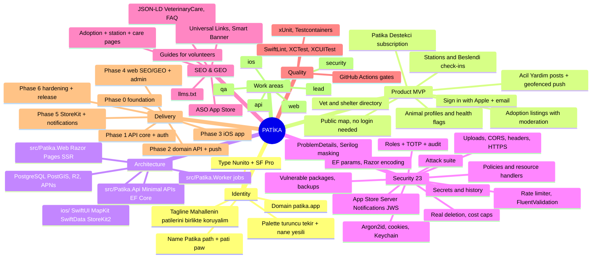

# PATİKA — Product Specification
**Stack:** Swift (iOS, SwiftUI, MapKit, StoreKit 2) · ASP.NET Core (C#) · PostgreSQL + PostGIS · Razor Pages web
**Product:** Community platform for street animals — feeding-station map, "beslendi" check-ins, animal profiles, adoption listings, urgent-help posts, vet/shelter directory.
**Owner:** Ayberk (`ayberkaarda/patika`) · **Specification version:** 1.0 · **Language rule:** code, identifiers, commits, docs = English; all user-facing product copy = Turkish (tr-TR primary, en secondary).

---

## 0. Operating Contract (read before any action)

1. **Phase-gated delivery.** Work strictly in the phases of §10; at the end of every phase **STOP and REPORT** (§11) and wait for Ayberk's explicit `devam`.
2. **No silent scope expansion.** Anything not in §3 is out of scope; propose it in the report.
3. **No git operations without explicit approval.** Never run `git add/commit/push/rebase/filter-repo/tag`; propose Conventional Commit messages (`feat(ios): ...`, `feat(api): ...`, `feat(web): ...`, `chore(ci): ...`).
4. **No placeholders.** No `TODO`, `FIXME`, `lorem`, `YOUR_KEY_HERE`, stubs, or fabricated real-world data. Vets/shelters (`care_places`) are seeded only as clearly labeled sample rows (`is_sample = true`, name prefixed `[ÖRNEK]`); real entries arrive via admin CSV import.
5. **Work areas have exclusive owners** (§9); cross-boundary needs go through `docs/handoffs/`.
6. **Privacy of volunteers is a product feature.** Photos are stripped of EXIF/GPS on device before upload; volunteer positions are never stored — only station/animal positions; logs round coordinates to 3 decimals.
7. **Decide, then record.** In-scope engineering choices are yours; log them in `docs/adr/`. Ask Ayberk only for scope, cost, or legal changes.
8. **Versions.** Latest stable Xcode/Swift/iOS SDK and .NET LTS (or current STS if LTS lacks a needed feature — decide in ADR-0001) at scaffold time; pin NuGet versions with Central Package Management; record resolved versions in `docs/adr/0001-stack-and-versions.md`.

---

## 1. Mind Map



Every top-level branch is a section below.

---

## 2. Corporate Identity (decided — do not re-brainstorm)

| Element | Decision |
|---|---|
| Name | **Patika** ("footpath"; contains *pati* = paw) |
| Tagline (tr) | **Mahallenin patilerini birlikte koruyalım.** |
| Positioning | Sokak kedileri ve köpekleri için mahalle gönüllülerini buluşturan uygulama: mama istasyonları, besleme takibi, sahiplendirme, acil yardım, en yakın veteriner ve bakımevi. |
| Audience | Urban animal lovers 20–55 with iPhones in İstanbul, İzmir, Ankara; neighbourhood volunteer groups; municipalities as future partners |
| Legal name | Patika Topluluk Teknolojileri |
| Domain | `patika.app` |
| Bundle id | `app.patika.ios` |
| App Store title | **Patika: Sokak Hayvanları** · subtitle **Mama istasyonu, sahiplendirme, acil yardım** |
| Palette | Turuncu Tekir `#F28C28` (primary) · Kaldırım Taşı `#3D3A36` (dark surface/text) · Nane Yeşili `#7BC8A4` (secondary: water/health) · Kar Beyazı `#FBFAF8` (surface) · Boncuk Mavisi `#2F6FED` (links) · Acil `#D64545` (urgent) · Sis `#8C8781` (muted) |
| Typography | Display: **Nunito** (700/800) bundled · Body: **SF Pro** (system, Dynamic Type) · numerals monospaced digits for counts |
| Logo concept | A paw print whose four toe pads trail off into a dotted path that curves upward. App icon: Kar Beyazı paw-trail on Turuncu Tekir. Deliver SVG + icon set in `brand/`. |
| Tone of voice | Warm, communal "biz", dignified, never guilt-tripping: "Bugün beslendi mi?", "Bir kap su bırak", "Acil yardım gerekiyor". |
| Design tokens | `brand/tokens.json` → Swift `PatikaDesignSystem` package (Color/Font/Spacing) and Razor CSS variables |

---

## 3. Product Scope (MVP) and Non-Goals

### Personas
- **Ziyaretçi:** browses map and adoption listings without an account.
- **Gönüllü:** signed in; checks in feedings, adds stations/animals/photos, posts urgent help, applies for adoption.
- **Moderatör:** reviews adoption and urgent posts, handles reports, verifies care places.

### MVP user stories
1. Sign in with Apple (required) and email + password (Argon2id) with email verification; password reset by email; anonymous browsing of map and listings.
2. Map (MapKit): feeding stations as clustered annotations; filters (kedi/köpek, mama/su, "mama bitti"); station detail: photos, last 10 check-ins, "Beslendi" button (optional photo, optional note), "Mama bitti" flag with auto-clear on next feeding.
3. Add station (location by pin drop or current position, type, photo). Edits by creator or moderators.
4. Animal profiles: species, name, sex, sterilized/vaccinated/ear-tagged flags, status (`healthy|injured|missing|adopted|deceased`), photos, linked station or free position; "Takip et" to receive updates; sighting log ("Bugün gördüm").
5. Adoption listings: from an animal profile; description, requirements, district; moderation queue before publish; requester sends a message via a form; poster sees requests in "İstekler" and replies through their own channel (phone shared only if the poster typed it into the reply). Listing auto-closes after 60 days or on "Sahiplendirildi".
6. **Acil Yardım:** injured/sick animal post with location, photo, category; geofenced push to volunteers within 2 km who opted in (cap 500 devices/post, 3 posts/user/day); moderator can close/escalate; directory of nearest vets and shelters (`care_places`, admin-curated, "24 saat" flag, phone, hours, distance).
7. Volunteer profile: display name, district, feedings count, badges ("İlk besleme", "100 besleme"); no leaderboards that shame.
8. Push notifications (APNs, token-based): urgent posts nearby (opt-in radius), replies to adoption requests, followed-animal updates.
9. Offline: SwiftData cache of stations/animals for last viewed region; outbox for check-ins; sync on reconnect.
10. **Patika Destekçi** (StoreKit 2 auto-renewable, monthly/yearly): supporter badge, no upsell banners, larger photo quota; revenue funds servers. Entitlement decided server-side from verified transactions + App Store Server Notifications.
11. Account deletion in-app and on web (`/hesap-silme`).
12. Web (Razor Pages): marketing, public adoption listings, station/district pages, care-place directory, guides, legal pages, impact page with real numbers, admin/moderation area.

### Non-goals
- Donations to individuals or any money flow besides the Destekçi subscription; live chat; Android (v2); vet appointment booking; real-time animal tracking devices; leaderboards; ads.

---

## 4. Architecture

### Repository layout
```
patika/
  ios/
    Patika.xcodeproj  (targets: Patika, PatikaTests, PatikaUITests)
    Packages/PatikaCore        models, API client, auth, sync (Swift Package)
    Packages/PatikaDesignSystem colors, fonts, components
    Packages/PatikaMap         map annotations, clustering, region cache
    Config/{Debug,Release}.xcconfig  (public base URLs only)
  src/
    Patika.Domain          entities, value objects, permissions, domain events
    Patika.Infrastructure  EF Core (Npgsql + NetTopologySuite), repositories, R2 storage, APNs, email
    Patika.Api             Minimal APIs (vertical slices under Features/), auth, rate limiting, ProblemDetails
    Patika.Web             Razor Pages: marketing, SEO pages, admin area
    Patika.Worker          BackgroundService jobs (push fan-out, deletion, reconciliation, backup verify)
    Patika.Contracts       request/response DTOs shared by Api and Web
  tests/
    Patika.UnitTests  Patika.IntegrationTests (Testcontainers)  Patika.SecurityTests
  brand/  docs/adr docs/security docs/ops docs/handoffs docs/seo docs/api
  .github/workflows  docker-compose.yml  Directory.Packages.props  Directory.Build.props
```

### iOS
- Swift 5.10+ (Swift 6 language mode if the toolchain is stable at scaffold), SwiftUI, iOS 17+, MVVM with `@Observable`, Swift Concurrency (actors for sync/outbox), `URLSession` async client with `Codable` models validated against `docs/api/openapi.json` by a CI contract test, MapKit (`Map` with clustering; `MKMapView` bridge only if SwiftUI clustering proves insufficient — record in ADR), Core Location (when-in-use only), `PhotosPicker` + camera capture, image pipeline (resize ≤ 1600 px, JPEG 0.8, **metadata stripped via `CGImageDestination` without EXIF/GPS**), SwiftData (cache + outbox), Keychain (`kSecAttrAccessibleAfterFirstUnlockThisDeviceOnly`), StoreKit 2, `UNUserNotificationCenter`, `BGAppRefreshTask` for outbox flush, Localizable strings (tr default, en), VoiceOver + Dynamic Type, SwiftLint (strict) + SwiftFormat, Swift Package Manager only, **zero third-party runtime dependencies** (security posture; Sentry allowed as the single exception if ADR-0004 approves it).

### Backend (.NET)
- ASP.NET Core Minimal APIs organised as vertical slices; FluentValidation (endpoint filter); ASP.NET Core Identity is **not** used — custom user store with Argon2id (`Konscious.Security.Cryptography.Argon2`), Sign in with Apple identity-token verification (Apple JWKS, nonce), ES256 access JWT (15 min) + opaque rotated refresh tokens (30 days, hashed); `Microsoft.AspNetCore.RateLimiting`; `AddProblemDetails`; Serilog (JSON, masking enricher); EF Core + Npgsql + NetTopologySuite (`geography(Point,4326)`, GiST indexes, `ST_DWithin`); Cloudflare R2 via `AWSSDK.S3` presigned PUT; APNs via `dotAPNS` (token-based `.p8` key from env); email via Resend; `NetEscapades.AspNetCore.SecurityHeaders` in Web; `Otp.NET` for TOTP; App Store Server API + Notifications V2 verification (`x5c` chain validated against the Apple Root CA G3 certificate pinned in `src/Patika.Infrastructure/Apple/AppleRootCA-G3.cer`).
- Worker: `BackgroundService` + Quartz.NET (cron) for `urgent.fanout`, `deletion.hard_delete`, `subscriptions.reconcile` (daily), `backup.verify` (daily), `adoption.autoclose`.
- Web: Razor Pages SSR (no SPA), `/admin` area with cookie auth (separate scheme) + TOTP step-up + audit log; public pages read through `Patika.Contracts` read models (no direct DbContext in pages — use application services).
- Deployment: Docker (multi-stage) behind Caddy/Cloudflare; `docker-compose.yml` for local (Postgres 16 + PostGIS, MinIO, api, web, worker). Hosting decided in ADR-0002.

---

## 5. Data Model and API Surface

### Tables (EF Core migrations; ids UUIDv7; `created_at/updated_at`)
`users` (email unique nullable-if-apple, email_verified_at, password_hash nullable, apple_sub unique nullable, display_name, district, role `User|Trusted|Moderator|Admin`, urgent_opt_in boolean, urgent_radius_m, totp_secret_enc nullable, deactivated_at) · `refresh_tokens` · `email_tokens` · `stations` (location geography, kind `Food|Water|Both`, species `Cat|Dog|Mixed`, photo_key, created_by, status `Active|NeedsRefill|Removed`, last_fed_at, feedings_count) · `feedings` (station_id, user_id nullable-after-deletion, at, photo_key nullable, note) · `animals` (station_id nullable, location geography, species, name, sex, sterilized, vaccinated, ear_tagged, status, created_by) · `animal_photos` (animal_id, key, created_by, moderation_state) · `sightings` (animal_id, user_id, at, note) · `follows` (user_id, animal_id unique) · `adoption_posts` (animal_id, description, requirements, district, state `Pending|Published|Rejected|Closed`, closes_at, created_by) · `adoption_requests` (post_id, requester_id, message, reply, state) · `urgent_posts` (location, category `Injured|Sick|Trapped|Other`, description, photo_key, state `Open|Handled|Closed`, created_by, notified_count) · `care_places` (name, kind `Vet|Shelter|MunicipalCare`, location, address, phone, hours_json, open_24h, verified, is_sample) · `device_tokens` (user_id, token unique, environment, last_seen_at) · `subscriptions` (user_id, original_transaction_id_hash, product_id, status, expires_at, environment, last_notification_uuid) · `app_store_notifications` (notification_uuid unique, type, subtype, received_at, processed_at) · `reports` (target_type, target_id, reporter_id, reason, state) · `audit_logs` · `deletion_requests` · `rate_limit_notes` (documentation only — limiter is in-memory per instance; multi-instance uses Redis if ADR-0002 selects horizontal scaling).

### API (`/v1`, JSON, RFC 9457)
`POST auth/register · POST auth/login · POST auth/apple · POST auth/refresh · POST auth/logout · POST auth/verify-email · POST auth/forgot · POST auth/reset · GET me · PATCH me · DELETE me · PUT me/device-token · PUT me/urgent-settings`
`GET stations?bbox=&kind=&species=&needsRefill= (max 500, paged) · POST stations · GET|PATCH stations/{id} · POST stations/{id}/feedings · POST stations/{id}/needs-refill`
`GET animals?bbox= · POST animals · GET|PATCH animals/{id} · POST animals/{id}/photos · POST animals/{id}/sightings · PUT animals/{id}/follow · DELETE animals/{id}/follow`
`GET adoptions?district=&species= · POST animals/{id}/adoption · GET adoptions/{id} · PATCH adoptions/{id} (owner close) · POST adoptions/{id}/requests · GET adoptions/{id}/requests (owner) · PATCH adoptions/{id}/requests/{rid}`
`GET urgent?near=lat,lng&radius= · POST urgent · PATCH urgent/{id}`
`GET care-places?near=&kind=&open24h=`
`POST uploads/presign (kind=station|animal|feeding|urgent)`
`POST reports`
`POST subscriptions/verify (signed transaction JWS from StoreKit 2)` · `POST webhooks/appstore`
`GET|POST|PATCH admin/** (Moderator|Admin + TOTP step-up)`
OpenAPI generated with Swashbuckle to `docs/api/openapi.json` (CI enforces up-to-date).

---

## 6. Security — the 23-item checklist, mapped to this stack

1. **Anahtarları çıkar.** Impl: iOS ships no secrets (assume the IPA is readable) — `.xcconfig` holds only `API_BASE_URL`; no third-party keys (MapKit needs none); backend secrets from environment / `dotnet user-secrets` (dev) only; `appsettings*.json` contain no secrets; `.env*`, `*.p8`, `*.mobileprovision`, `*.p12` gitignored; `gitleaks` pre-commit + CI. Verify: `gitleaks detect` clean; grep for `BEGIN PRIVATE KEY|AuthKey_` empty.
2. **.env'i geçmişten sil.** Impl: `docs/security/history-purge-runbook.md` with `git filter-repo` commands for `.env`, `*.p8`, `*.p12`, `appsettings.Production.json`, plus rotation list (DB password, JWT keys, R2 keys, APNs key, Resend key, App Store Server API key, TOTP encryption key). **Not executed** — requires Ayberk. Verify: runbook + CI history scan.
3. **İzin kurallarını yaz.** Impl: `src/Patika.Domain/Security/Permissions.cs` (static matrix) + `docs/security/authorization-matrix.md`: `Guest` (read public), `User` (create stations/animals/feedings/urgent, own edits, adoption requests), `Trusted` (after 25 verified feedings: edit any station), `Moderator` (moderation queue, close posts, verify care places), `Admin` (roles, care-place import, user actions). ASP.NET policies + resource-based `IAuthorizationHandler`s (`OwnerOrModeratorRequirement`). Verify: table-driven tests over every matrix cell.
4. **Yetkiyi sunucuda tut.** Impl: every mutating endpoint calls `IAuthorizationService.AuthorizeAsync(user, resource, policy)`; queries scoped by ownership/moderation state; geofenced notification recipients computed server-side; iOS hides controls only. Verify: IDOR suite (`Patika.SecurityTests/IdorTests.cs`): user A vs user B's adoption post, requests, station edits → 403/404.
5. **Girişe sınır koy.** Impl: `AddRateLimiter` sliding-window policies: `auth` 5/15 min per IP **and** per normalized email (partition key from body), `apple` 10/15 min per IP, `refresh` 30/min per user; global 300/min per IP; `RejectionStatusCode = 429` + `Retry-After`; client IP from `ForwardedHeaders` with known proxies only. Verify: 6th login → 429; spoofed `X-Forwarded-For` does not bypass.
6. **Girdiyi doğrula.** Impl: FluentValidation validators for every request DTO (coordinates within valid ranges and inside Türkiye bounding box for creation, string lengths, enum membership, bbox area ≤ 400 km², radius ≤ 5 km); `MaxRequestBodySize` 1 MB for JSON; JSON `UnmappedMemberHandling = Disallow`; iOS validates in ViewModels. Verify: negative tests per validator.
7. **Yüklemeyi sınırla.** Impl: presigned R2 PUT with `Content-Length` 1..5 MB and `Content-Type image/jpeg|image/png|image/webp`; iOS converts HEIC → JPEG and strips metadata before upload; worker post-processes with ImageSharp (re-encode WebP, max 1600 px, thumbnails 320/800, strip metadata), magic-byte check, quarantine on failure; quota 30 uploads/user/day (Destekçi 100). Verify: MIME spoof and oversize rejected; EXIF absent in stored objects (test reads metadata).
8. **CORS'u kilitle.** Impl: API has no browser client in MVP → CORS not enabled (no headers emitted); Web is same-origin SSR; a `CorsPolicy` allowlist (`https://patika.app`) exists in config but is off by feature flag. Verify: preflight from any origin returns no CORS headers.
9. **Güvenlik başlıkları.** Impl: Web: `NetEscapades.AspNetCore.SecurityHeaders` — HSTS (2 years, includeSubDomains, preload), CSP with per-request nonce (`script-src 'self' 'nonce-…'`, `object-src 'none'`, `frame-ancestors 'none'`, `base-uri 'self'`, `img-src 'self' data: https://cdn.patika.app`), `X-Content-Type-Options`, `Referrer-Policy: strict-origin-when-cross-origin`, `Permissions-Policy: geolocation=(self), camera=(), microphone=()`; API: `Cache-Control: no-store`, `X-Content-Type-Options`. Verify: header assertions in integration tests.
10. **HTTPS zorunlu.** Impl: TLS at Caddy/Cloudflare; `UseForwardedHeaders` (known proxies) → `UseHttpsRedirection` + `UseHsts`; iOS ATS defaults (no `NSAllowsArbitraryLoads`); optional SPKI pinning via `URLSessionDelegate` with primary + backup pins and documented rotation date (on in Release, feature-flagged). Verify: `http://` request to API redirects; ATS test.
11. **Şifreleri hash'le.** Impl: Argon2id (Konscious; m=65536 KiB, t=3, p=1, 16-byte salt) via `IPasswordHasher`; password policy ≥ 10 chars + HIBP k-anonymity at registration; Apple-only users have `password_hash = NULL` and password login disabled; refresh/email tokens stored as SHA-256; TOTP secrets encrypted with AES-256-GCM key from env. Verify: DB shows only `$argon2id$`; login timing constant.
12. **Çerezi güvenli yap.** Impl: Web admin cookie `__Host-patika.admin` (HttpOnly, Secure, SameSite=Strict, Path=/, 30 min sliding) + antiforgery on all POSTs; iOS stores tokens in Keychain (`AfterFirstUnlockThisDeviceOnly`, not iCloud-synced), access token in memory, refresh rotation with reuse detection; tokens wiped on sign-out/deletion. Verify: cookie attribute tests; refresh reuse revokes the family.
13. **Hata mesajını kıs.** Impl: `AddProblemDetails` + custom `IExceptionHandler` mapping to generic `title`, machine `code`, `traceId`; no `DeveloperExceptionPage` outside Development; Razor error page generic; iOS maps `code` → Turkish strings in `Localizable.xcstrings`. Verify: forced 500 returns only generic body + `traceId`.
14. **Logları temizle.** Impl: Serilog JSON with a masking enricher (emails → `a***@d***`, coordinates rounded to 3 dp, no bodies for `/auth/*` and `/uploads/*`, `Authorization`/`Cookie` dropped, tokens never), request id in every line, retention 30 days documented; iOS uses `OSLog` with `%{private}` for user data; Sentry (if enabled) `beforeSend` scrub. Verify: log sample from register + feeding + urgent flows contains no email/token/precise coordinate.
15. **Sorguyu parametrele.** Impl: EF Core LINQ only; `FromSqlInterpolated`/`FromSql` (interpolated) allowed, `FromSqlRaw`/`ExecuteSqlRaw` banned by a Roslyn banned-API list (`BannedSymbols.txt`); spatial predicates through NetTopologySuite functions. Verify: build fails on banned symbols; grep for `FromSqlRaw` empty.
16. **XSS'e karşı kaçır.** Impl: Razor auto-encodes; `Html.Raw` banned for user content (analyzer + code review checklist); CSP nonce; user text sanitized of control characters server-side; iOS renders `Text` only (no `WKWebView`, no attributed HTML from users). Verify: stored `<script>` in an adoption description renders as text on web and iOS.
17. **Webhook imzası.** Impl: `POST /v1/webhooks/appstore` (App Store Server Notifications V2): parse `signedPayload` JWS, validate `x5c` chain to Apple Root CA G3 (pinned cert), verify signature (ES256), check `bundleId = app.patika.ios` and `environment`, verify nested `signedTransactionInfo`/`signedRenewalInfo` the same way, idempotency by `notificationUUID` (unique index), respond 200 within 2 s, process in worker; `POST subscriptions/verify` accepts the StoreKit 2 transaction JWS and verifies it server-side identically, then calls App Store Server API `Get Transaction Info` before granting entitlement; daily `subscriptions.reconcile` job. Verify: tests with tampered payload, wrong chain, wrong bundle id, replayed UUID, sandbox vs production mismatch.
18. **Admin'e rol koy.** Impl: `role` on `users` (User|Trusted|Moderator|Admin); Web `/admin` area: password + TOTP (`Otp.NET`) login, step-up every 15 min for destructive actions; moderation queue (adoption/urgent/photos/reports), care-place import, role management (Admin only); every action → `audit_logs`; moderators cannot delete users or read emails. Verify: role matrix tests; audit assertions; e2e admin flow.
19. **Paketleri denetle.** Impl: `dotnet list package --vulnerable --include-transitive` in CI (fail on High/Critical), Central Package Management (`Directory.Packages.props`), Dependabot (`nuget`, `github-actions`, `swift`), `dotnet-outdated` report, CycloneDX SBOM; iOS: dependency count kept at zero (or one) and reviewed in ADR-0004. Verify: CI workflow + report artifact.
20. **Otomatik yedek.** Impl: `docs/ops/backup-restore.md`; `ops/backup/backup.sh` (`pg_dump -Fc` daily, `age`-encrypted, to a separate write-only R2 bucket, 30-day lifecycle) + WAL/PITR when self-hosted (`pgBackRest`) or managed PITR (ADR-0002); R2 versioning on photo bucket; worker `backup.verify` checks last backup age and alerts; CI `restore-drill.yml` weekly restores latest dump into Postgres+PostGIS container and runs spatial smoke queries. Verify: drill output.
21. **Hesabı gerçekten sil.** Impl: `Ayarlar → Hesabımı sil` (App Store Review Guideline 5.1.1(v)) and `patika.app/hesap-silme`: re-auth → immediate deactivation (tokens revoked, device tokens deleted, follows removed, open adoption posts closed) → 7-day grace (sign-in cancels) → worker `deletion.hard_delete`: delete PII rows and R2 photos uploaded by the user; feedings/sightings anonymized (`user_id = NULL`) to preserve station history integrity; `original_transaction_id_hash` retained 90 days for refund/fraud handling then purged; confirmation email; audit row without PII. Verify: e2e test asserts no residual PII rows.
22. **Harcama uyarısı kur.** Impl: `docs/ops/cost-alerts.md` (hosting budget, DB size, R2 storage/egress, Resend volume, Sentry quota — APNs is free); application caps: urgent fan-out ≤ 500 devices/post, 3 urgent posts/user/day, presign quota, bbox query limits; worker `cost.guard` counts daily pushes/emails and pauses non-critical sends above caps with an alert email. Verify: doc + guard tests.
23. **Saldırgan gibi dene.** Impl: `docs/security/threat-model.md` (STRIDE: fake feeding spam, location privacy of volunteers via photos/logs, IDOR on adoption requests, adoption scams, abusive content, subscription forgery, notification replay, token theft on jailbroken devices, moderation privilege escalation); `tests/Patika.SecurityTests` attack suite (IDOR matrix, rate-limit bypass via spoofed headers, JWT tampering, refresh reuse, oversized bodies, MIME spoof, EXIF leak check, webhook forgery/replay, CSRF on admin POST without token, admin without TOTP); OWASP ZAP baseline (Web) + API scan (`openapi.json`) in CI; MobSF static scan of the IPA + manual checks (ATS, Keychain accessibility, no `NSAllowsArbitraryLoads`, no debug logs); documented in `docs/security/pentest-report.md` with fixes and retest. Verify: report present; findings closed or accepted with reason.

---

## 7. SEO and GEO (web = `src/Patika.Web` Razor Pages)

### Information architecture
`/` · `/sahiplendirme` · `/sahiplendirme/[il]` · `/sahiplendirme/[il]/[ilce]` · `/sahiplendirme/[slug]` (`noindex` once closed) · `/istasyonlar/[il]/[ilce]` (station lists with counts and last-fed times) · `/bakim-yerleri/[il]` and `/bakim-yeri/[slug]` (vets/shelters with `VeterinaryCare`/`AnimalShelter` JSON-LD) · `/rehber/[slug]` (guides: "Sokak kedisi nasıl beslenir", "Yaralı kedi veya köpek bulursam ne yapmalıyım", "Kısırlaştırma nerede yapılır", "Kışın sokak hayvanları için barınak", "Sahiplendirme öncesi kontrol listesi") · `/etki` (impact: real counts from DB — stations, feedings, adoptions) · `/hakkinda` · `/sss` · `/gizlilik` · `/kvkk-aydinlatma` · `/hesap-silme` · `/iletisim` · `/admin/**` (`noindex`, disallowed).

### Technical SEO
- SSR Razor with semantic HTML; per-page title ≤ 60 / description ≤ 155 (Turkish); canonical; `hreflang` `tr-TR` + `en` + `x-default`; `sitemap.xml` index + chunked sitemaps (adoptions, districts, care places, guides) generated from DB with honest `lastmod`; `robots.txt`; OG/Twitter images (per adoption post generated server-side with ImageSharp from the animal photo + brand frame); JSON-LD: `Organization`, `MobileApplication` (iOS, `applicationCategory: SocialNetworkingApplication`), `VeterinaryCare`/`AnimalShelter` (`LocalBusiness` subtypes) for care places, `BreadcrumbList`, `FAQPage` on `/sss`, `Article` on guides; Core Web Vitals via minimal JS, WebP/AVIF, response caching (`OutputCache` for public pages, 5 min), brotli; Lighthouse CI budgets ≥ 90.
- App linking: `/.well-known/apple-app-site-association` (`applinks` paths `/sahiplendirme/*`, `/s/*`, `/a/*`, `/acil/*`), `apple-itunes-app` Smart App Banner meta with `app-argument`; iOS `Associated Domains` entitlement `applinks:patika.app`; universal link routing in `PatikaApp` scene handling.

### GEO
- `/llms.txt` + `/llms-full.txt`; answer-first 40–60 word definitional paragraph on every page ("Patika, sokak hayvanları için…"); `/sss` with 15 Turkish Q&A pairs mirrored in JSON-LD; consistent entity facts across `/hakkinda`, `llms.txt`, JSON-LD; `/etki` presents quotable, dated statistics with a methodology note; guides structured with H2 questions and short quotable answers; honest `dateModified`.

### ASO (`docs/seo/aso.md`)
Title "Patika: Sokak Hayvanları"; subtitle "Mama istasyonu, sahiplendirme, acil yardım"; keyword field (tr): sokak kedisi, sokak köpeği, mama istasyonu, sahiplendirme, kedi sahiplen, köpek sahiplen, hayvan gönüllü, yaralı hayvan; en secondary; 6 screenshots with Turkish captions; App Privacy labels: Location (Precise, linked to user for check-ins — decide: use approximate for volunteer settings, precise only at the moment of creating a station/urgent post and not stored as user attribute), Photos (user content), Contact info (email) — must match implementation exactly.

---

## 8. Quality, Testing, CI, Observability

- iOS: SwiftLint strict + SwiftFormat; unit tests (XCTest or Swift Testing) for models, API client (URLProtocol stubs), image pipeline (EXIF stripped assertion), outbox/sync actor; XCUITest smoke flows (browse map, sign in, feeding check-in, adoption request, delete account); accessibility audit (`XCUIApplication.performAccessibilityAudit`); localization completeness test (tr/en keys).
- .NET: xUnit + FluentAssertions; `WebApplicationFactory` integration tests with Testcontainers (Postgres + PostGIS, MinIO); architecture tests (NetArchTest: Domain has no infra deps, Web never references DbContext); contract test comparing generated OpenAPI with committed `docs/api/openapi.json`.
- CI (`.github/workflows/ci.yml`): macOS job (`xcodebuild test` on simulator, SwiftLint), Ubuntu job (dotnet build/test, vulnerable-package check, gitleaks, ZAP on compose stack, Lighthouse CI on Web). `testflight.yml` on manual dispatch (fastlane `pilot`) — release action, still not a git action.
- Observability: Serilog JSON + request ids; Sentry .NET (scrubbed); iOS crash reporting per ADR-0004; `GET /health` (no details) and `/health/ready` internal.
- Accessibility: VoiceOver labels on all annotations/buttons, Dynamic Type up to XXL, contrast ≥ 4.5:1; Turkish first.

---

## 9. Work Ownership and Repository Conventions

| Owner | Owns (exclusive write) | Reads |
|---|---|---|
| `lead` | `docs/adr/**`, `docs/handoffs/**`, `docs/api/**`, `brand/**`, `src/Patika.Contracts/**`, `CONTRIBUTING.md`, root configs, `docker-compose.yml`, `Directory.*.props` | everything |
| `api` | `src/Patika.Api/**`, `src/Patika.Domain/**`, `src/Patika.Infrastructure/**`, `src/Patika.Worker/**`, `tests/Patika.IntegrationTests/**`, `tests/Patika.UnitTests/**` | contracts, ADRs |
| `ios` | `ios/**` | `docs/api/openapi.json`, brand |
| `web` | `src/Patika.Web/**`, `docs/seo/**` | contracts, brand |
| `security` | `docs/security/**`, `tests/Patika.SecurityTests/**`, `.github/workflows/security.yml`, `ops/backup/**` | everything (read-only elsewhere) |
| `qa` | `ios/PatikaUITests/**`, `.github/workflows/ci.yml`, `.github/workflows/testflight.yml` | everything |

Rules: handoffs via `docs/handoffs/<from>-to-<to>-<NNN>.md`; contract changes flow through `lead`; git operations follow the approval rule in §0.

---

## 10. Delivery Phases and Gates

Each phase ends with **STOP → REPORT (§11) → wait for `devam`**.

**Phase 0 — Foundation.** Solution + projects, Xcode project + packages, `CONTRIBUTING.md` (§13), ADR-0001 (stack/versions), ADR-0002 (hosting/scaling), ADR-0003 (map clustering approach), ADR-0004 (iOS third-party policy), `brand/` tokens/logo/icons, `docker-compose.yml` (Postgres+PostGIS, MinIO, api, web, worker), CI skeleton, authorization matrix draft, threat-model outline, `.env.example`. Gate: `dotnet build` and `xcodebuild build` succeed.

**Phase 1 — API core + auth + security baseline (items 1, 3–6, 8–15).** EF model + migrations + spatial indexes, sample `[ÖRNEK]` seeds, auth (email, Apple, refresh rotation), rate limiting, validation, headers, ProblemDetails, masked logging, permissions + resource handlers with matrix tests, IDOR harness. Gate: tests green.

**Phase 2 — Domain API + media + push (items 7, 21 partial).** Stations, feedings, animals, photos, sightings, follows, adoption posts/requests, urgent posts with geofenced fan-out, care places + admin CSV import, presign + post-processing, reports, device tokens, deletion request flow, OpenAPI export. Gate: integration tests; worker jobs demonstrated.

**Phase 3 — iOS app.** Design system, map with clustering and filters, station/animal/adoption/urgent flows, image pipeline with metadata stripping, offline cache + outbox, auth, profile, notifications, settings + deletion, universal links, localization. Gate: XCUITest smoke green on simulator; SwiftLint clean.

**Phase 4 — Web SEO/GEO + admin (§7, item 18).** Public pages, programmatic district/care-place pages, guides (5 Turkish articles ≥ 600 words), legal pages, impact page, sitemap/robots/JSON-LD/hreflang/OG generation, AASA, `llms.txt`, admin/moderation area with TOTP and audit, Lighthouse CI. Gate: Lighthouse ≥ 90 on 5 pages; JSON-LD validates; admin e2e.

**Phase 5 — Destekçi subscription + App Store notifications (item 17).** StoreKit 2 products, paywall (tr copy), transaction verification endpoint, notifications webhook with JWS chain validation, reconciliation job, entitlement gating (quota, badge). Gate: webhook and entitlement tests green; sandbox flow documented.

**Phase 6 — Hardening and release readiness (items 2, 19, 20, 22, 23 + matrix).** Attack suite, ZAP, MobSF/IPA checks, vulnerable-package gate, backups + restore drill, cost alerts + `cost.guard`, history-purge runbook, ASO doc + App Store copy (tr/en), privacy labels mapping, final **23-item verification matrix**. Gate: FINAL REPORT.

---

## 11. Report Template (use verbatim at every gate)

```
# Patika — Phase <N> Report
## Summary (5 lines max)
## Files created / modified (grouped by owner, full paths)
## Decisions & ADRs added
## Security checklist status
| # | Item | Status (done / partial / not-started) | Evidence (test name, doc path) |
## SEO/GEO status (Phase 4+)
## Tests executed (command + result counts)
## Known gaps / risks
## Open questions / proposals (scope, cost, legal)
## Proposed Conventional Commits (not executed)
## Next phase preview (3 lines)
STOPPED — waiting for "devam".
```

---

## 12. Definition of Done (final)

- 23/23 items **done** with evidence; SEO/GEO checklist complete; every MVP story demonstrable (XCUITest + integration tests).
- No placeholders (CI grep `TODO|FIXME|lorem|YOUR_`); no `FromSqlRaw`; no third-party iOS runtime deps beyond ADR-0004.
- `dotnet test` green; vulnerable packages High/Critical = 0; `gitleaks` clean; SwiftLint clean; Lighthouse budgets met.
- Docs: ADRs, authorization matrix, threat model, pentest report, backup/restore runbook, cost alerts, ASO, App Store copy, KVKK texts (aydınlatma metni covering location and photo processing).
- Release: signing configuration documented (no certificates in repo), TestFlight workflow, Docker images, Caddy config.

---

## 13. `CONTRIBUTING.md` to create in Phase 0 (fill completely)

```
# Patika — Contributor Rules
- Language: code/docs/commits English; product copy Turkish (tr-TR), English secondary.
- Phase discipline per the product spec (§10); stop and report at gates; wait for "devam".
- Never run git commands. Propose Conventional Commits in reports.
- Privacy rules: strip EXIF/GPS on device; never store volunteer positions; round coordinates in logs.
- No placeholders; sample data only when labeled [ÖRNEK] / is_sample=true.
- Ownership table (copy of spec §9); handoffs via docs/handoffs/.
- Security: 23-item checklist is a hard requirement; docs/security/verification-matrix.md maintained.
- Commands: dotnet build | dotnet test | dotnet run --project src/Patika.Api | docker compose up ; ios: xcodebuild -scheme Patika test -destination 'platform=iOS Simulator,name=iPhone 15' ; swiftlint
- Env: backend secrets via environment/user-secrets only; ios via Config/*.xcconfig (public values only) — keys documented in docs/ops/env.md.
- Parallel work only on disjoint ownership sets (§9).
```
